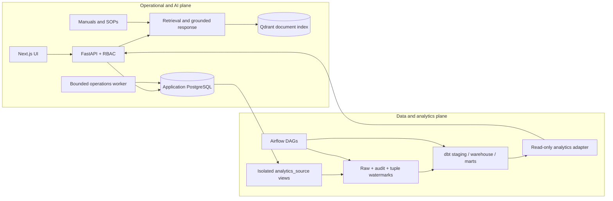

# AI Maintenance Copilot and Maintenance Data Platform

An evidence-backed portfolio project that combines an operational maintenance
application, grounded RAG assistance, and a batch Data Platform for multi-domain
analytics at laptop scale.

The project addresses a common maintenance problem: work orders, tickets,
inventory movements, costs, operating readings, manuals, and SOPs often live in
different systems. The repository demonstrates how to keep transactional
workflows authoritative while building reproducible analytics and
evidence-bound AI assistance around them.

This is a local synthetic engineering project. It is not a production company
deployment, a production SLA, or evidence of real-user business impact.

## What this project demonstrates

- PostgreSQL-backed maintenance workflows for assets, tickets, preventive
  plans, work orders, maintenance evidence, spare parts, and notifications.
- FastAPI authentication, RBAC, append-only audit records, bounded background
  jobs, and a Next.js product UI.
- Hybrid document retrieval and grounded RAG responses with citations, safety
  notices, and deterministic fallback behavior.
- Incremental Data Platform ingestion with tuple watermarks, checksum-verified
  artifacts, restartable COPY loading, Airflow orchestration, and dbt quality
  gates.
- Structured maintenance analytics across 7.7M+ generated rows without using a
  vector database as a replacement for relational queries.
- Measured query and API performance work, including failure diagnosis,
  bounded experiments, and machine-readable before/after evidence.

## Architecture at a glance



The two planes are connected but intentionally bounded. PostgreSQL and dbt own
structured facts, aggregations, reconciliation, and site-scoped analytics. RAG
is reserved for unstructured evidence such as manuals, SOPs, checklists, and
maintenance notes. Structured rows are not bulk-embedded merely to answer SQL
questions.

See the [canonical architecture](docs/architecture.md) for component ownership,
transaction boundaries, Airflow dependency groups, watermark recovery, cache
design, and known production gaps.

## Operational and RAG plane

The operational application covers the implemented maintenance workflow:

- asset lifecycle, hierarchy, attachments, and authenticated QR lookup;
- ticket intake, assignment, named lifecycle actions, SLA state, and
  escalation evidence;
- preventive plans, immutable checklist snapshots, work-order execution,
  completion, and independent verification;
- spare-part catalogues, stock positions, reservations, issues, consumption,
  returns, transfers, and immutable movements;
- durable jobs, leases, retry/dead-letter state, transactional outbox events,
  and in-app notifications;
- batch anomaly detection, explainable risk prioritization, and maintenance
  KPI projections;
- hybrid retrieval over manuals and SOPs, metadata filtering, relevance gates,
  citation validation, and safe fallback when evidence is insufficient.

Humans remain responsible for field inspection, safety checks, prioritization,
maintenance execution, and final decisions. Risk scores and AI responses are
decision support, not automatic control.

## Data Platform and analytics plane

The canonical data flow is:

```text
isolated OLTP -> analytics_source views -> raw/audit
-> dbt staging/warehouse/marts -> read-only analytics adapter
-> authenticated API / BI / bounded evidence export
```

Important contracts:

- application Alembic head: `20260726_0008`;
- Data Platform Alembic head: `20260824_dp0003`;
- independent Data Platform version table: `data_platform_alembic_version`;
- incremental position: `(updated_at, entity_id)` or the domain-equivalent
  source tuple;
- immutable local artifacts with SHA-256 and chunk-level load audit;
- raw commit before watermark finalization;
- row locks and monotonic watermark advancement;
- empty reruns preserve watermarks and add zero raw versions;
- source/raw/staging/fact reconciliation and explicit integrity tests;
- authenticated, allow-listed, parameterized, read-only analytics queries.

Stage 9 proves the million-work-order path and measured watermark index. Stage
10 extends it to tickets, status history, inventory, spare parts, and costs with
failure recovery. Stage 11 reduces Analytics API connection contention while
preserving authorization and response semantics.

## Technology stack

| Area | Technology |
|---|---|
| API and services | Python 3.11, FastAPI, Pydantic, SQLAlchemy, psycopg |
| Transactional storage | PostgreSQL, Alembic |
| Data engineering | Airflow 3, dbt Core/dbt-postgres, PostgreSQL COPY |
| Analytics and ML | pandas, NumPy, scikit-learn |
| RAG | Qdrant, hybrid retrieval, optional sentence-transformers, optional local/OpenAI-compatible LLM |
| Frontend | Next.js 16, React 19, TypeScript, TanStack Query, Recharts |
| Quality | pytest, Ruff, Vitest, ESLint, TypeScript, dbt tests |
| Runtime | Docker Compose, Windows PowerShell runbooks |

External LLM and embedding providers are optional. The scale benchmarks did not
call external LLM, embedding, AWS, or Qdrant bulk APIs.

## Repository map

```text
src/                         operational API, business services, RAG, analytics
data_platform/               ingestion, Airflow DAGs, dbt project, migrations
frontend/                    authenticated Next.js user experience
migrations/                  application-owned Alembic history
scripts/                     safe verification and explicit operator commands
tests/                       unit, contract, architecture, and PostgreSQL tests
docs/                        canonical design, evidence, runbooks, portfolio
data/                        ignored runtime/generated data plus tracked keepers
```

Generated scale CSVs, manifests, dbt targets/logs, caches, database dumps,
attachments, and runtime evidence remain ignored. The tracked benchmark JSON in
`docs/` is the reviewable summary; it does not contain credentials or personal
data.

## Data domains

The Stage 10 synthetic checkpoint contains:

| Domain | Verified rows |
|---|---:|
| Work orders | 1,100,000 |
| Work-order status history | 3,300,000 |
| Tickets | 300,000 |
| Ticket events | 900,000 |
| Spare parts | 25,000 |
| Inventory movements | 1,500,000 |
| Work-order costs | 1,100,000 |

The generation/load evidence covers 145 chunks, 7,728,467 rows, and
2,106,564,675 bytes. The final local database was approximately 10.95 GB. These
are project/lab metrics from deterministic synthetic data.

## Airflow, dbt, and recovery

The Stage 9 DAG has 9 tasks. The Stage 10 multi-domain DAG has 19 task instances:
preflight/audit, six independent extracts, six raw loads, dbt run/test,
reconciliation, atomic watermark finalization, and terminal audit.

The Stage 10 baseline, controlled-failure retry, and empty rerun all completed.
The injected failure occurred after raw `ticket_events` commit; retry inserted
zero duplicates and advanced all six watermarks exactly once to version 2.

dbt grew from 11 models and 307 tests (`318/318` build nodes) to 26 models and
433 tests (`459/459` build nodes). Tests cover grain, chronology, referential
integrity, ticket SLA evidence, signed inventory semantics, cost arithmetic,
and cross-layer reconciliation.

## Authenticated Analytics API and Stage 11

The Analytics API exposes six allow-listed capabilities through FastAPI. Calls
require `analytics.read`, use bound parameters in read-only transactions, and
retain site/user scope in the cache key.

The accepted Stage 11 configuration is two Uvicorn workers, SQLAlchemy pool
`6+0` per worker, six direct analytics slots per worker, and a process-local LRU
cache with a 5-second TTL and 256-entry bound. The cache is bypassed when no
authorization scope is supplied.

| Scenario | Baseline | Final | Change |
|---|---:|---:|---:|
| 25-client RPS | 49.4449 | 64.5314 | +30.5117% |
| 25-client p95 | 1,734.9344 ms | 1,154.0085 ms | -33.4840% |
| 50-client RPS | 41.5979 | 57.8139 | +38.9827% |
| 50-client p95 | 4,284.3778 ms | 2,805.6529 ms | -34.5143% |

The final benchmark completed 900 requests with zero errors, zero timeouts, and
774/774 non-empty analytics payloads. Maximum PostgreSQL connections fell from
33 to 23. This is a synthetic laptop benchmark, not production capacity.

## Verified evidence

| Evidence | Verified result | Classification |
|---|---|---|
| Stage 9 scale | 1.1M work orders; 1.11M raw versions; 24.33x p50 index speedup | Historical local synthetic run |
| Stage 10 domains | 7,728,467 generated/copied rows; 8 integrity checks with zero violations | Historical local synthetic run |
| Stage 10 Airflow/dbt | 19 tasks; controlled retry; `459/459` dbt nodes | Historical local synthetic run |
| Stage 10 validation | 1,365 backend + 87 PostgreSQL + 141 frontend + 459 dbt = 2,052 | Historical Stage 10 evidence |
| Stage 11 API | ~34.5% lower 50-client p95; ~39.0% higher RPS; 0 errors | Historical Stage 11 benchmark |
| Stage 12 verifier | Required docs, evidence consistency, links, secrets, lineage, ignored artifacts | Runnable offline now |

The [release manifest](docs/release-manifest.json) is the machine-readable source
for public portfolio metrics. Expensive Stage 9-11 pipelines and benchmarks are
not rerun during normal verification.

## Quick start: offline review

Prerequisites are PowerShell and Git; Python and Docker are optional in Offline
mode.

```powershell
Set-Location D:\code\rag\ai_maintain_copilot
powershell -NoProfile -ExecutionPolicy Bypass `
  -File .\scripts\verify_final_release.ps1 -Mode Offline
```

The verifier does not start or stop containers, mutate a database, call AWS,
generate data, or invoke external AI services. Missing optional tools are
reported as `SKIP`; broken required documents, inconsistent metrics, secrets,
public IPs, or tracked scale artifacts are failures.

For a 5-10 minute evidence-first walkthrough, use the
[demo runbook](docs/demo-runbook.md).

## Optional local runtime

Use a private `.env` derived from `.env.example`; never commit it. Validate the
configuration before starting only the services you deliberately need:

```powershell
Copy-Item .env.example .env
# Populate local secrets in .env without printing them.
docker compose -f docker-compose.yml config --quiet
docker compose -f docker-compose.yml up -d --wait postgres qdrant migrate api frontend
```

The full scale dataset is not required for application review. If the preserved
scale environment already exists, follow the read-only path in the
[operations runbook](docs/operations-runbook.md). Regeneration is intentionally
not part of quick start because it is time-, disk-, and memory-intensive.

## Security boundaries

- FastAPI authentication and RBAC are authoritative; hidden UI controls are not
  authorization.
- Passwords, tokens, cookies, connection strings, and reporter PII are excluded
  from audit payloads and release evidence.
- Refresh tokens remain revocable and HttpOnly; access tokens are not stored in
  browser local storage.
- Transactional mutations, audit, and selected outbox events commit together.
- Analytics uses an allow-listed query catalogue, site filters, date/result
  bounds, statement timeouts, and an authorization-safe cache key.
- Qdrant stores document chunks for RAG, not relational analytics facts.
- Scale data and runtime artifacts are ignored; tracked summaries are scanned
  for high-confidence secrets and unexpected public IPs.
- The historical AWS learning lab was torn down. There is no live RDS claim.

## Limitations

- Synthetic laptop evidence does not establish production SLA, uptime,
  multi-user adoption, or business impact.
- No multi-host HA, automated failover, PITR rehearsal at scale, or production
  incident response was validated.
- The Stage 11 cache is process-local and TTL-only; replicas would require a
  coherent invalidation design if stricter freshness were needed.
- Operational and scale Compose topologies are local learning environments,
  not hardened cloud deployments.
- RAG evidence quality is bounded by indexed documents and retrieval gates; the
  assistant does not predict exact failure times or replace human judgment.
- Real maintenance-domain data requires governance, retention, consent,
  classification, lineage, and quality ownership beyond this repository.

## Production evolution roadmap

1. Establish real data ownership, quality contracts, retention, and access
   governance with a narrowly scoped pilot.
2. Move workloads to private networking with least-privilege workload
   identities and managed secrets.
3. Add stable encryption-key management, encrypted object storage, HA/PITR,
   tested restore objectives, monitoring, alerting, and on-call ownership.
4. Introduce CI/CD and infrastructure as code with policy, migration, security,
   and release gates.
5. Perform representative production-scale load, failure, and recovery tests
   before setting any capacity or SLA target.
6. Add a distributed cache only when measurements justify it, with explicit
   coherence and invalidation semantics.

## Canonical documentation

- [Architecture](docs/architecture.md)
- [Demo runbook](docs/demo-runbook.md)
- [Operations and reproduction](docs/operations-runbook.md)
- [Data Platform integration](docs/data-platform-integration.md)
- [Structured data versus RAG](docs/structured-data-vs-rag.md)
- [Stage 9 evidence](docs/benchmark-results-1m.md)
- [Stage 10 evidence](docs/benchmark-results-domain-scale.md)
- [Stage 10 failure recovery](docs/reliability-failure-recovery.md)
- [Stage 11 API performance](docs/stage11-api-performance.md)
- [Portfolio summary](docs/portfolio/project-summary.md)
- [Interview guide](docs/portfolio/interview-guide.md)
- [Project handover](docs/project-handover.md)
- [Final release checklist](docs/final-release-checklist.md)
- [Machine-readable release manifest](docs/release-manifest.json)
