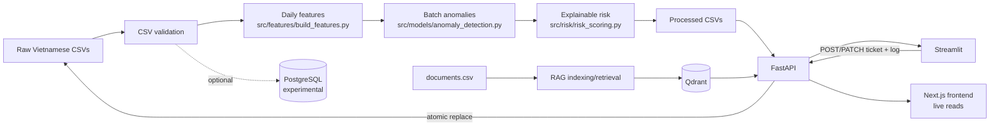

# AI Maintenance Copilot

Nền tảng decision-support cho bảo trì thiết bị, sử dụng Vietnamese synthetic data, batch anomaly detection, explainable risk scoring và RAG retrieval trên SOP/checklist.

> Trạng thái: portfolio MVP đã hoàn thiện trong phạm vi đã khóa. Repository không phải production-ready và không thay thế CMMS/S-Maintain.

## Bài Toán

Facility Manager và technician thường phải tổng hợp thủ công thông tin từ asset register, ticket, maintenance log, operational readings và tài liệu hướng dẫn. AI Maintenance Copilot tạo một luồng thống nhất để:

- nhận diện asset có tín hiệu bất thường;
- xếp hạng thiết bị theo explainable risk score;
- giải thích nguyên nhân và hành động tham khảo bằng tiếng Việt;
- tìm SOP/checklist phù hợp và hiển thị nguồn cho technician.

Hệ thống là lớp hỗ trợ quyết định. Manager và technician chịu trách nhiệm xác minh dữ liệu, đánh giá điều kiện an toàn và đưa ra quyết định cuối cùng.

## Revised MVP Scope

MVP tập trung vào:

- thông tin asset cơ bản;
- ticket và maintenance history;
- preventive maintenance tracking;
- operational data theo batch;
- anomaly detection và risk prioritization;
- recurring issue analysis và maintenance KPI ở mức mô tả;
- RAG retrieval cho SOP/checklist.

Synthetic data foundation hiện tập trung vào 27 assets thuộc HVAC, pump và generator, với 120 ngày operational readings theo giờ.

Không thuộc phạm vi:

- spare-parts inventory;
- QR code;
- resident hoặc technician mobile app;
- vendor/contract management;
- complex approval workflow;
- real-time IoT streaming;
- enterprise authentication/authorization;
- automatic production work-order creation;
- exact failure-time prediction.

Chi tiết và tiêu chí thành công: [docs/mvp_scope.md](docs/mvp_scope.md).

## Current Features Và Future Work

Đã có implementation:

- deterministic Vietnamese synthetic data;
- CSV validation;
- daily asset-level feature engineering;
- rule-based signals kết hợp Isolation Forest scoring;
- explainable risk scoring và top risky assets;
- preventive maintenance status, recurring issue và maintenance KPI snapshots;
- CSV-backed FastAPI cho asset, analytics, Copilot context và local ticket/log writes;
- Streamlit dashboard với năm workflow views cho manager và technician;
- Next.js manager frontend dùng live FastAPI read endpoints, runtime Zod validation và read-only ticket workspace;
- Qdrant-based SOP/checklist retrieval với metadata filters và relevance gate;
- deterministic Maintenance Copilot response có sources, safety notice và safe fallback.

Các production concerns như scheduler, authentication, audit logging, observability và deployment hardening không thuộc portfolio MVP hiện tại.

## Canonical Architecture

Primary architecture là **CSV-first** và **batch-first**.



Canonical analytics implementations:

| Stage | Module | Output |
|---|---|---|
| Feature engineering | `src/features/build_features.py` | `data/processed/asset_daily_features.csv` |
| Anomaly detection | `src/models/anomaly_detection.py` | `data/processed/anomaly_results.csv` |
| Risk scoring | `src/risk/risk_scoring.py` | `data/processed/risk_scores.csv` |

FastAPI đọc processed CSV qua service layer và ghi hẹp vào raw ticket/log CSV bằng atomic replacement. Streamlit chỉ gọi FastAPI, không đọc hoặc ghi CSV trực tiếp.

PostgreSQL được giữ như optional/experimental structured-storage path. Nó không cần thiết để chạy main data pipeline, API, dashboard hoặc non-RAG pages. Xem [docs/architecture.md](docs/architecture.md).

## End-to-End User Story

1. Manager mở dashboard và xem maintenance risk summary.
2. Manager chọn top risky asset.
3. Hệ thống tách measured facts khỏi recommendation; manager tạo inspection ticket và gán technician.
4. Technician chuyển ticket sang `Đang xử lý`, xem asset/ticket context và tham khảo SOP/checklist từ Copilot.
5. Technician ghi maintenance result, resolve ticket hoặc giữ follow-up.
6. Dashboard thông báo analytics chưa đổi ngay; batch pipeline tiếp theo mới cập nhật features, anomalies, KPI và risk ranking.

Quy trình nghiệp vụ chi tiết: [docs/business_process.md](docs/business_process.md).

## Data Sources

Raw synthetic CSVs:

- `data/raw/assets.csv`
- `data/raw/sensor_readings.csv`
- `data/raw/maintenance_tickets.csv`
- `data/raw/maintenance_logs.csv`
- `data/raw/documents.csv`

Canonical processed outputs:

- `data/processed/asset_daily_features.csv`
- `data/processed/anomaly_results.csv`
- `data/processed/risk_scores.csv`
- `data/processed/preventive_maintenance_status.csv`
- `data/processed/recurring_issues.csv`
- `data/processed/maintenance_kpis.csv`

Default generation tạo 27 assets và 120 ngày hourly readings. Generator không tạo raw risk result hoặc raw anomaly label; analytics output chỉ được tạo bởi canonical processed pipelines. Đây là synthetic demo data, không phải production dataset hoặc bằng chứng model accuracy.

Minimum field definitions: [docs/data_contract.md](docs/data_contract.md).

## Vietnamese Data Design

Code, module, column và API field dùng tiếng Anh. Business values và nội dung hiển thị cho user dùng tiếng Việt.

Ví dụ:

- `asset_type`: `Máy lạnh`, `Máy bơm nước`, `Máy phát điện dự phòng`;
- `priority`: `Thấp`, `Trung bình`, `Cao`, `Khẩn cấp`;
- `risk_level`: `Thấp`, `Trung bình`, `Cao`, `Khẩn cấp`;
- `anomaly_type`: `Tăng điện năng bất thường`, `Độ rung tăng bất thường`.

## Feature Engineering

`src/features/build_features.py` tổng hợp daily asset-level features:

- energy, temperature, vibration và runtime aggregates;
- rolling 7-day baselines và delta signals;
- days since maintenance và days overdue;
- ticket counts trong 7/30 ngày;
- high-priority ticket counts;
- point-in-time unresolved ticket, recurring category và maintenance follow-up counts;
- asset age và criticality score.

Raw readings không còn chứa `pressure`. Feature pipeline tạm phát sinh `pressure = 0.0` để giữ compatibility với downstream anomaly/API contracts; đây không phải measurement mới.

## Anomaly Detection

`src/models/anomaly_detection.py` là implementation canonical. Nó kết hợp:

- rule-based signals để giải thích các pattern đã biết;
- Isolation Forest để bổ sung relative outlier score trong cùng asset type.

```text
anomaly_score = 70% rule_based_score + 30% isolation_forest_score
```

Trong implementation hiện tại, rule signals có vai trò chính trong quyết định `is_anomaly`; Isolation Forest chủ yếu điều chỉnh score và explanation. Đây là batch retrospective scoring, không phải real-time alerting.

Final flag dùng combined score threshold 60. Vì Isolation Forest chỉ đóng góp tối đa 30 điểm, nó không thể tự tạo final flag khi không có rule signal. Output bổ sung `anomalous_metrics` và Vietnamese contributing signals.

## Risk Scoring

`src/risk/risk_scoring.py` là implementation canonical.

```text
final_risk_score =
  20% anomaly_score
+ 25% maintenance_overdue_score
+ 20% unresolved_ticket_score
+ 10% recent_ticket_score
+  7.5% recurring_issue_score
+ 10% criticality_score
+  5% follow_up_score
+  2.5% runtime_score
```

Risk levels:

- `0-30`: `Thấp`
- `31-60`: `Trung bình`
- `61-80`: `Cao`
- `81-100`: `Khẩn cấp`

Risk score là heuristic prioritization score. Nó không phải calibrated failure probability và không dự đoán exact failure time.

Formula, component thresholds, preventive status, recurrence và KPI definitions: [docs/analytics.md](docs/analytics.md).

## Maintenance Reports

Canonical maintenance analytics cũng nằm trong `src/features/build_features.py`:

- preventive status phân loại `Quá hạn`, `Sắp đến hạn`, `Chưa đến hạn` và số ngày quá hạn;
- recurring issues group ticket theo `asset_id` + `failure_category`, với threshold cố định 3 occurrences;
- KPI snapshot mô tả ticket resolution, thời gian xử lý, preventive status, recurring groups, follow-up logs và high/critical risk assets.

Sau lần generate mặc định đã verify, outputs gồm 27 preventive rows, 25 asset/category recurring rows và 1 KPI snapshot. Đây là reporting trên synthetic data, không phải business-performance measurement.

## FastAPI Contract

Existing endpoints được giữ nguyên:

- `GET /health`
- `GET /summary`
- `GET /assets/risk`
- `GET /assets/risk/top`
- `GET /assets/risk/{asset_id}`
- `GET /assets/anomalies`
- `GET /assets/anomalies/{asset_id}`
- `GET /assets/{asset_id}/context`
- `POST /copilot/ask`

Manager workflow endpoints:

- `GET /assets`
- `GET /assets/{asset_id}`
- `GET /assets/{asset_id}/details`
- `GET /maintenance/preventive`
- `GET /maintenance/recurring-issues`
- `GET /maintenance/kpis`
- `GET /tickets`
- `GET /maintenance/logs`
- `POST /tickets`
- `PATCH /tickets/{ticket_id}`
- `POST /maintenance/logs`

Các list endpoint hỗ trợ filters theo data contract. `/assets/{asset_id}/details` gom asset profile, latest risk, preventive status, risk history, anomaly, ticket, log và recurring issues mà không thay đổi RAG logic.

Write endpoints chỉ dành cho local single-user portfolio demo. Chúng kiểm tra enum, relationship, chronology, status transition, duplicate ID và stage CSV trước khi replace; maintenance-log write đồng bộ asset maintenance dates và rollback handled failures. Không có concurrent-user locking, crash-safe multi-file commit hoặc production transaction isolation. Ghi ticket/log không chạy lại analytics ngay.

Ví dụ:

```bash
curl http://localhost:8000/health
curl http://localhost:8000/summary
curl "http://localhost:8000/assets/risk/top?limit=5"
curl http://localhost:8000/assets/GENERATOR_002/details
curl "http://localhost:8000/maintenance/preventive?maintenance_status=overdue"
curl "http://localhost:8000/maintenance/recurring-issues?recurrence_flag=true"
curl http://localhost:8000/maintenance/kpis
```

Tạo và nhận inspection ticket:

```bash
curl -X POST http://localhost:8000/tickets \
  -H "Content-Type: application/json" \
  -d '{"asset_id":"GENERATOR_002","issue_description":"Kiểm tra khả năng khởi động theo tín hiệu risk batch.","priority":"Cao","failure_category":"Lỗi điện","technician_id":"TECH_001","manager_note":"Ưu tiên kiểm tra trong tuần."}'

curl -X PATCH http://localhost:8000/tickets/TCK-000043 \
  -H "Content-Type: application/json" \
  -d '{"status":"Đang xử lý","technician_id":"TECH_002","note":"Đã nhận kiểm tra."}'
```

`ticket_id` trong ví dụ update phụ thuộc dữ liệu hiện tại; dùng ID trả về từ `POST /tickets`.

Sau kiểm tra, ghi log rồi resolve ticket khi kết quả không cần follow-up:

```bash
curl -X POST http://localhost:8000/maintenance/logs \
  -H "Content-Type: application/json" \
  -d '{"ticket_id":"TCK-000043","asset_id":"GENERATOR_002","maintenance_date":"2026-07-15","inspection_result":"Ắc quy yếu, đầu cực oxy hóa.","actions_taken":"Vệ sinh đầu cực và kiểm tra điện áp.","parts_replaced":"Không thay vật tư","technician_note":"Đã chạy thử tại chỗ.","maintenance_result":"Đã xử lý","follow_up_required":false,"next_maintenance_date":"2026-11-12"}'

curl -X PATCH http://localhost:8000/tickets/TCK-000043 \
  -H "Content-Type: application/json" \
  -d '{"status":"Đã xử lý","note":"Đã hoàn tất kiểm tra."}'
```

`next_maintenance_date` phải bằng ngày thực hiện cộng maintenance interval của asset. API không tự recalculation risk/KPI sau các request này.

Copilot request:

```bash
curl -X POST http://localhost:8000/copilot/ask \
  -H "Content-Type: application/json" \
  -d '{"question":"Vì sao GENERATOR_002 đang rủi ro cao?","asset_id":"GENERATOR_002","top_k":5}'
```

Request giữ `question`, optional `asset_id` và `top_k`; có thể thêm optional `document_type` hoặc `failure_category`. Response vẫn giữ `answer`, `asset_context`, `sources`, `retrieved_chunks` và bổ sung `retrieval_status`, `relevance_status`, `safety_notice`, `filters_applied`.

## Streamlit Dashboard

Current dashboard views:

- `Tổng quan`: KPI, ticket/risk/preventive distributions và top priorities;
- `Thiết bị và rủi ro`: asset filters, risk badges, measured facts, recommendation và action tạo inspection ticket;
- `Ticket workspace`: ba trạng thái, assignment/update, related asset, maintenance result và Copilot handoff;
- `Bất thường và lỗi lặp lại`: anomaly signals và deterministic recurring groups;
- `Trợ lý bảo trì`: asset/ticket context, existing retrieval, sources và technician disclaimer.

Dashboard lấy dữ liệu qua `API_BASE_URL`, mặc định `http://localhost:8000`.

## Next.js Frontend

`frontend/` cung cấp một manager-facing frontend thay thế để minh họa UX web hiện đại. Các routes `Tổng quan`, `Thiết bị`, dynamic asset detail, `Ticket` và `Bất thường` dùng live FastAPI read endpoints qua TanStack Query; Zod kiểm tra response contract trước khi adapters tạo display models.

```powershell
cd frontend
Copy-Item .env.example .env.local
npm install
npm run dev
```

Mặc định `NEXT_PUBLIC_API_BASE_URL=http://127.0.0.1:8000`. Ticket controls trong Next.js hiện chỉ đọc và được ghi rõ chưa kết nối; Streamlit workflow hiện tại không bị thay thế hoặc xóa. Copilot page của Next.js vẫn dùng response fixture cho tới dedicated frontend Copilot milestone. Chi tiết: [frontend/README.md](frontend/README.md).

## RAG Maintenance Copilot

Current RAG workflow:

1. Đọc `data/raw/documents.csv`.
2. Chuẩn hóa legacy CSV fields thành `document_id`, `document_type`, `content`, `failure_category`, `version` và `effective_date`.
3. Chunk nội dung theo section marker và giữ đầy đủ source metadata cùng `chunk_index`.
4. Tạo local sentence-transformers embeddings với E5-style prefixes.
5. Thay thế toàn bộ Qdrant collection `maintenance_knowledge` và upsert stable chunk IDs.
6. Retrieve top-k chunks với `asset_type` filter; `document_type` và `failure_category` là optional filters.
7. Loại chunk dưới relevance threshold và chỉ compose answer khi còn nguồn đủ liên quan.
8. Kết hợp retrieved guidance với structured asset facts từ CSV-backed service.
9. Tạo deterministic Vietnamese response với năm phần: tình trạng, checklist, nguồn, an toàn và giới hạn.

Document coverage hiện tại:

| Asset type | Preventive document | Troubleshooting document |
|---|---|---|
| HVAC | Checklist kiểm tra định kỳ máy lạnh | Máy lạnh không làm mát |
| Pump | Checklist kiểm tra định kỳ máy bơm | Rung hoặc tiếng ồn bất thường |
| Generator | Checklist kiểm tra định kỳ máy phát | Không khởi động |

Default source set có 6 documents và tạo 30 chunks với cấu hình `max_chars=800`, `overlap=80`. `python -m src.rag.index_documents` luôn rebuild collection, vì vậy chạy lại cùng input không tạo duplicate và tài liệu bị xóa/đổi không để stale chunk active.

Relevance threshold là retrieval gate, không phải xác suất đúng:

- deterministic `HashEmbeddingProvider` trong unit tests: `0.15`;
- local `SentenceTransformerEmbeddingProvider`: `0.55`.

Khi kết quả rỗng, dưới threshold, câu hỏi ngoài phạm vi hoặc Qdrant unavailable, Copilot trả safe fallback và không tạo checklist từ unrelated chunks. API health và ba dashboard workflow còn lại không phụ thuộc Qdrant.

Copilot không sử dụng paid API và hiện không có generative LLM. Đây không phải automatic diagnostic system. Anomaly/Risk Score không chứng minh failure; manager/technician phải xác minh thiết bị và ưu tiên manual nhà sản xuất cùng quy trình an toàn tòa nhà.

Ví dụ câu hỏi trong phạm vi:

- `Thiết bị này cần kiểm tra gì trước?` khi đã chọn asset;
- `Máy bơm rung bất thường thì kiểm tra những bước nào?`;
- `Máy phát điện không khởi động thì tham khảo checklist nào?`;
- `SOP bảo trì định kỳ cho HVAC là gì?`.

## Setup

Yêu cầu: Python 3.11+.

Dependency groups:

| Nhóm | Vai trò |
|---|---|
| Core | CSV pipeline, FastAPI, Streamlit, scikit-learn, Qdrant client và configuration |
| `rag` | `sentence-transformers` cho multilingual E5 embeddings |
| `dev` | pytest và Ruff |
| `postgres` | SQLAlchemy và psycopg cho optional/experimental database path |

Canonical full-repository install dùng tất cả extras để chạy được demo và toàn bộ tests. PostgreSQL service vẫn không cần cho main demo.

Configuration có sensible local defaults. Có thể tạo local `.env` bằng:

```powershell
Copy-Item .env.example .env
```

Các biến hữu ích:

| Variable | Default | Dùng cho |
|---|---|---|
| `APP_NAME` | `AI Maintenance Copilot` | FastAPI title |
| `API_BASE_URL` | `http://localhost:8000` | Streamlit gọi FastAPI |
| `QDRANT_URL` | `http://localhost:6333` | RAG indexing/retrieval |
| `QDRANT_COLLECTION` | `maintenance_knowledge` | Qdrant collection |
| `EMBEDDING_MODEL_NAME` | `intfloat/multilingual-e5-small` | Local embeddings |
| `DATABASE_URL` | local PostgreSQL URL | Chỉ optional database experiment |

Các PostgreSQL credentials trong `.env.example` chỉ là local Docker defaults, không phải production secrets. File `.env` được gitignore.

Linux/macOS:

```bash
python -m venv .venv
source .venv/bin/activate
python -m pip install -e ".[dev,rag,postgres]"
```

Windows PowerShell:

```powershell
python -m venv .venv
.\.venv\Scripts\Activate.ps1
python -m pip install -e ".[dev,rag,postgres]"
```

## Windows PowerShell Quickstart

PowerShell không cần `make`:

```powershell
python -m src.data_generation.generate_data
python -m src.ingestion.validation
python -m src.features.build_features
python -m src.models.anomaly_detection
python -m src.risk.risk_scoring
python -m src.features.build_features --analysis preventive
python -m src.features.build_features --analysis recurring
python -m src.features.build_features --analysis kpis
docker compose up -d qdrant
python -m src.rag.index_documents
```

Terminal API:

```powershell
python -m uvicorn src.api.main:app --reload --host 0.0.0.0 --port 8000
```

Terminal dashboard:

```powershell
$env:API_BASE_URL = "http://localhost:8000"
python -m streamlit run src/dashboard/app.py
```

Verify:

```powershell
Invoke-RestMethod http://localhost:8000/health
$body = @{
  question = "Máy phát điện không khởi động thì cần kiểm tra gì trước?"
  asset_id = "GENERATOR_002"
  top_k = 5
} | ConvertTo-Json
Invoke-RestMethod http://localhost:8000/copilot/ask `
  -Method Post -ContentType "application/json; charset=utf-8" -Body $body
```

Stop API/dashboard bằng `Ctrl+C`, sau đó:

```powershell
docker compose stop qdrant
```

Equivalent Make targets: `generate-data`, `validate-data`, `build-features`, `detect-anomalies`, `score-risk`, `build-preventive`, `build-recurring`, `build-kpis`, `qdrant-up`, `index-documents`, `run-api`, `run-dashboard`, `test`, `lint`, `qdrant-down`.

Demo 5–7 phút: [docs/demo_script.md](docs/demo_script.md).

## Optional PostgreSQL Experiment

PostgreSQL không nằm trong primary runtime path. Chỉ chạy các bước sau khi muốn thử SQLAlchemy schema và raw CSV loading:

```powershell
docker compose up -d postgres
python -m src.database.init_db
python -m src.ingestion.load_data --replace
```

Database path hiện không cấp dữ liệu cho FastAPI hoặc Streamlit.

## Verification

```powershell
python -m pytest
python -m ruff check .
```

Lần verify Milestone 4.5 ngày 2026-07-15: `122 passed`, Ruff và `git diff --check` đều đạt. Streamlit AppTest và live health smoke đạt; OpenAPI có đủ ba write methods. Manual `GENERATOR_002` workflow trên isolated CSV copies đã tạo/assign/resolve ticket, ghi log, qua full raw validation, mở Copilot checklist có nguồn và xác nhận risk/KPI không đổi trước batch tiếp theo. Còn một `StarletteDeprecationWarning` chỉ thuộc test client, được giải thích trong [troubleshooting](docs/troubleshooting.md). Các kết quả này xác nhận tính tái lập của portfolio demo, không chứng minh production readiness hoặc model accuracy.

## Limitations

- Synthetic data chưa được kiểm chứng bằng maintenance history thực tế.
- Analytics thresholds và risk weights là transparent demo heuristics, chưa được hiệu chuẩn trên dữ liệu thực tế.
- Synthetic chronology chỉ mô phỏng quy trình đơn giản và chưa được đối chiếu với quy tắc lịch bảo trì thực tế của một cơ sở cụ thể.
- API hiện phục vụ processed CSV, không có scheduler hoặc cache invalidation strategy cho production.
- Isolation Forest và risk formula chưa được đánh giá trên labeled failure outcomes.
- Copilot có relevance threshold minh bạch nhưng chưa có labeled retrieval evaluation dataset hoặc hiệu chuẩn trên tài liệu thực tế.
- Sáu SOP/checklist là synthetic/illustrative và không thay thế tài liệu nhà sản xuất.
- Deterministic composer là extractive decision support, không phải diagnosis hoặc generative reasoning.
- Dashboard là manager-facing portfolio workflow, chưa có production caching, accessibility audit hoặc browser-level regression suite.
- CSV writes dùng atomic replacement nhưng không có locking; chỉ phù hợp một local portfolio user và không an toàn cho concurrent production users.
- Ticket/log mới không làm risk hoặc KPI đổi ngay; cần chạy lại canonical batch pipeline.
- Không có production auth, audit logging, observability hoặc deployment hardening.

## Cleanup Result

Milestone 6 đã kiểm tra imports, tests và docs rồi xóa duplicate anomaly/risk implementations, ingestion helpers, sample-data wrapper, root Streamlit wrapper và proposal rỗng. Optional PostgreSQL modules được giữ vì vẫn có compatibility tests. Chi tiết evidence: [docs/architecture.md](docs/architecture.md).

## Repository Layout

```text
src/config/           Settings và Vietnamese value mappings
src/data_generation/  Synthetic maintenance data
src/ingestion/        CSV validation; optional database loading
src/database/         Optional/experimental SQLAlchemy path
src/features/         Canonical daily feature pipeline
src/models/           Canonical anomaly pipeline
src/risk/             Canonical risk pipeline
src/rag/              Document retrieval và Copilot composition
src/api/              CSV-backed FastAPI
src/dashboard/        Streamlit app và API client
tests/                Automated tests
docs/                 Scope, architecture, process, contracts và demo docs
```

## Supporting Documentation

- [MVP scope](docs/mvp_scope.md)
- [Business process](docs/business_process.md)
- [Data contract](docs/data_contract.md)
- [Canonical architecture](docs/architecture.md)
- [Analytics pipeline](docs/analytics.md)
- [Demo script](docs/demo_script.md)
- [Interview notes](docs/interview_notes.md)
- [Troubleshooting](docs/troubleshooting.md)
- [CV bullets](docs/cv_bullets.md)
