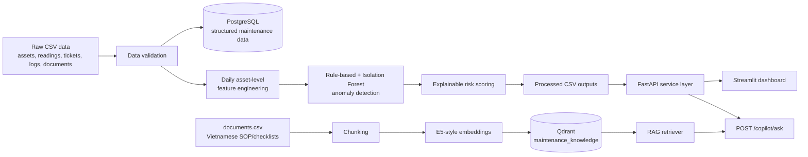
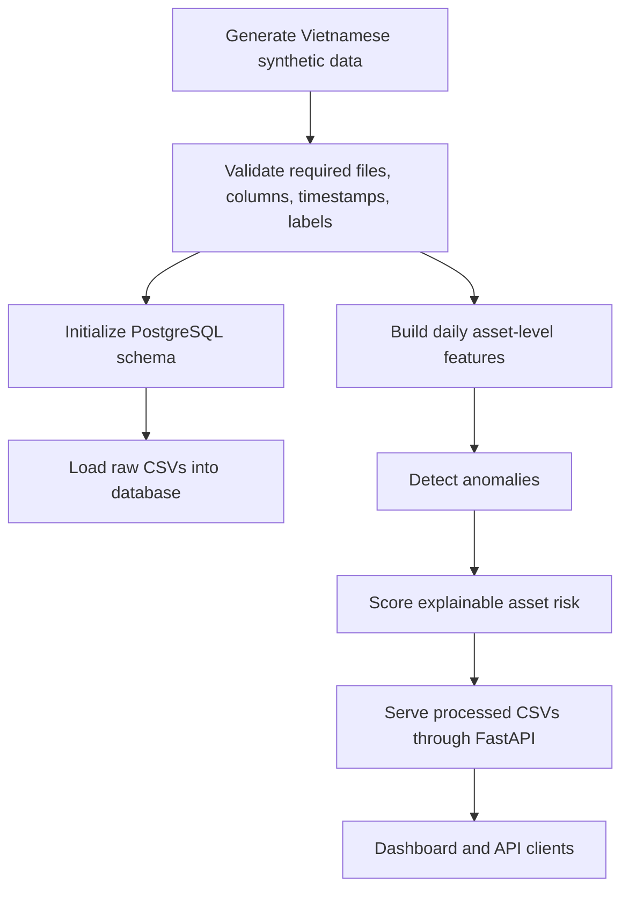
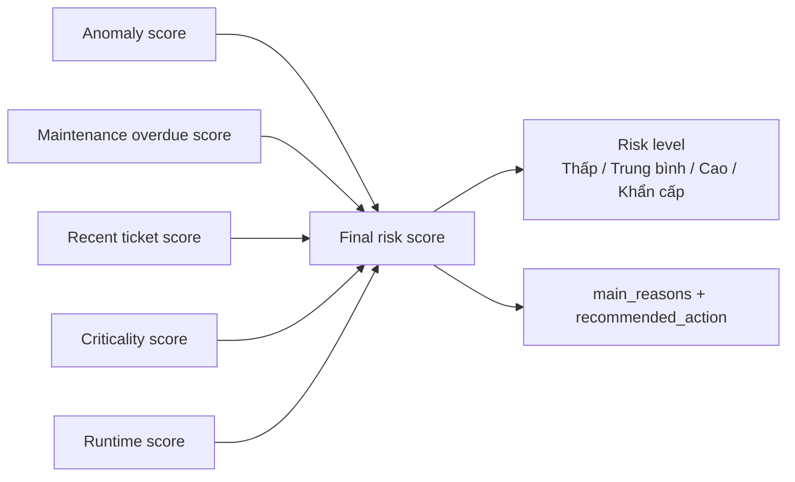
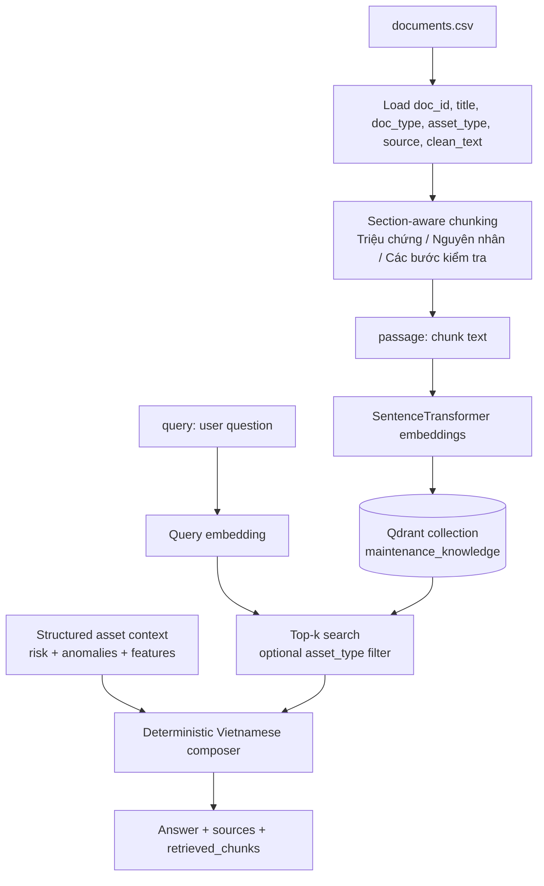

# AI Maintenance Copilot

Vietnamese predictive maintenance intelligence platform that detects asset anomalies, scores equipment risk, and answers technician questions with SOP-grounded RAG recommendations.

## Problem Statement

Facility maintenance teams often have sensor readings, tickets, logs, preventive-maintenance schedules, and SOP documents, but the information is fragmented across systems. A facility manager needs to know which assets are risky today, why they are risky, and what a technician should inspect next. A technician needs the relevant checklist or troubleshooting guidance without searching through documents manually.

AI Maintenance Copilot turns maintenance data into an AI decision-support workflow:

- identify abnormal asset behavior;
- rank equipment by explainable risk;
- surface Vietnamese recommendations for managers and technicians;
- retrieve SOP/checklist context for a grounded maintenance copilot.

## Business Value

- Faster prioritization of high-risk assets before failures become urgent incidents.
- Explainable maintenance recommendations instead of opaque model scores.
- Vietnamese user-facing labels, reasons, and guidance for local facility teams.
- API-first design so dashboards, CMMS integrations, and future copilots can reuse the same intelligence layer.
- Portfolio-ready example of applied data engineering, ML, FastAPI, Streamlit, and RAG in one end-to-end product.

## Decision-Support Layer, Not CMMS Replacement

This project does not replace CMMS/S-Maintain systems. A CMMS remains the source of record for assets, work orders, technician assignment, inventory, approvals, and compliance history.

AI Maintenance Copilot is an AI layer on top of those systems. It reads operational data, generates risk intelligence, explains why an asset needs attention, and helps technicians retrieve SOP/checklist context. In production, it would integrate with a CMMS rather than own the full maintenance workflow.

## End-to-End User Story

1. A facility manager opens the Streamlit dashboard.
2. The overview shows current asset count, anomaly count, high-risk count, urgent-risk count, latest processed date, and average risk score.
3. The manager opens the top-risk table and selects the riskiest asset.
4. The asset detail view explains the risk drivers and Vietnamese recommended action.
5. The manager or technician opens the Maintenance Copilot tab.
6. They ask: `Vì sao GENERATOR_002 đang rủi ro cao?`
7. The copilot combines structured asset risk/anomaly context with retrieved SOP/checklist chunks from Qdrant.
8. The answer lists grounded next actions and shows the source documents behind the recommendation.

## Architecture Overview



## Tech Stack

- Python 3.11+
- pandas, NumPy
- scikit-learn Isolation Forest
- FastAPI and Uvicorn
- Streamlit
- PostgreSQL with SQLAlchemy
- Qdrant vector database
- sentence-transformers with `intfloat/multilingual-e5-small` for optional local embeddings
- Pydantic and pydantic-settings
- pytest and Ruff
- Docker Compose for local PostgreSQL/Qdrant services

## Data Sources

Synthetic data is generated for a Vietnamese facility maintenance scenario:

- `data/raw/assets.csv`
- `data/raw/sensor_readings.csv`
- `data/raw/maintenance_tickets.csv`
- `data/raw/maintenance_logs.csv`
- `data/raw/risk_scores.csv`
- `data/raw/documents.csv`

Processed intelligence outputs:

- `data/processed/asset_daily_features.csv`
- `data/processed/anomaly_results.csv`
- `data/processed/risk_scores.csv`

Default generated dataset:

- 100 facility assets
- 60 days of hourly sensor readings
- about 144,000 sensor reading rows
- 6,000 daily asset-level feature/risk rows
- Vietnamese SOP/checklist/troubleshooting documents for RAG

## Vietnamese Synthetic Data Design

The codebase keeps Python modules, column names, table names, and API field names in English for maintainability. User-facing business values remain Vietnamese.

Examples:

- `asset_type`: `Máy lạnh`, `Máy bơm nước`, `Thang máy`, `Máy phát điện dự phòng`, `Hệ thống chiếu sáng`, `Tủ điện`, `Bồn nước`, `Hệ thống báo cháy`
- `priority`: `Thấp`, `Trung bình`, `Cao`, `Khẩn cấp`
- `risk_level`: `Thấp`, `Trung bình`, `Cao`, `Khẩn cấp`
- `anomaly_type`: `Tăng điện năng bất thường`, `Độ rung tăng bất thường`, `Thời gian vận hành bất thường`, `Nhiệt độ cao bất thường`

Injected anomaly patterns include HVAC energy spikes, pump vibration increases, repeated elevator issues, overdue generator maintenance, and abnormal lighting runtime.

## Database Design

PostgreSQL stores structured maintenance data using SQLAlchemy models:

- `assets`: asset identity, type, location, floor, criticality, installation date, maintenance cadence, status.
- `sensor_readings`: hourly readings for energy, temperature, vibration, runtime, pressure, status, and anomaly label.
- `maintenance_tickets`: ticket priority, status, issue description, technician note, failure type, created/resolved timestamps.
- `maintenance_logs`: maintenance type, technician, actions taken, parts replaced, notes, next maintenance date.
- `risk_scores`: risk components, final score, level, explanation, and recommended action.
- `documents`: SOP/checklist/troubleshooting source text for RAG.

The current API intentionally reads stable processed CSV outputs through a service layer, keeping the serving path simple while the data science pipeline evolves.

## Data Pipeline



## Feature Engineering

The feature builder writes `data/processed/asset_daily_features.csv` with daily asset-level signals:

- daily energy, temperature, vibration, runtime, and pressure aggregates;
- 7-day rolling energy, temperature, and vibration baselines;
- energy, temperature, vibration, and runtime deltas;
- days since last maintenance and days overdue;
- 7-day and 30-day ticket counts;
- high-priority ticket counts;
- asset age and criticality score.

## Anomaly Detection

The anomaly detector writes `data/processed/anomaly_results.csv`.

It combines:

- rule-based detection for interpretable maintenance patterns;
- Isolation Forest for multivariate outlier scoring.

Rule examples:

- energy spike when `energy_delta_percent >= 50`;
- vibration increase above threshold;
- runtime abnormality when `runtime_delta_percent >= 40`;
- high temperature above threshold.

Final anomaly score:

```text
anomaly_score = 70% rule_based_score + 30% isolation_forest_score
```

Outputs include Vietnamese `anomaly_type` and `anomaly_reasons`, so operators can understand what changed.

## Risk Scoring

The risk scorer writes `data/processed/risk_scores.csv`.



Formula:

```text
final_risk_score =
  35% anomaly_score
+ 20% maintenance_overdue_score
+ 20% recent_ticket_score
+ 15% criticality_score
+ 10% runtime_score
```

Risk levels:

- `0-30`: `Thấp`
- `31-60`: `Trung bình`
- `61-80`: `Cao`
- `81-100`: `Khẩn cấp`

The result is not a claim that failure will definitely occur. It is a prioritization score for maintenance decision support.

## FastAPI Backend

The FastAPI layer exposes processed maintenance intelligence to dashboards and integrations.

Endpoints:

- `GET /health`
- `GET /summary`
- `GET /assets/risk`
- `GET /assets/risk/top`
- `GET /assets/risk/{asset_id}`
- `GET /assets/anomalies`
- `GET /assets/anomalies/{asset_id}`
- `GET /assets/{asset_id}/context`
- `POST /copilot/ask`

Example calls:

```bash
curl http://localhost:8000/health
curl http://localhost:8000/summary
curl "http://localhost:8000/assets/risk/top?limit=5"
curl "http://localhost:8000/assets/anomalies?only_anomalies=true&limit=10"
curl http://localhost:8000/assets/GENERATOR_002/context
```

Copilot request:

```bash
curl -X POST http://localhost:8000/copilot/ask \
  -H "Content-Type: application/json" \
  -d '{"question":"Vì sao GENERATOR_002 đang rủi ro cao?","asset_id":"GENERATOR_002","top_k":5}'
```

Example `/summary` response:

```json
{
  "total_assets": 100,
  "total_records": 6000,
  "high_risk_count": 12,
  "urgent_risk_count": 3,
  "anomaly_count": 8,
  "latest_date": "2026-06-30",
  "average_risk_score": 42.7
}
```

## Streamlit Dashboard

The dashboard consumes FastAPI endpoints instead of reading processed CSV files directly.

Pages:

- `Overview`: summary metrics, top 10 risky assets, risk-level distribution.
- `Asset Risk Monitoring`: filters by `risk_level`, `asset_type`, `location`, and `limit`; selected asset detail and risk trend.
- `Anomaly Monitoring`: filters by `anomaly_type`, `asset_type`, `only_anomalies`, and `limit`; anomaly tables and simple charts.
- `Asset Context`: latest risk row, recent anomalies, recent feature records, and latest recommendation.
- `Demo Story`: guided manager-to-technician walkthrough.
- `Maintenance Copilot`: question input, optional `asset_id`, `top_k`, answer, sources, and retrieved chunks.

## RAG Maintenance Copilot

The RAG copilot answers Vietnamese technician/manager questions without paid APIs. It uses local embeddings when installed and a deterministic answer composer.



Workflow:

1. Load `data/raw/documents.csv`.
2. Chunk `clean_text` using Vietnamese section markers when present.
3. Embed document chunks with E5-style `passage:` prefix.
4. Upsert chunks into Qdrant collection `maintenance_knowledge`.
5. Embed user question with E5-style `query:` prefix.
6. Retrieve top-k chunks, optionally filtered by inferred `asset_type`.
7. Load structured asset context if `asset_id` is provided.
8. Compose a deterministic Vietnamese answer with sources and no hallucinated claims.

Example Copilot questions:

- `Vì sao GENERATOR_002 đang rủi ro cao?`
- `Máy phát điện dự phòng cần kiểm tra gì trước?`
- `Theo SOP, nếu máy lạnh tiêu thụ điện tăng bất thường thì xử lý thế nào?`
- `Tóm tắt các dấu hiệu bất thường gần đây của thiết bị này.`
- `Kỹ thuật viên nên làm gì tiếp theo?`

## Setup

Install the standard development environment:

```bash
python -m venv .venv
source .venv/bin/activate
python -m pip install -e ".[dev]"
```

For RAG indexing/query with the default multilingual embedding model:

```bash
python -m pip install -e ".[dev,rag]"
```

Windows PowerShell:

```powershell
python -m venv .venv
.\.venv\Scripts\Activate.ps1
python -m pip install -e ".[dev,rag]"
```

Start local infrastructure:

```bash
make services-up
```

## Full Demo Commands

Run the full local data and intelligence pipeline:

```bash
make services-up
make generate-data
make init-db
make load-data
make build-features
make detect-anomalies
make score-risk
make index-documents
```

Run the API:

```bash
make run-api
```

Run the dashboard in a second terminal:

```bash
make run-dashboard
```

Ask the copilot from the CLI:

```bash
make rag-query QUESTION="Vì sao GENERATOR_002 đang rủi ro cao?" ASSET_ID=GENERATOR_002
```

Useful Makefile commands:

```bash
make install
make services-up
make services-down
make generate-data
make init-db
make load-data
make build-features
make detect-anomalies
make score-risk
make index-documents
make rag-query QUESTION="Vì sao GENERATOR_002 đang rủi ro cao?" ASSET_ID=GENERATOR_002
make run-api
make run-dashboard
make test
make lint
```

## Evaluation And Tests

The repository includes automated coverage for:

- synthetic data generation;
- ingestion validation;
- database loading;
- feature engineering;
- anomaly detection;
- risk scoring;
- FastAPI health and route behavior;
- dashboard API client helpers;
- RAG document loading, chunking, retrieval structure, vector store behavior, copilot answer shape;
- `/copilot/ask` endpoint shape.

Verification:

```bash
python -m pytest
python -m ruff check .
```

Latest local verification: pytest passes and Ruff passes.

## Limitations

- The data is synthetic and designed for demo realism, not production model validation.
- The API reads processed CSV outputs rather than querying PostgreSQL directly.
- Risk scoring is an explainable prioritization heuristic, not a calibrated failure-probability model.
- The RAG composer is deterministic/extractive and does not use an LLM.
- `sentence-transformers` and the embedding model must be installed/downloaded for real document indexing.
- Qdrant must be running and documents must be indexed before copilot retrieval is useful.
- No authentication, authorization, observability, scheduling, or production deployment hardening is included in this MVP.

## Future Improvements

- Replace or augment the deterministic composer with an LLM while keeping citations and source grounding.
- Add RAG retrieval over maintenance tickets, technician notes, and incident history.
- Add evaluation datasets for retrieval quality, answer faithfulness, and recommendation usefulness.
- Move API serving from processed CSVs to database-backed query services.
- Add model persistence, drift monitoring, and scheduled pipeline execution.
- Add authentication, role-based access, audit logging, and production observability.
- Add richer dashboard trend charts and technician feedback capture.
- Integrate with a real CMMS/S-Maintain instance.

## CV Bullets

- Built an AI Maintenance Copilot that analyzes Vietnamese facility maintenance data to detect anomalies, score equipment risk, and generate SOP-grounded troubleshooting recommendations.
- Engineered daily asset-level features across 100 synthetic assets and 60 days of hourly readings, including rolling energy trends, ticket frequency, maintenance overdue days, and criticality scores.
- Implemented rule-based and Isolation Forest anomaly detection, producing explainable Vietnamese anomaly reasons for facility assets.
- Designed an explainable risk scoring engine combining anomaly score, maintenance overdue status, recent tickets, asset criticality, and runtime behavior.
- Developed a CSV-backed FastAPI service and Streamlit dashboard for risk monitoring, anomaly review, asset context inspection, and copilot interaction.
- Integrated Qdrant-based RAG retrieval over Vietnamese SOP/checklist documents to provide source-grounded technician recommendations.
- Added automated pytest/Ruff validation across data generation, ingestion, feature engineering, anomaly detection, risk scoring, API routes, dashboard helpers, and RAG components.

## Repository Layout

```text
src/config/           Application settings and Vietnamese value mappings
src/database/         SQLAlchemy models, session helpers, and schema init
src/data_generation/  Deterministic Vietnamese synthetic facility data
src/ingestion/        CSV validation and database loading
src/features/         Daily asset-level feature engineering
src/models/           Rule-based + Isolation Forest anomaly detection
src/risk/             Explainable risk scoring
src/rag/              Document loading, chunking, embeddings, Qdrant retrieval, copilot answers
src/api/              FastAPI application and schemas
src/dashboard/        Streamlit dashboard and API client
tests/                Pytest suite
docs/                 Architecture, demo, interview, CV, and troubleshooting notes
data/raw/             Generated raw demo data
data/processed/       Generated processed intelligence outputs
```

## Supporting Docs

- [Demo script](docs/demo_script.md)
- [Interview notes](docs/interview_notes.md)
- [CV bullets](docs/cv_bullets.md)
- [Troubleshooting](docs/troubleshooting.md)
- [Architecture notes](docs/architecture.md)
