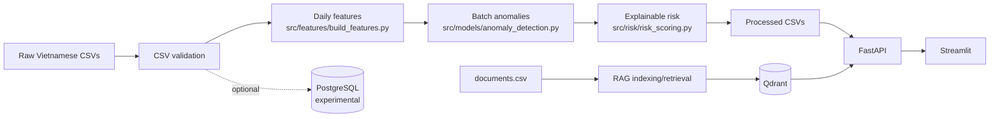

# AI Maintenance Copilot

Nền tảng decision-support cho bảo trì thiết bị, sử dụng Vietnamese synthetic data, batch anomaly detection, explainable risk scoring và RAG retrieval trên SOP/checklist.

> Trạng thái: portfolio MVP đang được hoàn thiện. Repository không được mô tả là production-ready và không thay thế CMMS/S-Maintain.

## Bài Toán

Facility Manager và technician thường phải tổng hợp thủ công thông tin từ asset register, ticket, maintenance log, operational readings và tài liệu hướng dẫn. AI Maintenance Copilot tạo một luồng thống nhất để:

- nhận diện asset có tín hiệu bất thường;
- xếp hạng thiết bị theo explainable risk score;
- giải thích nguyên nhân và hành động tham khảo bằng tiếng Việt;
- tìm SOP/checklist phù hợp và hiển thị nguồn cho technician.

Hệ thống là lớp hỗ trợ quyết định. Manager và technician chịu trách nhiệm xác minh dữ liệu, đánh giá điều kiện an toàn và đưa ra quyết định cuối cùng.

## Revised MVP Scope

MVP tập trung vào:

- thông tin asset cơ bản;
- ticket và maintenance history;
- preventive maintenance tracking;
- operational data theo batch;
- anomaly detection và risk prioritization;
- recurring issue analysis và maintenance KPI ở mức mô tả;
- RAG retrieval cho SOP/checklist.

Không thuộc phạm vi:

- spare-parts inventory;
- QR code;
- resident hoặc technician mobile app;
- vendor/contract management;
- complex approval workflow;
- real-time IoT streaming;
- enterprise authentication/authorization;
- automatic production work-order creation;
- exact failure-time prediction.

Chi tiết và tiêu chí thành công: [docs/mvp_scope.md](docs/mvp_scope.md).

## Current Features Và Future Work

Đã có implementation:

- deterministic Vietnamese synthetic data;
- CSV validation;
- daily asset-level feature engineering;
- rule-based signals kết hợp Isolation Forest scoring;
- explainable risk scoring và top risky assets;
- CSV-backed FastAPI;
- Streamlit risk/anomaly dashboard;
- Qdrant-based SOP/checklist retrieval;
- deterministic Maintenance Copilot response kèm sources.

Thuộc target MVP nhưng chưa được triển khai đầy đủ:

- API/dashboard views cho asset master, tickets và maintenance logs;
- upcoming maintenance view;
- recurring issue report;
- maintenance-process KPI dashboard;
- explicit `maintenance_result` field;
- SOP/checklist coverage cho toàn bộ asset types.

Các mục chưa hoàn thiện được xem là future milestones, không phải current capabilities.

## Canonical Architecture

Primary architecture là **CSV-first** và **batch-first**.



Canonical analytics implementations:

| Stage | Module | Output |
|---|---|---|
| Feature engineering | `src/features/build_features.py` | `data/processed/asset_daily_features.csv` |
| Anomaly detection | `src/models/anomaly_detection.py` | `data/processed/anomaly_results.csv` |
| Risk scoring | `src/risk/risk_scoring.py` | `data/processed/risk_scores.csv` |

FastAPI đọc processed CSV qua service layer. Streamlit gọi FastAPI và không đọc CSV trực tiếp.

PostgreSQL được giữ như optional/experimental structured-storage path. Nó không cần thiết để chạy main data pipeline, API, dashboard hoặc non-RAG pages. Xem [docs/architecture.md](docs/architecture.md).

## End-to-End User Story

1. Manager mở dashboard và xem maintenance risk summary.
2. Manager chọn top risky asset.
3. Hệ thống hiển thị risk reasons, recent anomalies và recommended action.
4. Technician kiểm tra thiết bị theo quy định an toàn và tham khảo SOP/checklist từ Copilot.
5. Technician ghi nhận action và maintenance result trong hệ thống nguồn.
6. Batch pipeline tiếp theo cập nhật features, anomalies và risk ranking.

Quy trình nghiệp vụ chi tiết: [docs/business_process.md](docs/business_process.md).

## Data Sources

Raw synthetic CSVs:

- `data/raw/assets.csv`
- `data/raw/sensor_readings.csv`
- `data/raw/maintenance_tickets.csv`
- `data/raw/maintenance_logs.csv`
- `data/raw/risk_scores.csv` (legacy generated snapshot, không phải canonical processed risk)
- `data/raw/documents.csv`

Canonical processed outputs:

- `data/processed/asset_daily_features.csv`
- `data/processed/anomaly_results.csv`
- `data/processed/risk_scores.csv`

Default generation hiện tạo 100 assets và 60 ngày hourly readings. Đây là synthetic demo data, không phải production dataset hoặc bằng chứng model accuracy.

Minimum field definitions: [docs/data_contract.md](docs/data_contract.md).

## Vietnamese Data Design

Code, module, column và API field dùng tiếng Anh. Business values và nội dung hiển thị cho user dùng tiếng Việt.

Ví dụ:

- `asset_type`: `Máy lạnh`, `Máy bơm nước`, `Thang máy`, `Máy phát điện dự phòng`;
- `priority`: `Thấp`, `Trung bình`, `Cao`, `Khẩn cấp`;
- `risk_level`: `Thấp`, `Trung bình`, `Cao`, `Khẩn cấp`;
- `anomaly_type`: `Tăng điện năng bất thường`, `Độ rung tăng bất thường`.

## Feature Engineering

`src/features/build_features.py` tổng hợp daily asset-level features:

- energy, temperature, vibration, runtime và pressure aggregates;
- rolling 7-day baselines và delta signals;
- days since maintenance và days overdue;
- ticket counts trong 7/30 ngày;
- high-priority ticket counts;
- asset age và criticality score.

`pressure` hiện được giữ để tương thích với dataset cũ nhưng không phải minimum field của revised MVP.

## Anomaly Detection

`src/models/anomaly_detection.py` là implementation canonical. Nó kết hợp:

- rule-based signals để giải thích các pattern đã biết;
- Isolation Forest để bổ sung relative outlier score trong cùng asset type.

```text
anomaly_score = 70% rule_based_score + 30% isolation_forest_score
```

Trong implementation hiện tại, rule signals có vai trò chính trong quyết định `is_anomaly`; Isolation Forest chủ yếu điều chỉnh score và explanation. Đây là batch retrospective scoring, không phải real-time alerting.

## Risk Scoring

`src/risk/risk_scoring.py` là implementation canonical.

```text
final_risk_score =
  35% anomaly_score
+ 20% maintenance_overdue_score
+ 20% recent_ticket_score
+ 15% criticality_score
+ 10% runtime_score
```

Risk levels:

- `0-30`: `Thấp`
- `31-60`: `Trung bình`
- `61-80`: `Cao`
- `81-100`: `Khẩn cấp`

Risk score là heuristic prioritization score. Nó không phải calibrated failure probability và không dự đoán exact failure time.

## FastAPI Contract

Existing API contract được giữ nguyên trong Milestone 1:

- `GET /health`
- `GET /summary`
- `GET /assets/risk`
- `GET /assets/risk/top`
- `GET /assets/risk/{asset_id}`
- `GET /assets/anomalies`
- `GET /assets/anomalies/{asset_id}`
- `GET /assets/{asset_id}/context`
- `POST /copilot/ask`

Ví dụ:

```bash
curl http://localhost:8000/health
curl http://localhost:8000/summary
curl "http://localhost:8000/assets/risk/top?limit=5"
curl http://localhost:8000/assets/GENERATOR_002/context
```

Copilot request:

```bash
curl -X POST http://localhost:8000/copilot/ask \
  -H "Content-Type: application/json" \
  -d '{"question":"Vì sao GENERATOR_002 đang rủi ro cao?","asset_id":"GENERATOR_002","top_k":5}'
```

## Streamlit Dashboard

Current dashboard pages:

- `Overview`
- `Asset Risk Monitoring`
- `Anomaly Monitoring`
- `Asset Context`
- `Demo Story`
- `Maintenance Copilot`

Dashboard lấy dữ liệu qua `API_BASE_URL`, mặc định `http://localhost:8000`.

## RAG Maintenance Copilot

Current RAG workflow:

1. Đọc `data/raw/documents.csv`.
2. Chunk `clean_text` và giữ source metadata.
3. Tạo local sentence-transformers embeddings với E5-style prefixes.
4. Upsert vào Qdrant collection `maintenance_knowledge`.
5. Retrieve top-k chunks, có thể filter theo `asset_type`.
6. Kết hợp tài liệu với structured asset context.
7. Tạo deterministic Vietnamese response và trả về sources.

Copilot không sử dụng paid API và hiện không có generative LLM. Manager/technician phải xác minh recommendation trước khi hành động.

## Setup

Yêu cầu: Python 3.11+.

Linux/macOS:

```bash
python -m venv .venv
source .venv/bin/activate
python -m pip install -e ".[dev,rag]"
```

Windows PowerShell:

```powershell
python -m venv .venv
.\.venv\Scripts\Activate.ps1
python -m pip install -e ".[dev,rag]"
```

## Main Portfolio Demo

### 1. Chạy CSV Batch Pipeline

PostgreSQL không cần cho các command này:

```bash
make generate-data
make build-features
make detect-anomalies
make score-risk
```

### 2. Khởi Động Qdrant Và Index Documents

Qdrant chỉ cần cho Maintenance Copilot:

```bash
docker compose up -d qdrant
make index-documents
```

### 3. Chạy FastAPI

```bash
make run-api
```

Mở `http://localhost:8000/docs`.

### 4. Chạy Streamlit

Trong terminal thứ hai:

```bash
make run-dashboard
```

### 5. Demo Copilot

```bash
make rag-query QUESTION="Vì sao GENERATOR_002 đang rủi ro cao?" ASSET_ID=GENERATOR_002
```

Demo walkthrough đầy đủ: [docs/demo_script.md](docs/demo_script.md).

## Optional PostgreSQL Experiment

PostgreSQL không nằm trong primary runtime path. Chỉ chạy các bước sau khi muốn thử SQLAlchemy schema và raw CSV loading:

```bash
docker compose up -d postgres
make init-db
make load-data
```

Database path hiện không cấp dữ liệu cho FastAPI hoặc Streamlit.

## Verification

```bash
python -m pytest
python -m ruff check .
```

Test suite bao phủ data generation, validation, optional database loading, feature engineering, anomaly detection, risk scoring, API, dashboard client helpers và RAG components. Test hiện tại chưa chứng minh production readiness, model accuracy hoặc end-to-end live Qdrant/PostgreSQL behavior.

## Limitations

- Synthetic data chưa được kiểm chứng bằng maintenance history thực tế.
- Preventive timeline trong generated data cần được làm chặt ở milestone sau.
- API hiện phục vụ processed CSV, không có scheduler hoặc cache invalidation strategy cho production.
- Isolation Forest và risk formula chưa được đánh giá trên labeled failure outcomes.
- Copilot retrieval quality chưa có evaluation dataset hoặc relevance threshold.
- Một số target MVP views vẫn là future work.
- Không có production auth, audit logging, observability hoặc deployment hardening.

## Legacy Modules

Repository tạm thời giữ các duplicate/compatibility modules để tránh xóa code trước cleanup milestone. Không mở rộng các module sau:

- `src/models/anomaly.py`
- `src/risk/scoring.py`
- `src/ingestion/documents.py`
- `src/ingestion/tickets.py`
- `src/data_generation/sample_data.py`
- root `app.py`

Danh sách đầy đủ và canonical replacement nằm trong [docs/architecture.md](docs/architecture.md).

## Repository Layout

```text
src/config/           Settings và Vietnamese value mappings
src/data_generation/  Synthetic maintenance data
src/ingestion/        CSV validation; optional database loading
src/database/         Optional/experimental SQLAlchemy path
src/features/         Canonical daily feature pipeline
src/models/           Canonical anomaly pipeline và legacy wrapper
src/risk/             Canonical risk pipeline và legacy helper
src/rag/              Document retrieval và Copilot composition
src/api/              CSV-backed FastAPI
src/dashboard/        Streamlit app và API client
tests/                Automated tests
docs/                 Scope, architecture, process, contracts và demo docs
```

## Supporting Documentation

- [MVP scope](docs/mvp_scope.md)
- [Business process](docs/business_process.md)
- [Data contract](docs/data_contract.md)
- [Canonical architecture](docs/architecture.md)
- [Demo script](docs/demo_script.md)
- [Interview notes](docs/interview_notes.md)
- [Troubleshooting](docs/troubleshooting.md)
- [CV bullets](docs/cv_bullets.md)
