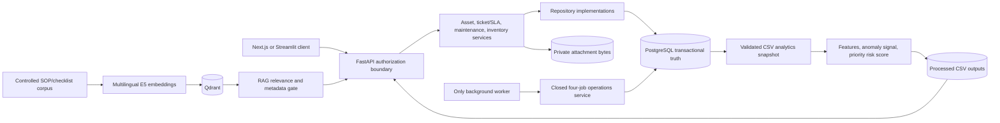
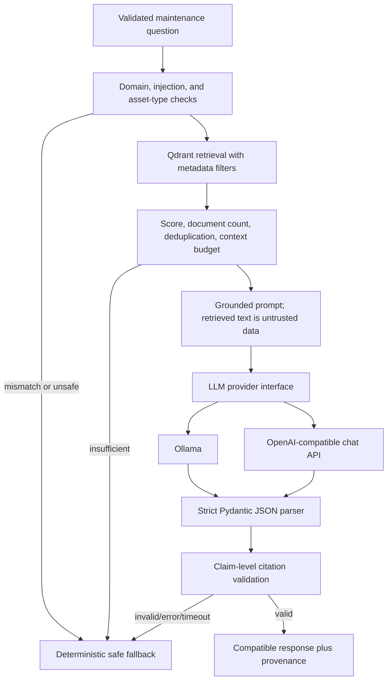

# Project Audit And Implementation Plan

Audit date: 2026-07-28<br>
Repository state: `feat/pm9-pilot-deployment-rehearsal` with pre-existing uncommitted PM9 work preserved<br>
Product boundary: internal-pilot maintenance decision support, not an autonomous controller or a complete CMMS

## Executive Summary

The repository already contains a substantial and unusually well-bounded maintenance platform. PostgreSQL is the transactional source of truth, FastAPI is the authorization boundary, Alembic owns schema evolution, Qdrant is isolated to document retrieval, analytics remain batch-first, and the single PostgreSQL-backed worker accepts only the four scheduled operations in the closed PM7 catalog. The baseline is clean: 308 Python tests passed, 73 PostgreSQL-dependent tests were skipped because an isolated test database was not configured, Ruff passed, all 112 frontend tests passed, frontend lint/type checking/build passed, Docker Compose configuration was valid, and Alembic reported one head.

The title claim “using RAG and LLM” was not technically complete at the audit baseline. Retrieval, relevance gating, metadata filtering, source display, and deterministic Vietnamese fallback behavior were real, but `src/rag/copilot.py` never called a generative model. It extracted source sentences and composed a fixed Markdown answer. The most important implementation work is therefore a provider-independent LLM boundary, structured output validation, prompt/context isolation, citation validation, provider failure handling, explicit answer provenance, and end-to-end tests.

The codebase is suitable for continued development and a controlled local demo at baseline. It is not yet suitable for an accurate RAG-and-LLM graduation claim, company handover without additional documentation, or production. The implementation order below closes the graduation-critical gap without disturbing the mature transactional domains.

## Repository And Architecture Inspected

The audit covered the tracked repository structure plus current untracked PM9 files, including:

- root configuration, environment templates, Make targets, Dockerfiles, Compose files, Alembic configuration, release/deployment manifests, and existing architecture/operations documentation;
- all backend packages under `src/`, their public classes/functions, route registrations, service/repository factories, and security-sensitive patterns;
- all eight linear Alembic revisions and the SQLAlchemy model/constraint inventory;
- all Python tests and their skip conditions;
- all Next.js application routes, components, hooks, API clients, Zod schemas, tests, configuration, lockfile, and container build;
- the raw document corpus, RAG loader/chunker/embedder/vector-store/retriever/index/query/Copilot path, and RAG tests;
- the canonical feature, anomaly, risk, dashboard, ingestion, seed, snapshot, maintenance, ticket/SLA, inventory, operations/outbox, security, reliability, and attachment paths;
- the installed Next.js 16 client-component and Vitest guidance before frontend changes.

## Current Architecture



The target addition is `RAG -> grounded prompt -> provider abstraction -> structured parser -> citation validator -> compatible API response`, with the current deterministic composer retained as a safe fallback.

## Feature Inventory

Implemented product areas include:

- authenticated asset catalog, lifecycle, operational status, hierarchy, QR lookup, attachments, and audit history;
- legacy ticket compatibility plus the rich ticket lifecycle, intake, priority matrix, comments, SLA policies/calendars, pauses, reopen occurrences, and escalation;
- preventive plans, bounded recurrence, immutable checklist versions/snapshots, work orders, completion, independent verification, maintenance logs, and evidence;
- spare-part master data, stock positions, thresholds, requirements, reservations, issues, consumptions, returns, atomic transfers, append-only movements, and idempotency;
- in-app notifications, durable jobs, leases, retries, dead letters, transactional outbox, delivery attempts, heartbeat, operational metrics, and rehearsals;
- validated synthetic data, PostgreSQL import/export, batch feature engineering, combined rule/Isolation Forest anomaly support, priority risk scoring, preventive/recurring/KPI reports;
- multilingual E5 embeddings, stable chunk IDs, Qdrant upsert/search, metadata filters, relevance thresholds, deterministic RAG responses, citations, and safe fallbacks;
- Next.js authenticated workspaces and a legacy Streamlit API client.

## What Is Implemented Correctly

### Transactional And Domain Boundaries

- Routes depend on services and do not select storage or mutate SQLAlchemy entities directly.
- PostgreSQL remains primary; unavailable PostgreSQL does not silently fall back to mutable CSV.
- Startup checks storage but does not create or migrate tables.
- Alembic has one linear head (`20260726_0008`).
- Named lifecycle actions, optimistic versions, row locks, unique constraints, idempotency keys, append-only histories, and same-transaction audit/outbox writes are present in the canonical services/repositories.
- Ticket resolution remains separate from work-order completion/verification.
- Inventory preserves `available = on_hand - reserved` and explicit reserve/issue/consume/return semantics.
- The worker and event catalogs are closed and durable; no arbitrary scheduler or executable workflow surface was found.

### Identity And Security

- Argon2 password hashing, generic authentication failures, refresh-token hashing and rotation, revocation checks, CSRF binding for cookie mutations, explicit CORS/trusted hosts, and production configuration validation are implemented.
- Frontend access tokens are held in module memory; no `localStorage` or `sessionStorage` token use was found.
- FastAPI permissions are canonical; the frontend consumes returned permission codes rather than defining a second role matrix.
- Attachment type/signature/extension/size/checksum/path controls and authenticated download boundaries are documented and tested.
- Audit/outbox payload filters exclude credential and reporter-contact fields.

### Analytics And RAG

- Rolling feature calculations avoid obvious same-row leakage where prior-window values are required.
- Isolation Forest uses a fixed random seed; missing numeric data has explicit handling.
- UI/docs describe anomaly and risk as support/priority signals rather than automatic diagnoses.
- E5 `query:`/`passage:` prefixes are correct for the configured embedding family.
- Chunk IDs and Qdrant point IDs are deterministic; upserts are idempotent for unchanged chunks.
- Collection creation is non-destructive by default and rejects dimension mismatch.
- Asset/document/failure metadata filters and relevance thresholds exist.
- Low-relevance, empty, and unavailable retrieval already produce safe responses without raw infrastructure details.

### Frontend

- A single typed API client owns authentication refresh, timeouts, safe errors, request validation, and response validation.
- Copilot answers are rendered as text, not executable HTML.
- Loading, empty, error, fallback, retry, accessibility, and responsive patterns are present across the main workspaces.
- Baseline lint, TypeScript, Vitest, and production build are clean.

## Critical Issues

### C-1: No Generative LLM Stage

`src/rag/copilot.py` explicitly composes a deterministic answer and does not call any LLM. The project therefore has real RAG but not the requested grounded RAG-plus-LLM flow. This is the only graduation-title-critical implementation gap.

Planned correction: add provider-neutral LLM models/interfaces, Ollama and OpenAI-compatible HTTP providers, grounded prompt construction, strict JSON parsing, citation validation, safe retry/error handling, configuration, API provenance fields, frontend states, and tests.

### C-2: Asset Context Can Be Mixed Across Types

When a selected asset is HVAC but the question explicitly mentions a pump, the current filter uses the question type while the prompt/answer context still contains the selected HVAC asset. That can produce incompatible evidence and asset facts.

Planned correction: reject the request before retrieval with an explicit Vietnamese mismatch warning and a typed status. Add the five requested inference/match/mismatch tests.

## High-Priority Issues

### H-1: No Citation Validation For Generated Text

The current deterministic path controls its own source list, but a generative stage would be able to invent identifiers unless generation is schema-constrained and every cited identifier is checked against the exact prompt context.

Planned correction: use response-local source IDs, require citations for the summary and every technical claim/recommendation, reject unknown IDs, compute the returned citation union server-side, and fall back on severe validation failure.

### H-2: Prompt Injection Controls Are Missing

Retrieved text is currently treated as content, but no generative prompt exists and therefore there is no explicit untrusted-data isolation or injection screening.

Planned correction: isolate serialized source records under a system policy, label them untrusted, screen user/context instructions that attempt to override policy or exfiltrate secrets, and never put retrieved content in the system-instruction role.

### H-3: LLM/RAG Configuration And Failure Semantics Are Absent

There are no provider/model/base URL/key/timeout/temperature/token/context settings, no provider-specific error mapping, no bounded transient retry, and no response field that distinguishes generated output from deterministic fallback.

Planned correction: add validated settings and environment templates; default LLM generation to disabled so existing deployments remain safe; expose additive `response_mode`, `fallback_reason`, evidence, provider, structured answer, and citation-validation fields.

### H-4: Frontend Timeout Is Shorter Than A Local LLM Call — Resolved

The shared API client defaults to 10 seconds. A cold local Ollama call may legitimately take longer, so the browser can abort while the backend is still generating.

Resolution: the Copilot-specific timeout is 75 seconds, covering the default two-attempt backend envelope plus validation. The live Docker/Ollama workflow completed within the configured 240-second E2E client bound. Operators who increase backend timeout/retry maxima must align their ingress/client timeout too.

### H-5: PostgreSQL Integration Evidence Is Not Active In This Environment — Resolved

The baseline skipped 73 tests because `TEST_DATABASE_URL` was absent. Runtime verification later created an isolated database ending `_test`, ran base-to-head migration, and passed all 73 PostgreSQL tests plus the 420-test full suite with zero skips.

Recommended correction: provision an isolated PostgreSQL test database, run `alembic upgrade head` against it, then execute `pytest -m postgres` and the full suite. Never point these tests at the demo/developer database.

## Medium-Priority Issues

### M-1: Oversized Modules Increase Change Risk

Several files combine thousands of lines: `postgres_inventory.py`, `database/models.py`, `pilot_contract.py`, `load_harness.py`, `postgres_operations.py`, and major service/frontend workspace files. Their responsibilities are generally coherent, but navigation, ownership, and review cost are high.

Recommendation: split only along stable bounded-context or read/write/serialization boundaries in future milestones. Do not perform a mechanical repository-wide split during the LLM change.

### M-2: Knowledge-Base Administration Is CLI-Only

Indexing is explicit and safe, but there is no persisted document administration model, active/inactive/superseded lifecycle, upload status, or admin UI. The CSV corpus remains the source contract.

Recommendation: retain a production-quality CLI for this milestone. A future admin workflow requires a transactional metadata design, authorization, storage reuse, lifecycle/version rules, and a migration; adding it now would destabilize the core.

### M-3: In-Process Rate Limiting Is Single-Instance

Login limiting is intentionally process-local and Copilot has no dedicated request limiter. This is acceptable only within the documented single-instance internal-pilot boundary.

Implemented: Copilot now has a bounded per-authenticated-user limiter for the single-instance demo. Gateway/shared limiting remains required before horizontally scaled or internet-facing deployment.

### M-4: Main Compose File Is Infrastructure-Oriented

The main Compose file now builds migration/API/frontend and starts worker through its explicit profile. PostgreSQL and Qdrant remain persistent prerequisites; the pilot Compose file still owns the stricter rehearsal topology.

Implemented and verified: the documented worker profile, host Ollama connectivity, isolated Compose project, Qdrant readiness dependency, and five-service health path passed locally.

### M-5: No Reproducible RAG/LLM Evaluation Harness

The corpus and unit tests exist, but Recall@K, MRR, no-answer behavior, citation validity/coverage, unsupported-claim rate, and mode comparison are not computed by a reusable evaluation command.

Implemented: the JSONL dataset and deterministic/configured-Qdrant/RAG-LLM modes report retrieval, answer, call, evidence, citation, alias, safety, escalation, and fallback results with explicit small-dataset limitations.

## Low-Priority Improvements

- Consolidate duplicate high-level architecture files after the pre-existing root `ARCHITECTURE.md` and `REFACTOR_PLAN.md` work is reviewed by the owner.
- Add a CI workflow once the owner selects the supported Python/Node/PostgreSQL matrix and secret strategy.
- Add browser E2E coverage for the full login-to-Copilot demo; current frontend coverage is component/API-boundary focused.
- Add managed observability, retention policies, malware scanning, and multi-instance controls only if the product boundary is expanded beyond an internal pilot.

## Security Findings

No committed real credential was identified by the bounded pattern scan; `.env` was intentionally excluded from output and remains ignored. No dynamic code execution, arbitrary job definitions, permissive CORS wildcard, token browser persistence, or production `metadata.create_all()` use was found.

The new LLM boundary must treat both questions and retrieved documents as untrusted, avoid logging question/context/API keys, validate provider URLs, use bounded timeouts and response sizes, reject malformed JSON/invalid citations, and expose only fixed public-safe error categories. Provider calls are outbound-only decision-support calls and must never perform tools, SQL, shell, workflow, or business mutations.

## Data-Integrity Findings

The schema and services include the important uniqueness, foreign-key, check, version, row-lock, and append-only controls described by the business documentation. The migration chain is linear. No schema change is needed for LLM integration because generation is request-scoped decision support; adding a database table would create unnecessary persistence and privacy scope.

Database-integrity behavior was re-executed on the dedicated `_test` database: 73 focused PostgreSQL tests and the final 420-test suite passed without skips. This is local synthetic evidence, not production data certification.

## RAG Findings

The existing corpus has controlled Vietnamese SOP/checklist content and stable metadata. Chunking preserves known headings, bounds chunk size/overlap, and produces content-derived stable IDs. Indexing uses deterministic Qdrant IDs and non-destructive collection creation by default. Retrieval correctly passes asset/document/failure filters and uses separate thresholds for deterministic test embeddings and semantic embeddings.

Remaining KB weaknesses are document lifecycle status and a persisted ingestion registry. Bounded serialized context assembly, question/asset/document injection screening, stable response-local aliases, and generated citation validation are implemented and exercised against live Qdrant/Ollama.

## LLM Findings

At baseline there is no `src/llm` package, provider configuration, provider call, structured generation model, prompt builder, output parser, citation validator, provider smoke command, or LLM evaluation. The deterministic formatter is safe and useful and must remain as the fallback rather than being removed.

## Frontend Findings

The Copilot workspace already carries stable asset/ticket IDs, uses typed Zod boundaries, renders source metadata separately, avoids calibrated-probability language, retains questions on transport failure, prevents duplicate submissions, and escapes backend text. It currently labels all successful retrieval responses similarly and cannot distinguish AI-generated content, deterministic fallback, provider failure, mismatch, or citation/evidence status. These are additive UI changes; no route redesign is needed.

## Backend Findings

The backend has clear route/service/repository boundaries and domain-specific exceptions. Provider/prompt/parser/citation responsibilities now live under `src/llm`; deterministic response rendering/serialization is separated in `src/rag/copilot_response.py`; the canonical Copilot service retains scope, retrieval, grounding gates, and orchestration.

## Database Findings

- Eight ordered revisions, one head.
- PostgreSQL-only migration guard.
- Startup performs health checks and fails closed; it does not migrate or create tables.
- No LLM schema change is justified.
- Clean online base-to-head upgrade was executed on `maintenance_runtime_test`, including the historical QR backfill; `alembic check` found no drift.

## Testing Findings

Baseline commands and results:

| Command | Result |
|---|---|
| `.venv\\Scripts\\python.exe -m pytest` | 308 passed, 73 skipped, 0 failed |
| `.venv\\Scripts\\python.exe -m ruff check .` | passed |
| `python -m compileall -q src tests` | passed |
| `.venv\\Scripts\\python.exe -m alembic heads` | one head |
| `npm run lint` | passed |
| `npm run typecheck` | passed |
| `npm test` | 112 passed, 0 failed |
| `npm run build` | passed, 32 routes generated/compiled |
| `docker compose config --quiet` | passed |

The system Python lacks pytest/Ruff/Alembic; the project virtual environment is the verified interpreter. One upstream FastAPI/Starlette `httpx` deprecation warning is present and is not a repository failure.

## Deployment Findings

Containers pin major runtime images and use non-root API/worker/frontend users. PostgreSQL and Qdrant use persistent volumes and meaningful health gates. An isolated full-stack project passed with zero restarts, but the 9.16 GB Python/RAG image took 170.5 seconds to unpack from cache on Docker Desktop. Pilot validation remains stricter than development Compose. Ollama remains optional and environment-selected; external providers still require protected secret injection.

## Recommended Target Architecture



## Implementation Order

1. Preserve baseline and existing PM9 changes.
2. Add strict LLM models/errors/provider protocol.
3. Add Ollama and OpenAI-compatible providers plus validated settings/factory.
4. Add prompt builder, context budget/injection isolation, parser, and citation validator.
5. Integrate into `MaintenanceCopilot` with mismatch detection and deterministic fallback.
6. Extend API and frontend contracts additively; fix Copilot timeout and provenance states.
7. Add unit/integration-boundary tests for success, disabled, timeout, unavailable, malformed output, invalid citations, injection, evidence, and mismatch.
8. Add evaluation assets and provider smoke instructions.
9. Update architecture, security, design, demo, handover, README, environment, Docker, and changelog documentation.
10. Re-run targeted and full verification and update this audit with final evidence.

## Remaining Known Limitations

The following limitations are intentional unless later implementation changes them:

- no autonomous diagnosis, action, ticket transition, work-order transition, or stock mutation from LLM output;
- no exact failure-time prediction or calibrated failure probability;
- no multi-tenancy, SSO/MFA, managed secrets, centralized observability, external notifications, or high availability;
- local attachment storage and no malware scanner;
- small synthetic/document corpus, so evaluation results demonstrate plumbing and safety behavior rather than scientific generalization;
- no semantic unsupported-claim verifier beyond constrained output, source coverage, and deterministic citation validation;
- KB administration remains explicit CLI/CSV indexing for this milestone;
- local PostgreSQL/Qdrant/Ollama/Compose runtime paths are verified, but production readiness still requires intended-host, organizational, recovery, security, and dependency evidence.

## Final Implementation Outcome

The two critical baseline findings are implemented:

- a real provider call now exists between grounded retrieval and validated response, with Ollama and OpenAI-compatible adapters selected by environment;
- selected asset/question asset type mismatch is rejected before retrieval.

The high-priority controls are also implemented: strict structured output, untrusted-context prompt construction, user/document injection screening, bounded provider calls/retries/context, exact response-local citation validation, transparent generation/fallback provenance, frontend evidence states, Copilot rate limiting, evaluation tooling, and environment/Compose/handover documentation.

The deterministic response path was preserved and extracted with source serialization into `src/rag/copilot_response.py`; retrieval/scope orchestration remains in `src/rag/copilot.py`. No PostgreSQL schema change was needed.

### Final Readiness Assessment

| Level | Conclusion |
|---|---|
| Development | Suitable; complete service-independent suite is clean |
| Local demo | Suitable; PostgreSQL, Qdrant, Ollama, worker, API, and frontend were exercised together on the isolated runtime project |
| Graduation defense | Suitable for a controlled local rehearsal; repeat the documented short preflight on the defense machine |
| Company engineering handover | Suitable with the handover/runbooks and explicit unresolved gates |
| Production | Not suitable; external security/operations/data/recovery/dependency gates remain |

### Final Verification Evidence

| Command | Result |
|---|---|
| `.venv\\Scripts\\python.exe -m compileall -q src tests evaluation` | passed |
| `.venv\\Scripts\\python.exe -m ruff check .` | passed |
| Changed-file `ruff format --check` | passed; all 40 changed or newly added Python files are formatted |
| Full-repository `ruff format --check .` | not clean; 67 pre-existing files outside this change set would be reformatted |
| `.venv\\Scripts\\python.exe -m pytest` with isolated PostgreSQL | 420 passed, 0 skipped, 0 failed |
| Focused PostgreSQL integration | 73 passed, 0 skipped, 0 failed |
| Focused LLM/RAG hardening/evaluation/E2E safety | 38 passed, 0 failed |
| `npm run lint` | passed |
| `npm run typecheck` | passed |
| `npm test` | 115 passed, 0 failed |
| `npm run build` | passed; 32 Next.js routes |
| `python -m alembic heads` | one head: `20260726_0008` |
| Main and pilot `docker compose ... config --quiet` | passed |
| Live configured-Qdrant evaluation | Recall@1 0.833, Recall@3/5 1.0, MRR 0.917, 2/2 no-answer cases matched |
| Real Ollama smoke and RAG+LLM | passed with `qwen2.5-coder:7b`; accepted grounded responses for HVAC, pump, and generator |
| Full Compose runtime | five services healthy, migration exit 0, all restart counts 0 |
| Authenticated graduation smoke | passed multi-role ticket/Copilot/inventory/work-order/audit/worker flow in 140 seconds |
| `python -m pip check` | no broken requirements |
| `git diff --check` | passed |

### Verification Limitations And Failures

- Full-repository formatting remains incremental: `python -m ruff format --check .` reports 67 pre-existing migration, backend, and test files outside this change set. All 40 Python files changed or added by this work pass the formatter. A repository-wide cosmetic rewrite was intentionally not mixed into the runtime change set.
- The first combined Compose build timed out after 20 minutes. Separate builds passed and showed 170.5 seconds spent unpacking the cached 9.16 GB Python/RAG image; `compose up --no-build` then brought the complete stack healthy. This remains a workstation/build-size performance limitation.
- Browser-DOM automation is not installed. The added live E2E runner verifies real frontend routes and the complete authenticated API workflow without mocks or stored authentication state.
- Alembic offline `--sql` remains unsupported at historical data-dependent revision `20260718_0003`; the canonical online base-to-head migration, including that QR backfill, passed on the isolated `_test` database.
- Frontend dependency audit: Next was upgraded from 16.2.10 to current stable 16.2.12 and safe audit fixes were applied. `npm audit --omit=dev` still reports three high advisories in Next's pinned PostCSS/Sharp tree; its forced fix proposes an unsafe downgrade to Next 9.3.3. This remains a deployment blocker to track against the next patched stable release.

Full command output and live service evidence are recorded in [Runtime verification](RUNTIME_VERIFICATION.md).

### Reproduction Commands

After starting Docker Desktop/PostgreSQL and confirming `.env` still points to a dedicated `_test` database:

```powershell
$line = Get-Content .env | Where-Object { $_ -match '^TEST_DATABASE_URL=' } | Select-Object -Last 1
$env:TEST_DATABASE_URL = $line.Substring('TEST_DATABASE_URL='.Length).Trim()
python -m src.database.create_test_database
python -m pytest
```

For containers:

```powershell
docker compose build api frontend
docker compose up --build
```

For a real local Ollama provider after setting the documented environment values:

```powershell
ollama serve
ollama pull <MODEL_NAME>
python -m src.llm.smoke
python -m evaluation.run_evaluation --backend configured-qdrant --mode rag-llm
```
