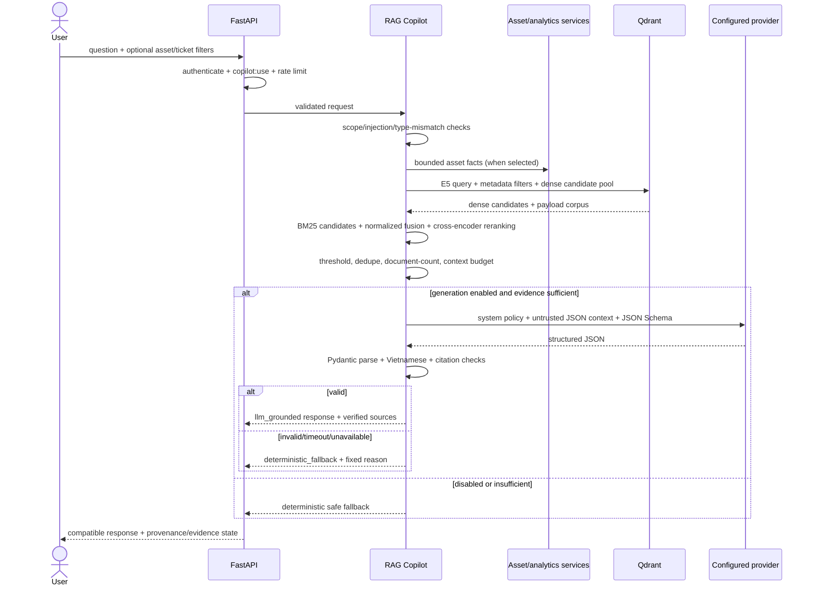

# RAG And Grounded LLM Design

## Purpose And Product Boundary

Maintenance Copilot answers focused HVAC, pump, and generator maintenance questions from the controlled SOP/checklist corpus. It supports human troubleshooting and prioritization; it does not diagnose automatically, control equipment, transition tickets/work orders, mutate inventory, or predict an exact failure time.

The generated answer is optional. Retrieval and deterministic fallback remain available when generation is disabled or fails.

## End-To-End Flow



## Components

| Responsibility | Canonical module |
|---|---|
| Document load and metadata normalization | `src/rag/document_loader.py` |
| Heading-aware stable chunking | `src/rag/chunking.py` |
| E5 embedding prefixes/provider | `src/rag/embeddings.py` |
| Qdrant collection, idempotent upsert, filters | `src/rag/vector_store.py` |
| Retrieval protocol and relevance threshold | `src/rag/retriever.py` |
| Bounded in-memory BM25 index | `src/rag/sparse_search.py` |
| Normalized fusion and metadata prior | `src/rag/hybrid_retriever.py` |
| Cross-encoder boundary and CPU fallback | `src/rag/reranking.py` |
| Scope, intent, equipment, failure, and unsafe-action analysis | `src/rag/query_analysis.py` |
| Scope, mismatch, retrieval, fallback orchestration | `src/rag/copilot.py` |
| Compatible response rendering and source serialization | `src/rag/copilot_response.py` |
| Provider-neutral request/result/errors | `src/llm/base.py` |
| Strict answer schema | `src/llm/models.py` |
| Grounded prompt/context budget | `src/llm/prompt_builder.py` |
| Injection screening | `src/llm/prompt_security.py` |
| Provider selection | `src/llm/provider_factory.py` |
| Ollama adapter | `src/llm/providers/ollama.py` |
| OpenAI-compatible adapter | `src/llm/providers/openai_compatible.py` |
| Local schema/language validation | `src/llm/output_parser.py` |
| Claim-level source validation | `src/llm/citation_validator.py` |

## Provider Contract

`LLMProvider.generate()` receives a provider-neutral request containing:

- one system policy;
- one user prompt containing bounded JSON data;
- the Pydantic-derived JSON Schema;
- bounded temperature and output token values.

It returns raw content plus the configured provider/model identifiers. Business logic does not import provider-specific response shapes.

Ollama calls its non-streaming chat API and passes the JSON Schema in `format`. The OpenAI-compatible adapter calls the configured Chat Completions API root and uses strict `response_format.json_schema`. Both calls use the same local parser afterward; provider-side structured output is not trusted by itself.

Provider HTTP behavior is bounded:

- no redirects;
- default 30-second timeout, maximum 120 seconds by settings validation;
- maximum 2 MiB response;
- default one retry, maximum two, only for timeout/transport/transient HTTP status;
- no raw provider body or connection detail in public errors/logs.

## Structured Answer

The LLM must return:

- `summary` and `summary_source_ids`;
- `possible_causes[]` with text and source IDs;
- `recommended_checks[]` with text and source IDs;
- `safety_warnings[]` with text and source IDs;
- `escalation_required`;
- union `source_ids`;
- `confidence`: `low`, `medium`, or `high` evidence strength, not a probability;
- `insufficient_evidence`.

Unknown fields are forbidden. Lengths and list sizes are bounded. A normal grounded answer requires at least one cited check. `insufficient_evidence=true` requires escalation and cannot claim high confidence.

## Prompt And Context Policy

The system policy requires Vietnamese output, source-only claims, possible-versus-confirmed distinction, ordered checks, source-derived safety warnings, escalation when evidence is weak, and no hidden prompt/config disclosure.

Retrieved chunks are serialized inside `retrieved_context` in the user message. They never enter the system role. Each chunk receives a response-local alias (`S1`, `S2`, …). The prompt contains only bounded allow-listed asset/risk/anomaly fields; reporter contact, attachment path/body, authentication data, inventory ledger, comments, tokens, and credentials are excluded.

Whole chunks are selected in retrieval order until the character budget is reached. The builder does not silently truncate a procedure mid-chunk. Duplicate chunk IDs are removed.

Follow-up requests may include only `conversation_context`: recent intent, resolved asset/failure type, previous local source IDs, and a maximum 600-character prior-answer summary. Raw chat history and arbitrary fields are rejected. Previous context is used only for an explicit follow-up reference, is screened as untrusted data, and never overrides a newly named equipment type.

## Hallucination And Citation Controls

The implementation layers controls rather than claiming hallucinations are impossible:

1. Maintenance-domain and focused-asset scope gate.
2. Selected asset/question type consistency gate.
3. Prompt-injection screening for question and chunks.
4. Qdrant metadata filter and relevance threshold.
5. Minimum distinct-document count.
6. Context budget and source deduplication.
7. Provider-side JSON Schema when supported.
8. Strict local Pydantic parsing and Vietnamese maintenance-language check.
9. Claim-level citation coverage.
10. Exact alias allow-list validation.
11. Deterministic fallback for every failure category.

Citation validity means the identifier exists in the exact prompt context, every structured claim has at least one identifier, the top-level set equals the claim union, and each claim has a minimum lexical overlap with its cited text. Lexical support rejects obvious mismatches; it does not prove semantic entailment or technical correctness, which remains a human/evaluation responsibility.

## Hybrid Score Contract

Dense cosine scores are mapped to `[0, 1]`. Positive BM25 scores are log-normalized against the current candidate pool. Missing-channel scores are zero; candidates from either channel therefore remain recoverable. The retrieval score uses equal dense/sparse weights by default.

After cross-encoder scoring, the final score is:

```text
final_score =
  0.55 * normalized_retrieval_score
+ 0.40 * normalized_reranker_score
+ 0.05 * bounded_metadata_prior
```

Configuration validation requires each weight group to sum to `1.0` and caps `RAG_METADATA_WEIGHT` at `0.10`. Candidate defaults are 20 dense, 20 sparse, 20 fused/reranked, and 5 returned. The `0.55` relevance threshold is an initial evidence gate, not a diagnostic probability, and must be evaluated against an approved corpus before a pilot.

## Asset-Context Mismatch

Asset types are normalized to the existing Vietnamese business values. Behavior:

| Selected asset | Question inference | Result |
|---|---|---|
| HVAC | pump | `asset_context_mismatch`, no retrieval |
| pump | generator | `asset_context_mismatch`, no retrieval |
| none | pump | retrieve with pump filter |
| HVAC | HVAC | retrieve with HVAC filter |
| none | unknown | `missing_asset_context` |

The system never combines selected asset facts with documents for a different inferred type.

## Safe Fallback Matrix

| Condition | Behavior |
|---|---|
| LLM disabled | deterministic answer from relevant retrieved chunks |
| Provider timeout/unavailable/error | deterministic answer from the same prompt-approved chunks |
| Malformed/non-Vietnamese output | deterministic answer; raw output discarded |
| Invalid citation | deterministic answer; invalid ID never returned as valid |
| LLM reports insufficient evidence | generic escalation fallback; retrieved sources may remain visible |
| Low relevance/empty/minimum documents not met | no technical checklist generated |
| Question injection | reject before asset lookup/retrieval |
| Retrieved injection only | remove unsafe chunks; fallback if none remain |
| Asset mismatch | confirmation warning; no retrieval/generation |
| Outside domain/unsupported type | zero-source scope fallback |

`response_mode` is `llm_grounded` only after all validations pass. Every other response is `deterministic_fallback` with a fixed `fallback_reason`.

## API Compatibility

Existing fields are unchanged: `answer`, `asset_context`, `sources`, `retrieved_chunks`, `retrieval_status`, `relevance_status`, `safety_notice`, and `filters_applied`.

Additive fields are:

- `response_mode`;
- `fallback_reason`;
- `structured_answer`;
- `llm_provider` and `llm_model` (never key/base URL);
- `evidence_status`;
- `citation_validation`;
- `context_warnings`;
- `citation_ids` on displayed documents and `citation_id` on chunks.

The frontend validates all fields with Zod and clearly separates AI-generated response, deterministic fallback, evidence strength, safety, escalation, and sources.

## Configuration

Required only when generation is enabled:

```dotenv
LLM_ENABLED=true
LLM_PROVIDER=ollama
LLM_MODEL=<MODEL_NAME>
LLM_BASE_URL=http://localhost:11434
```

RAG controls are centralized as `RAG_CHUNK_SIZE`, `RAG_CHUNK_OVERLAP`, candidate counts, fusion/final weights, `RAG_RELEVANCE_THRESHOLD`, `RAG_RERANKER_MODEL`, device settings, and the bounded BM25 corpus size. Optional/bounded LLM settings are `LLM_API_KEY`, `LLM_TIMEOUT_SECONDS`, `LLM_TEMPERATURE`, `LLM_MAX_TOKENS`, `LLM_MAX_RETRIES`, `LLM_MAX_CONTEXT_CHARS`, and `LLM_MIN_RELEVANT_DOCUMENTS`.

`python -m src.llm.smoke` checks provider reachability and structured output without using maintenance/user data.

## Knowledge-Base Administration Decision

The current corpus remains an explicit CSV/CLI contract. `python -m src.rag.index_documents` validates every row, chunks, embeds, creates/checks the collection, creates server-side keyword payload indexes, and upserts only added/updated stable point IDs. It is non-destructive by default. `--replace` deletes only reported obsolete points after successful validation/upsert; `--recreate` is an explicit destructive operator command. Indexing never occurs during API startup.

Future KB administration should add persisted document status (`active`, `inactive`, `superseded`), version/effective dates, immutable source checksums, operator audit, and active-only retrieval before adding UI.

## Current Limitations

- Six synthetic/illustrative documents only.
- Lexical citation support is only an inconsistency guard; there is no semantic entailment proof or calibrated confidence.
- BM25 is intentionally in-memory and capped at `RAG_SPARSE_MAX_CHUNKS`; a larger approved corpus requires a managed sparse backend design.
- No persisted KB lifecycle registry/admin UI.
- Injection screening is conservative pattern detection, not a complete defense.
- Provider privacy/residency and local-model supply chain are deployment responsibilities.
- Generation is synchronous and bounded; no streaming is introduced.
- No LLM output is persisted as a business record or automatically executed.
