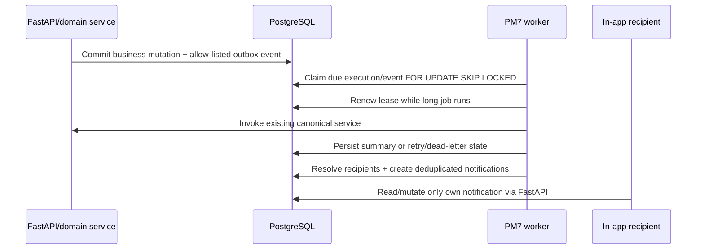
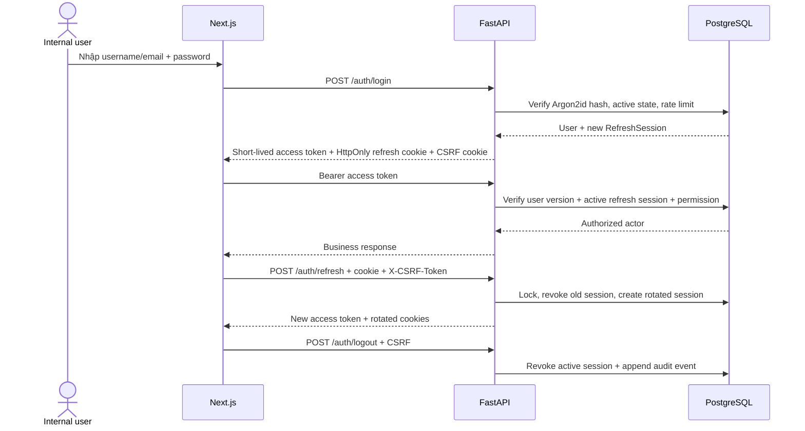
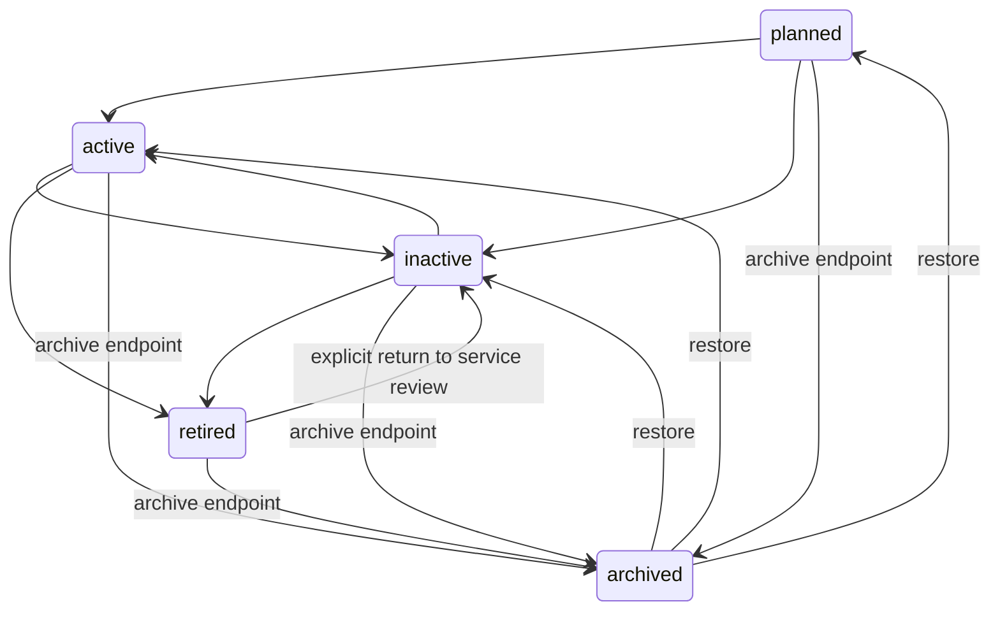
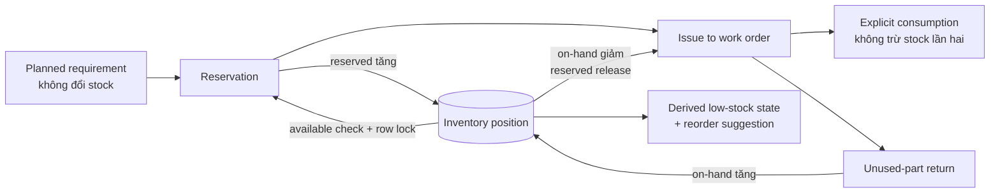
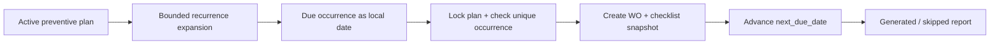
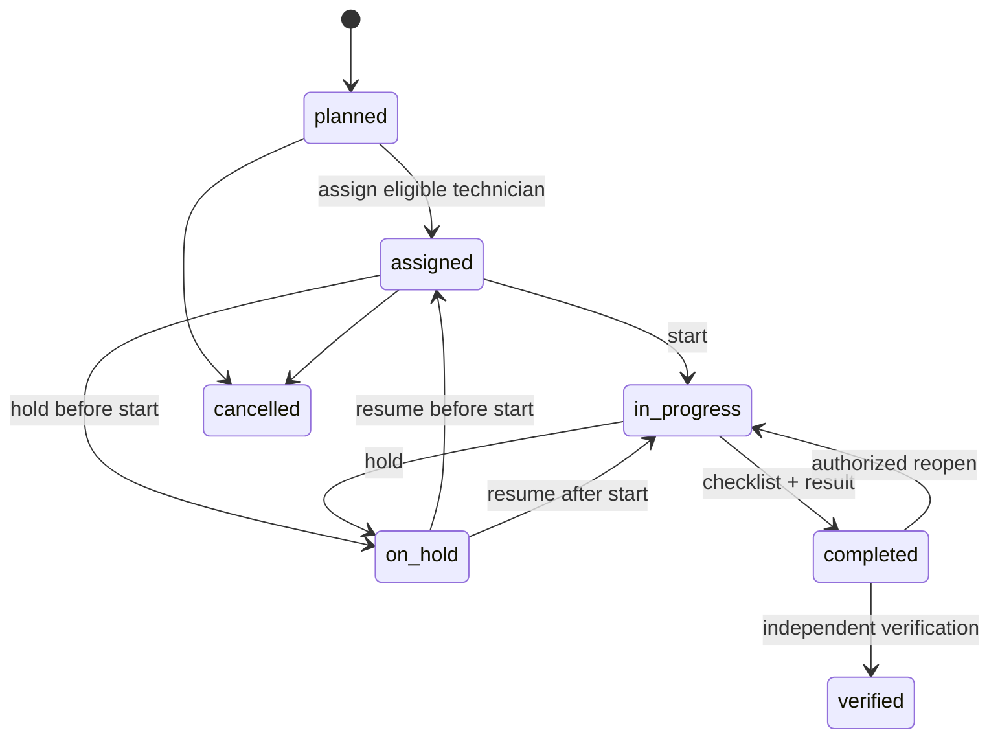

# Kiến Trúc Canonical Cho Internal Pilot

## Architecture Decision

PostgreSQL là runtime transactional source of truth cho asset, hierarchical location, attachment metadata, rich ticket/SLA history, preventive maintenance plan, checklist template, standalone work order, maintenance log, spare-part inventory, user identity, refresh session, audit log, scheduled job, outbox event và in-app notification. FastAPI vẫn là serving và authorization boundary duy nhất. Product Milestone 7 bổ sung một worker độc lập, PostgreSQL-backed; legacy API, PM1-PM6 domain behavior, analytics formulas và RAG behavior vẫn được giữ.

Analytics vẫn **batch-first**. CSV không còn là mutable runtime source of truth; nó giữ bốn vai trò rõ ràng:

- tạo Vietnamese synthetic data;
- seed/import và canonical demo reset;
- snapshot từ PostgreSQL sang input contract của batch analytics;
- lưu processed feature, anomaly, risk, preventive, recurring issue và KPI outputs.

Qdrant chỉ lưu vector chunks cho RAG retrieval. PM7 tạo nền tảng vận hành cho internal pilot, chưa phải production-ready architecture.

## Modular monolith decomposition

The public `src/api/routes.py` import remains a compatibility facade. The
system/readiness, analytics, and Copilot endpoint families now live in focused
routers under `src/api/routers/`, while the facade preserves the existing
dependency override and function import seams used by tests and internal
callers. `src/application/copilot_factory.py` is the shared outer composition
root; `src/api/composition.py` remains a compatibility import.

RAG does not import `src.api.services`. It consumes the narrow
`AssetContextProvider` port in `src/rag/adapters/asset_context.py`; the API
composition root supplies `ProcessedDataAssetContextAdapter`. The adapter
exposes only bounded read context and recent ticket enrichment, so RAG remains
independent of FastAPI transport and transactional mutation code. The RAG
application pipeline is implemented by request-analysis, retrieval/evidence,
and generation/citation collaborators under `src/rag/application/`.

Frontend feature entrypoints live under `frontend/src/features/` for inventory,
work-order parts, ticket detail, and SLA administration. The old component
paths remain re-export facades. Inventory catalogue read operations also have a
dedicated application collaborator at
`src/inventory_management/application/catalogue_service.py`; stock-changing
operations remain in the canonical service so their transaction boundaries are
not fragmented. The current Next.js compatibility entrypoints similarly split
inventory operation forms, mutation hooks, Copilot response rendering, and
PM7 operations tables into feature-owned modules without changing request
payloads, query keys, or visible states.

## System Map

```mermaid
flowchart LR
    Seed[Canonical synthetic CSV seed<br/>27 assets, 42 tickets, 86 logs]
    Migration[Alembic migrations]
    Import[Validated idempotent import]
    DB[(PostgreSQL<br/>business state + identity + audit<br/>jobs + outbox + notifications)]
    Files[(Private local attachment bytes)]
    Repo[Repository interfaces<br/>PostgreSQL implementation]
    Service[Business services<br/>asset + ticket/SLA + maintenance + inventory]
    Ops[Operations service<br/>closed job + event catalogs]
    Worker[Independent PM7 worker<br/>bounded polling + leases]
    API[FastAPI<br/>unchanged contracts]
    Streamlit[Streamlit legacy health client]
    Next[Next.js authenticated frontend]

    Seed --> Import
    Migration --> DB
    Import --> DB
    DB <--> Repo
    Files <--> Service
    Repo <--> Service
    Service <--> API
    API -->|public health only| Streamlit
    API <--> Next
    CLI[Explicit domain and operator CLI] --> Service
    CLI --> Ops
    Worker <--> Ops
    Ops <--> DB
    Service -->|business state + outbox<br/>same transaction| DB
    Worker -->|invoke existing services only| Service
    Worker -->|create in-app notifications| DB
    Service -->|deterministic generation| WO[Plan occurrence -> work order]
    Next -->|opaque authenticated lookup| QR[Mobile web QR route]

    DB --> Snapshot[Validated analytics snapshot]
    Seed -->|sensor readings + documents| Snapshot
    Snapshot --> Features[Canonical feature pipeline]
    Features --> Anomaly[Canonical anomaly pipeline]
    Anomaly --> Risk[Canonical risk pipeline]
    Risk --> Reports[Preventive, recurring, KPI snapshots]
    Features --> Processed[(Processed CSV analytics)]
    Anomaly --> Processed
    Risk --> Processed
    Reports --> Processed
    Processed --> Service

    Docs[6 Vietnamese SOP/checklist documents]
    Docs --> Embeddings[Local embeddings]
    Embeddings --> Qdrant[(Qdrant)]
    Qdrant --> Copilot[RAG retrieval + relevance gate]
    Service --> Copilot
    Copilot --> LLM[Optional provider-neutral LLM]
    LLM --> Guard[Schema + citation validation]
    Guard --> Copilot
    Copilot --> API

    CsvAdapter[Explicit CSV compatibility adapter]
    CsvAdapter -. tests/demo fixtures only .-> Service
```



## Transactional Path

1. Alembic tạo và version schema; API không gọi `metadata.create_all()`.
2. `src/ingestion/load_data.py` validate full synthetic dataset, tạo deterministic location hierarchy/defaults rồi import assets, tickets và logs trong một transaction.
3. `src/repositories/contracts.py` định nghĩa storage-neutral operations.
4. `src/repositories/postgres/` and the historical repository façades (`postgres_assets.py`, `postgres_tickets.py`, `postgres_maintenance.py`, `postgres_inventory.py`, and `postgres_operations.py`) thực thi từng bounded context, dùng PostgreSQL constraints/sequence/row locks và không được gọi trực tiếp từ routes. Read/query capabilities are composed under the domain subpackages; transaction-sensitive mutations remain owned by the façades.
5. `src/api/services/compatibility.py`, các canonical domain services và `src/operations/service.py` giữ lifecycle, priority/SLA, chronology, recurrence, stock-control, completion, verification và operator rules.
6. FastAPI routes chỉ phụ thuộc service; route không chọn storage backend.
7. API startup kiểm tra PostgreSQL connection và migration tables. Nếu PostgreSQL không sẵn sàng, startup fail rõ ràng và không fallback sang mutable CSV.

`src/repositories/csv.py` cùng `src/api/csv_repository.py` được giữ làm compatibility adapter cho isolated tests và fixtures. Adapter vẫn có atomic file replacement nhưng không phải normal product mode.

### Persistence decomposition checkpoint

SQLAlchemy models are owned by `src/database/models/` and imported through the
compatibility package `src.database.models`; metadata snapshots and Alembic
checks are required to remain identical. PostgreSQL read/query implementations
are composed in `src/repositories/postgres/{inventory,maintenance,tickets,operations}/`.
Inventory catalogue and evidence mutations have real component implementations,
while stock-control, maintenance lifecycle, ticket lifecycle/SLA, and PM7
claim/delivery mutations remain in their original repositories until their full
transaction maps have method-level characterization coverage.

## Background Jobs, Outbox Và Notifications



PM7 có một closed job catalog, không nhận arbitrary code:

| Job key | Default interval | Max attempts | Existing operation reused |
|---|---:|---:|---|
| `preventive_generation` | 3.600 giây | 3 | Canonical preventive generation service |
| `sla_escalation` | 300 giây | 3 | Ticket SLA/escalation service |
| `analytics_refresh` | 86.400 giây | 2 | Snapshot + canonical batch analytics |
| `inventory_reorder_detection` | 900 giây | 3 | Canonical inventory balance/reorder rules |

Các job được seed ở trạng thái disabled. Administrator enable một job bằng optimistic version; actor đó được snapshot làm `run_as_user_id`. Scheduled execution của job disabled không được claim. Manual trigger/retry tạo persisted execution bình thường, cần caller-stable `Idempotency-Key` và không chạy code trong API process.

Worker claim bằng `FOR UPDATE SKIP LOCKED`, áp dụng `forbid_overlap`, bounded batch/polling, lease renewal và expired-lease recovery. Failure dùng exponential backoff có giới hạn; hết `max_attempts` chuyển execution sang `dead_lettered`. Outbox có retry riêng, tối đa 5 attempts, và append-only delivery-attempt history. Operator retry tạo execution mới, không sửa lịch sử dead-letter.

Event catalog chỉ chứa payload fields tối thiểu, giới hạn 16 KiB và từ chối credential, token, reporter contact, storage path hoặc file bytes. Recipient được resolve từ active user, existing role và explicit assignment. Notification chỉ là in-app record; không có email, SMS, push hoặc webhook.

Chi tiết: [Background jobs](background_jobs.md), [Notifications](notifications.md) và [Operations runbook](operations_runbook.md).

## Authentication Và Session Flow



- Password được hash bằng Argon2id; unknown user và wrong password trả cùng generic response.
- Access token là signed HS256 JWT, lifetime mặc định 15 phút, giữ trong frontend memory và không ghi `localStorage`.
- Refresh token là opaque random value trong `HttpOnly` cookie; PostgreSQL chỉ lưu SHA-256 hash. Mỗi refresh rotation thu hồi session cũ.
- CSRF dùng readable bound token cookie + `X-CSRF-Token` cho refresh/logout; refresh cookie có explicit path, `SameSite` và `Secure` policy.
- Mỗi protected request kiểm tra JWT, user active/version và refresh session chưa bị thu hồi, nên deactivate, password change và logout có hiệu lực ngay thay vì chờ access token hết hạn.
- CORS cho phép credentials nhưng chỉ nhận origins explicit; trusted-host middleware từ chối host ngoài allow-list. API docs chỉ bật ở `development` và `test`.

## Permission Model

`src/security/permissions.py` là canonical role/permission source. `/auth/me` và `/users/roles` trả permission codes cho frontend; TypeScript không định nghĩa lại role matrix. Ký hiệu: `Có` là permission được cấp; resource rule vẫn có thể giới hạn record cụ thể.

| Permission | Admin | Property Manager | Chief Engineer | Technician | Helpdesk | Storekeeper |
|---|---|---|---|---|---|---|
| `assets:read` | Có | Có | Có | Có | Có | Có |
| `assets:create` | Có | Không | Có | Không | Không | Không |
| `assets:update` | Có | Có | Có | Không | Không | Không |
| `assets:change_status` | Có | Có | Có | Có | Không | Không |
| `assets:archive` | Có | Có | Không | Không | Không | Không |
| `assets:restore` | Có | Có | Không | Không | Không | Không |
| `locations:read` | Có | Có | Có | Có | Không | Không |
| `locations:create` | Có | Có | Có | Không | Không | Không |
| `locations:update` | Có | Có | Có | Không | Không | Không |
| `locations:archive` | Có | Có | Không | Không | Không | Không |
| `attachments:read` | Có | Có | Có | Có | Không | Không |
| `attachments:create` | Có | Có | Có | Không | Không | Không |
| `attachments:delete` | Có | Có | Có | Không | Không | Không |
| `tickets:read` | Có | Có | Có | Có | Có | Có |
| `tickets:create` | Có | Có | Có | Không | Có | Không |
| `tickets:assign` | Có | Có | Có | Không | Có | Không |
| `tickets:update` | Có | Có | Có | Có | Có | Không |
| `tickets:resolve` | Có | Có | Có | Có | Không | Không |
| `tickets:acknowledge` | Có | Có | Có | Có | Có | Không |
| `tickets:execute` | Có | Có | Có | Có | Không | Không |
| `tickets:close` | Có | Có | Không | Không | Không | Không |
| `tickets:reopen` | Có | Có | Có | Không | Không | Không |
| `tickets:cancel` | Có | Có | Không | Không | Không | Không |
| `ticket_comments:internal` | Có | Có | Có | Có | Có | Không |
| `ticket_comments:requester` | Có | Có | Không | Không | Có | Không |
| `ticket_pii:read` | Có | Có | Không | Không | Có | Không |
| `sla_policies:read` | Có | Có | Có | Không | Có | Không |
| `sla_policies:manage` | Có | Có | Không | Không | Không | Không |
| `escalations:evaluate` | Có | Có | Có | Không | Có | Không |
| `escalations:execute` | Có | Có | Không | Không | Có | Không |
| `maintenance_logs:read` | Có | Có | Có | Có | Không | Không |
| `maintenance_logs:create` | Có | Không | Có | Có | Không | Không |
| `analytics:read` | Có | Có | Có | Không | Không | Không |
| `copilot:use` | Có | Có | Có | Có | Không | Không |
| `users:read` | Có | Không | Không | Không | Không | Không |
| `users:create` | Có | Không | Không | Không | Không | Không |
| `users:update` | Có | Không | Không | Không | Không | Không |
| `audit_logs:read` | Có | Có | Không | Không | Không | Không |

Resource rules thu hẹp matrix: Property Manager chỉ sửa business/location/warranty/maintenance fields và quản lý lifecycle; Chief Engineer sửa technical profile nhưng không archive; Technician chỉ đổi operational status theo transition cho phép và không được đặt `out_of_service`. Technician chỉ thấy/thao tác ticket/work-order inventory được gán bằng user hoặc `technician_id`; reporter PII và comment visibility tiếp tục được lọc theo permission. Helpdesk có thể intake, route, acknowledge, communicate và xem limited part availability nhưng không execute maintenance hoặc stock mutation. Storekeeper quản lý inventory named actions nhưng không complete/verify maintenance hoặc thay ticket lifecycle. Chi tiết: [RBAC matrix](rbac.md). Milestone này không có multi-tenant isolation.

Work-order permissions bổ sung:

| Role | Plan/template | Work order | Generation |
|---|---|---|---|
| Administrator | Toàn bộ | Toàn bộ | Có |
| Property Manager | Read | Read/create/assign/update/verify/cancel/reopen + evidence | Không |
| Chief Engineer | Read/create/update/pause/archive/version | Toàn bộ execution/verification + evidence | Có |
| Technician | Read template | Chỉ assigned WO: read/start/hold/resume/checklist/complete/evidence | Không; không tự verify |
| Helpdesk | Không | Limited read status | Không |
| Storekeeper | Không | Read identity/status | Không |

FastAPI kiểm tra permission trước khi vào service; service tiếp tục kiểm tra technician ownership, asset eligibility và self-verification. Frontend chỉ ẩn/hiện control để hỗ trợ usability, không phải security boundary.

## Threat Model Và Trade-Off

- Mục tiêu là local/internal pilot với user nội bộ, không phải internet-facing identity platform. Hệ thống bảo vệ trước credential guessing cơ bản, stolen database token plaintext, CSRF trên cookie actions, stale/revoked session và client-side privilege hiding bị bypass.
- Mọi môi trường ngoài local phải dùng HTTPS, `Secure=true`, signing secret ngẫu nhiên ít nhất 32 ký tự và secret injection ngoài Git.
- Login limiter hiện in-process theo identifier, không chia sẻ giữa nhiều API instances và không thay thế gateway/WAF throttling.
- HS256 hỗ trợ đúng một previous key trong bounded rotation grace period, nhưng
  chưa chạy real pilot rotation và chưa có managed key store/JWKS, SSO, MFA,
  recovery flow, email verification hoặc centralized session administration.
- Audit table append-only qua application và PostgreSQL trigger, nhưng database administrator vẫn là trust boundary; chưa có external tamper-evident sink hoặc retention policy.
- Không lưu IP address vì chưa cần cho single-building demo và để giảm dữ liệu cá nhân. User agent được giữ có giới hạn để hỗ trợ điều tra session.

## Canonical Database Schema

### Asset

- Primary key: `asset_id`.
- Identity/technical fields: type, category, manufacturer, model, optional normalized unique serial và production year.
- Lifecycle và operational status là hai state độc lập; archive giữ previous state để restore explicit.
- `location_id` tham chiếu hierarchy; legacy `location` leaf name và `installation_date` vẫn được duy trì cho analytics/API compatibility.
- Warranty, ownership, description và maintenance dates thuộc cùng optimistic `version` profile.
- Indexed filters gồm type, location, lifecycle, operational status, manufacturer/model và next-maintenance date.
- Check constraints bảo vệ enum codes, chronology, archive-state completeness, interval và serial normalization.

### Location

- UUID primary key, unique normalized `code`, type, optional self-referencing `parent_id` và archive flag `is_active`.
- Service duyệt ancestor chain để chặn self-parent/cycle; API trả breadcrumb đầy đủ.
- Archive không xóa node hoặc asset được gán. Active child phải được xử lý trước khi archive parent.
- Create/update/archive dùng optimistic `version` và audit actor.

### AssetAttachment

- PostgreSQL chỉ lưu metadata: UUID, asset FK, category, original filename, generated storage key, MIME, byte size, SHA-256 checksum, actor và soft-delete timestamps.
- Bytes nằm sau `AttachmentStorage`; local implementation dùng generated key và atomic replacement trong private root.
- Asset, metadata và audit không bị hard-delete; local byte cleanup failure được trả bằng `storage_cleanup_pending` để không giả vờ đã xóa hoàn toàn.

### Ticket

- Primary key: `ticket_id`, sinh từ PostgreSQL sequence `maintenance_ticket_id_seq`.
- Foreign key `asset_id -> assets.asset_id` với delete restricted.
- Composite unique key `(ticket_id, asset_id)` hỗ trợ relationship constraint từ maintenance log.
- Rich intake có reporter PII, category/subcategory, intake source, impact, urgency, calculated priority, support group và assigned user; role thiếu permission nhận PII đã redact.
- Lifecycle code-level gồm `open`, `assigned`, `in_progress`, `waiting`, `resolved`, `closed`, `cancelled`, `reopened`; chỉ named service actions được phép đổi trạng thái.
- Indexed fields bao phủ asset, status, priority, category, support group, assignee và timestamps.
- Optimistic `version` phát hiện stale update; check constraints bảo vệ code sets và lifecycle chronology.

### Ticket SLA Và Communication

- Category/subcategory, intake source và support group là reference tables có stable codes.
- Business calendar giữ IANA timezone, same-day periods và holidays; policy giữ effective range, pause behavior và một target cho mỗi priority.
- `ticket_sla_states` snapshot policy targets và calendar khi intake để policy update không sửa lịch sử. First-response và resolution state luôn derive từ timestamps/snapshot, không có editable breach flag.
- `ticket_sla_events`, `ticket_comments` và `ticket_escalation_events` là append-only qua PostgreSQL triggers.
- Escalation uniqueness theo ticket/rule/occurrence làm API/CLI/worker retry idempotent; rule code phân biệt first-response và resolution. Domain event không tự đổi ticket status; PM7 outbox consumer chỉ tạo in-app notification theo explicit catalog.
- Chi tiết lifecycle, matrix và clock semantics: [Ticket Operations Và SLA](ticket_operations.md).

### MaintenanceLog

- Primary key: `log_id`, sinh từ `maintenance_log_id_seq`.
- `asset_id` luôn bắt buộc; `ticket_id` nullable cho historical preventive log.
- Composite foreign key `(ticket_id, asset_id)` ngăn log liên kết sai asset.
- Append-only trong current service; không cần optimistic version.
- Check constraints bảo vệ maintenance type/result, follow-up consistency và date chronology.
- Optional unique `work_order_id` cùng composite FK `(work_order_id, asset_id)` cho completion path; legacy/direct logs giữ null.

### PreventiveMaintenancePlan

- UUID primary key, unique `plan_code`, asset FK, optional assignee/template FK và optimistic `version`.
- Controlled interval recurrence với local business dates, explicit IANA timezone, lead/grace period, bounded next/last generated due dates.
- Lifecycle `active/paused/archived`; không hard-delete, archived plan vẫn đọc được cùng generated work orders.
- Partial unique generated occurrence được đặt trên WorkOrder `(preventive_plan_id, due_date)`.

### ChecklistTemplate Và Snapshot

- Template dùng `(code, version_number)` unique; version mới là row mới, version cũ không mutate.
- Template items có deterministic sequence, response type, required/safety flags và coherent numeric bounds.
- Khi tạo work order, item được copy sang `work_order_checklist_items`; execution result, actor và timestamp thuộc snapshot đó.

### WorkOrder

- UUID primary key, unique `work_order_number` từ PostgreSQL sequence và composite `(id, asset_id)` cho log/evidence integrity.
- Optional source plan hoặc ticket; service bắt buộc source asset khớp work-order asset.
- State/timestamps được bảo vệ bằng named constraints và optimistic `version`; overdue chỉ là derived response field.
- Completion, linked maintenance log, verification actor và immutable history nằm trong PostgreSQL; evidence metadata ở `work_order_attachments`, bytes sau `AttachmentStorage`.

### Spare-Part Inventory

- `part_categories`, `units_of_measure`, `spare_parts` và `stock_locations` giữ master data/lifecycle bằng UUID, stable business code, optimistic `version` và UTC timestamps.
- `inventory_positions` có unique `(part_id, stock_location_id)`, non-negative on-hand/reserved checks và `reserved <= on_hand`. Client không write balance trực tiếp.
- `part_reorder_configurations` override thresholds theo part/location; nếu không có override, part-level thresholds được dùng.
- `inventory_operations` giữ idempotency key + request hash cho một named command. Một replay đúng payload trả kết quả đã commit; cùng key khác payload trả conflict.
- `inventory_movements` là ledger append-only. Opening, receipt, issue, return, transfer-in/out và adjustment đều giữ actor, UOM, reference, timestamp, reason, resulting quantities và optional work-order/cost snapshot.
- `work_order_part_requirements`, `stock_reservations`, `work_order_part_issues`, `work_order_part_consumptions` và `work_order_part_returns` là các entity riêng. Reservation events, issues, consumptions và returns có database trigger chặn update/delete.
- `inventory_attachments` chỉ giữ protected metadata/checksum; bytes tái sử dụng `AttachmentStorage`.

### User

- UUID primary key; normalized lowercase `username` là unique, `email` normalized là optional unique.
- `password_hash` chỉ chứa Argon2id encoded hash và không xuất hiện trong API response/audit.
- Stable English `role`, `is_active`, optional one-to-one `technician_id`, UTC timestamps và optimistic `version`.
- Role hoặc active-state change tăng version và thu hồi active refresh sessions.

### RefreshSession

- UUID primary key và foreign key tới user; chỉ lưu hashed opaque token và hashed CSRF binding.
- `created_at`, `expires_at`, `revoked_at`, limited `user_agent`; không lưu plaintext token hoặc IP.
- Refresh rotation dùng row lock và chỉ một concurrent request có thể sử dụng session cũ thành công.

### AuditLog

- UUID primary key; UTC `occurred_at`, nullable actor FK và actor name snapshot.
- `action`, resource, request ID, safe before/after JSON, safe metadata và outcome đều có index phù hợp cho filter/pagination.
- Application không có update/delete API. Migration tạo PostgreSQL trigger từ chối `UPDATE`/`DELETE` để bảo vệ append-only behavior.
- Successful business mutation và audit insert commit/rollback trong cùng transaction. Failed validation/authorization có thể ghi event độc lập với allow-listed metadata, không ghi request body nhạy cảm.

## Enum Strategy

PostgreSQL lưu stable English codes như `in_progress`, `electrical_issue`, `generator` và `critical`. Repository boundary dùng mappings trong `src/config/value_mappings.py` để trả lại Vietnamese display values như `Đang xử lý`, `Lỗi điện`, `Máy phát điện dự phòng` và `Rất quan trọng`.

Không tạo PostgreSQL native enum trong milestone này. String code + named check constraint giúp migration dễ review. Legacy asset/ticket mappings nằm trong `src/config/value_mappings.py`; PM4-PM6 bounded contexts giữ code/label tại canonical domain module tương ứng, gồm `src/inventory_management/domain.py`. API options trả code + Vietnamese label để frontend không duy trì role/business matrix thứ hai. Legacy API vẫn trả Vietnamese values hiện có.

## Asset State Model



- `inactive`, `retired` và `archived` ép operational status thành `out_of_service`; restore khôi phục state an toàn có chủ đích.
- Operational transitions dùng `running`, compatibility state `warning`, `fault`, `under_maintenance`, `out_of_service`. `warning` được giữ để không làm mất business meaning của 27 asset seed và legacy `status`.
- Retired/archived asset không nhận ticket mới. Archive không xóa ticket, log, attachment metadata, analytics reference hoặc audit event.
- Mọi mutation yêu cầu `expected_version`; stale write trả `409` và UI yêu cầu reload thay vì retry mù.

## Attachment Và QR Security

- Upload chỉ chấp nhận PDF, PNG, JPG/JPEG khi extension, claimed MIME và file signature khớp; size mặc định tối đa 10 MB. Executable, empty body, traversal filename và mismatched content bị từ chối.
- Original filename chỉ dùng làm download label. Storage key là random allow-listed path; download luôn qua authenticated FastAPI, có `Content-Disposition: attachment` và `X-Content-Type-Options: nosniff`.
- Download tính lại SHA-256 và fail `503` nếu bytes không khớp metadata. API/audit không trả storage key hoặc local path.
- QR token là deterministic UUID5 theo stable `asset_id`; payload chỉ là `${FRONTEND_BASE_URL}/scan/assets/{opaque-token}`. Token không chứa asset ID, user, credential hoặc auth token và không cấp quyền.
- `/asset-lookup/{token}` vẫn yêu cầu `assets:read`; unknown token trả `404`, archived asset trả `410`. Không có regeneration endpoint vì identity đang deterministic, nên không có regeneration audit event.

## Transaction Boundary

- Ticket creation là một database transaction; sequence bảo đảm generated ID không trùng khi nhiều request chạy đồng thời.
- Asset/location create, update, status, lifecycle và archive/restore commit optimistic state cùng allow-listed audit event trong một transaction.
- Attachment metadata + audit commit cùng transaction. Local object bytes không thể tham gia PostgreSQL transaction; upload xóa bytes nếu DB write thất bại, còn delete báo cleanup pending nếu physical delete thất bại.
- Ticket update đọc optimistic version và rollback khi record đã stale.
- Maintenance-log workflow lock ticket và asset, xác nhận expected versions, insert log và đồng bộ asset maintenance dates trong cùng transaction.
- Transaction ghi log đồng thời cập nhật maintenance dates của asset và concurrency metadata của ticket; ticket status vẫn do con người cập nhật explicit qua `PATCH /tickets/{ticket_id}`.
- Nếu insert, asset update hoặc ticket metadata update lỗi, toàn bộ request rollback; không dùng CSV-style manual rollback trong PostgreSQL implementation.
- Ticket chỉ được resolve sau khi có linked maintenance log. Resolve vẫn là explicit `PATCH /tickets/{ticket_id}` để giữ current frontend workflow và quyết định của technician/manager.
- Mỗi due occurrence generation lock plan row, kiểm tra existing `(plan_id, due_date)`, tạo work order/checklist snapshot/audit và chỉ cập nhật `last_generated_due_date`/`next_due_date` sau khi unit thành công. Concurrent retry trả skipped thay vì tạo duplicate.
- Work-order completion lock WO/checklist, validate mandatory/safety results, tạo đúng một MaintenanceLog và ghi audit trong một transaction. Retry idempotent trả linkage hiện có.
- Work-order verification yêu cầu actor khác người thực hiện, lock WO/asset, ghi verifier/timestamp, đồng bộ `last_maintenance_date` và compatibility `next_maintenance_date`, rồi audit trong một transaction.
- Completing hoặc verifying corrective WO không đổi ticket state. Ticket resolution vẫn là action explicit qua existing ticket service.
- Work-order evidence metadata và audit cùng PostgreSQL transaction; byte store có cùng single-node atomic-file trade-off như asset attachment.
- Reserve lock requirement và inventory position, kiểm tra optimistic version/available, tăng reserved và ghi reservation/event/audit cùng transaction.
- Issue lock work order, position và linked reservation/requirement; giảm on-hand, giải phóng reserved tương ứng, tạo movement/issue/event/audit cùng transaction.
- Consumption chỉ quyết toán quantity đã issue cho assigned technician; không tạo stock movement và không trừ tồn lần hai.
- Return lock issue + destination position, từ chối quantity lớn hơn outstanding, tăng on-hand và ghi return movement cùng transaction.
- Transfer lock hai position theo thứ tự deterministic; transfer-out và transfer-in dùng cùng `transfer_group_id` và commit/rollback cùng nhau.
- Adjustment chỉ qua named service, yêu cầu reason + supporting note và từ chối kết quả on-hand âm hoặc thấp hơn reserved.

## Inventory Stock Semantics



Canonical quantity relationship:

```text
available_quantity = on_hand_quantity - reserved_quantity
```

Reservation là allocation, không phải physical movement. Issue mới giảm on-hand. Consumption xác nhận phần issue đã được lắp/sử dụng và không tạo movement thứ hai. Return chỉ áp dụng cho outstanding issue, tạo movement tăng tồn ở active destination. Work-order completion dùng `warning_only` policy khi còn shortage hoặc unresolved issued stock; nó không tự issue, consume, return hoặc release.

## Preventive Scheduling Semantics



- Supported subset: every N days/weeks/months/years, `N=1..366`; raw RRULE không được nhận.
- Month-end giữ original day anchor và clamp khi tháng ngắn; leap-day clamp 28/02 ở năm không nhuận.
- `local_timezone` phải là IANA zone; due date là business date, execution timestamps là UTC và không có silent conversion.
- Expansion có max 256 occurrence/request và catch-up window 366 ngày. Pause không phát hành WO; resume bỏ backlog paused và derive kỳ tiếp theo từ resume date.
- Generation chỉ chạy qua protected `POST /maintenance-plans/generate`, dry-run endpoint, `src.maintenance_management.cli` hoặc canonical PM7 worker gọi cùng service. API startup không generate và không có implementation recurrence/generation thứ hai.

## Work-Order State Machine



`started_at`, `completed_at`, `verified_at` và `cancelled_at` chỉ được service ghi ở action tương ứng. Verified records là terminal/immutable trong current milestone. Reopen trước verification giữ append-only linked MaintenanceLog và không tạo record thứ hai khi complete lại; đây là local-pilot correction behavior, chưa phải full maintenance-record amendment workflow.

## Maintenance-Date Compatibility

- Plan giữ due date riêng; không ép mọi kỳ vào một asset field.
- Sau verification, `last_maintenance_date` nhận ngày của linked MaintenanceLog.
- Transactional `assets.next_maintenance_date` là compatibility aggregate cho UI/API: ngày sớm nhất trong các active plan `next_due_date`; nếu asset chưa có active plan, service giữ fallback từ linked maintenance result/legacy interval.
- Cancelled hoặc completed-but-unverified WO không cập nhật asset maintenance dates.
- Analytics snapshot vẫn export đúng legacy columns và fixed-interval chronology: asset/log next date được project từ maintenance date cộng `maintenance_interval_days`. Existing validator, preventive-overdue và Risk Score formulas không đổi; plan/WO dates vẫn là transactional operational view bổ sung.

## Batch Analytics Bridge

`src/database/export_snapshot.py` tạo một repeatable-read snapshot từ PostgreSQL cho assets, tickets và logs; sau đó ghép `sensor_readings.csv` và `documents.csv` từ canonical generated data. Trước validation, exporter chỉ chuyển maintenance dates sang legacy fixed-interval projection; nó không update PostgreSQL. Snapshot được canonical validator kiểm tra trước khi thay thế output directory.

Default output là `data/analytics_input/`. Batch flow sau đó là:

```text
PostgreSQL transaction data
        + generated sensor/document CSV
        -> validated analytics_input snapshot
        -> daily features
        -> anomaly detection
        -> risk scoring
        -> preventive / recurring / KPI outputs
        -> FastAPI reads next batch
```

Ghi ticket hoặc log không tự chạy pipeline. Analytics chỉ được làm mới khi operator trigger hoặc job `analytics_refresh` đến hạn; UI phải tiếp tục thông báo Risk Score và KPI chỉ cập nhật trong batch tiếp theo.

## Canonical Analytics Implementations

| Stage | Canonical implementation | Output |
|---|---|---|
| Daily feature engineering | `src/features/build_features.py` | `asset_daily_features.csv` |
| Batch anomaly detection | `src/models/anomaly_detection.py` | `anomaly_results.csv` |
| Explainable risk scoring | `src/risk/risk_scoring.py` | `risk_scores.csv` |
| Preventive, recurrence, KPI | `src/features/build_features.py` | Ba maintenance snapshot CSV |

Formula và definitions không thay đổi trong milestone này. Xem [Analytics pipeline](analytics.md).

## RAG And LLM Boundary

- Documents được chunk deterministically; multilingual E5 embeddings dùng đúng `passage:`/`query:` prefix.
- Qdrant chỉ lưu/filter chunks và không tham gia PostgreSQL transaction. Dense E5 retrieval kết hợp BM25 payload index trong memory, normalized fusion và multilingual cross-encoder reranking; metadata prior bị cap để không lấn át relevance.
- Copilot từ chối out-of-domain question, explicit prompt injection, unsupported asset và selected-asset/question type mismatch trước retrieval/generation.
- Relevance, distinct-document, source deduplication và context-size gates chạy trước provider call. Retrieved text được serialize như untrusted data trong user message, không bao giờ trở thành system instruction.
- `src/llm/` sở hữu provider protocol, Ollama/OpenAI-compatible adapters, prompt construction, strict Pydantic parser và citation validator. Provider không có tools, SQL, shell hoặc business mutation capability.
- Mỗi chunk trong prompt có response-local ID `S1..Sn`. Summary, possible causes, recommended checks và source-derived safety warnings đều phải cite ID hợp lệ. Unknown citation, malformed output, non-Vietnamese output hoặc provider failure chuyển sang deterministic fallback.
- `LLM_ENABLED=false` là default compatibility/security mode. API response thêm provenance/evidence fields nhưng giữ `answer`, `asset_context`, `sources`, `retrieved_chunks`, retrieval/relevance status và safety notice.
- Qdrant không lưu asset, ticket, maintenance log hoặc inventory ledger. Asset facts đến từ canonical services/latest batch analytics và chỉ dùng làm bounded decision-support context.

Chi tiết: [RAG/LLM design](RAG_LLM_DESIGN.md) và [evaluation](RAG_LLM_EVALUATION.md).

## Runtime Modes

| `STORAGE_BACKEND` | Mục đích | Mutable runtime source |
|---|---|---|
| `postgresql` | Normal product/demo mode | PostgreSQL |
| `csv` | Explicit isolated test hoặc compatibility fixture | Temporary/local CSV copies |

Không có automatic fallback. `STORAGE_BACKEND=postgresql` cùng database unavailable phải fail startup thay vì ghi sang CSV.

## Remaining Gaps

- Local authentication/RBAC/audit phù hợp internal pilot và hỗ trợ một previous
  signing key trong cửa sổ rotation, nhưng chưa có SSO, MFA, account recovery,
  external audit sink hoặc multi-tenancy.
- Basic login limiter chỉ nằm trong một API process; chưa có distributed throttling hoặc lockout operations workflow.
- Worker hiện là PostgreSQL polling process cho internal pilot; PM8 chỉ chạy
  bounded local load/recovery drill, chưa có high availability, autoscaling,
  extended soak/capacity-to-failure, queue partitioning hoặc distributed
  operations rehearsal.
- Notification chỉ có in-app inbox; chưa có external delivery, user preference, digest hoặc delivery acknowledgement.
- Health/metrics là safe operational JSON và structured logs cục bộ; chưa có centralized metrics/log aggregation, alert routing hoặc on-call integration.
- PM8 có isolated backup/restore drill nhưng chưa có production backup
  automation, point-in-time recovery rehearsal, failover hoặc connection-pool
  tuning theo tải representative của pilot host.
- CSV analytics snapshot replacement chưa phải distributed transaction với PostgreSQL.
- Local attachment storage chỉ phù hợp một API node; PM8 chỉ thêm read-only
  integrity assessment, chưa có S3-compatible implementation, malware scanner,
  coordinated lifecycle/backup hoặc cleanup reconciler.
- QR lookup đã authenticated nhưng chưa có camera/browser compatibility matrix, label fleet management hoặc offline scan.
- Optimistic conflict hiện trả HTTP `409`; UI chưa có merge workflow phức tạp.
- Ticket reporter PII chưa có field-level encryption hoặc retention/data-subject workflow.
- Inventory chưa có lot/serial tracking, cycle counting, barcode scanning, procurement/supplier workflow, stock valuation, accounting integration hoặc automatic replenishment.
- Low-stock state/reorder suggestion là threshold deterministic, không phải demand forecast hoặc optimization.
- PostgreSQL local Docker defaults và development ephemeral signing secret chỉ phục vụ development/demo, không phải secret strategy cho production.

## Refactor validation and ownership

Application-service extraction keeps the public service facades and leaves
transaction-sensitive repository methods as the session/lock/audit/outbox
owner. The extracted inventory, ticket, and maintenance capabilities are
listed in [`application-services.md`](application-services.md), while the
method-level repository transaction map is in
[`repository-transaction-map.md`](repository-transaction-map.md).

PostgreSQL integration work uses the dedicated local `_test` Compose project
on port `15433`; its startup, teardown, safety checks, and metadata snapshot
workflow are in [`testing-postgresql.md`](testing-postgresql.md).

Reliability contract tooling is now exposed through the compatibility package
`src/reliability/pilot_contract/`; `legacy.py` retains historical imports, the
package modules own validator responsibilities, `redaction.py` owns recursive
secret/path/contact redaction, and `__main__.py`
preserves the existing module CLI. This is tooling decomposition only; it does
not change release decisions, report schemas, command ordering, or fail-closed
validation.

## Human-In-The-Loop Boundary

Risk Score là tín hiệu prioritization, không phải calibrated failure probability. Manager quyết định ưu tiên, lịch và phân công; Storekeeper chịu trách nhiệm kiểm đếm và stock action; technician xác nhận hiện trường, usage và maintenance result; authorized reviewer xác minh độc lập. PM7 worker chỉ gọi bốn existing deterministic operations và tạo in-app records; nó không tự mua hàng, tự issue/consume stock, tự phê duyệt/resolve ticket, điều khiển thiết bị hoặc dự đoán chính xác thời điểm hỏng.

## PM8 Reliability Validation Boundary

PM8 không đổi system map hoặc thêm background architecture. Revision
`20260726_0008` chỉ thêm append-only outbox redrive intent, append-only
backup/restore evidence, redrive cycle number và closed operational alert types.
Alert evaluation chạy qua protected explicit API/CLI, không phải scheduler/job
thứ năm; notification vẫn dùng existing outbox/RBAC/owner isolation.

Pool capacity giữ giá trị SQLAlchemy trước PM8 nhưng trở thành explicit config.
Statement/lock/idle-transaction bounds làm failure hữu hạn; chúng không chứng
minh capacity. API telemetry là bounded process-local aggregates, durable
operational state vẫn ở PostgreSQL.

Backup CLI dùng supported PostgreSQL tools và restore vào database `_restore`
riêng. Attachment bytes vẫn cần backup/integrity step riêng. Xem
[reliability validation](reliability_validation.md).

## PM9 Deployment And Ownership Boundary

PM9 không đổi canonical transactional/data-flow architecture và hiện không thêm
migration sau `20260726_0008`. Nó bổ sung control-plane artifacts cho
internal-pilot rehearsal:

```text
versioned secret-free manifest
        + protected environment supplied by operator
        + closed Docker Compose rehearsal
        + opt-in closed authenticated post-start validator
        + structured ownership/limitation/release records
        + bounded reliability/recovery helpers
```

Runtime topology vẫn là một PostgreSQL, một Qdrant, một FastAPI process, một
`src/operations/worker.py` và một Next.js frontend. Migration container là
one-shot Alembic command, không phải service authority hoặc scheduler mới.
Background catalog vẫn chính xác bốn job:

- `preventive_generation`;
- `sla_escalation`;
- `analytics_refresh`;
- `inventory_reorder_detection`.

OS/operator-driven backup invocation nằm ngoài worker catalog. Step load,
deployment rehearsal, disk fixture và attachment archive là explicit operator/
test tooling; chúng không chạy ở API startup và không nhận arbitrary
executable definition.

Release identity được expose dạng additive, secret-free trên liveness/readiness
và OpenAPI metadata. Pilot settings fail closed nếu storage không phải
PostgreSQL, secret/default không đạt hoặc release identity chưa được verify.
FastAPI, service/repository boundaries và RBAC vẫn là authority; Compose hoặc
frontend không thay thế authorization.

Authenticated post-start validator chỉ gọi closed FastAPI read/auth surface. Nó
validate unauthenticated/auth/RBAC, release/database/worker, exact four-job
catalog, approved-data reads, batch analytics và owner-isolated notifications.
Business writes vẫn ngoài scope; chỉ authentication session creation, rotation
và revocation xảy ra. Validator cần explicit process guard, approved-data
attestation/evidence ID, protected credentials và HTTPS (trừ isolated loopback
test được opt in riêng). Redacted evidence nằm ngoài repository.

Persistent-state boundary của single-host pilot:

- PostgreSQL transactional state;
- Qdrant RAG-only index;
- local attachment bytes;
- batch analytics inputs/last-valid outputs;
- protected backup artifacts ngoài repository.

PostgreSQL dump và attachment archive phải restore theo cặp khi metadata không
rỗng. Đây không phải distributed transaction, automated PITR, object storage
hoặc HA.

## PM9 Verification Status

Current checkpoint đã chạy focused local/synthetic tests cho contract,
deployment planning, load safety, temporary artifact/checksum helpers và
injected disk capacity. Trên disposable local PostgreSQL 16 `_test`,
PostgreSQL-marked selection đạt `73 passed, 239 deselected`: ba real connection
terminations và một authorized non-empty attachment API/archive boundary pass.

Evidence này không phải full-stack intended-host run. Chưa chạy authenticated
deployment smoke, soak/mutation/capacity load, live worker-process kill, durable
disk alert, real secret rotation hoặc paired PostgreSQL dump + attachment
recovery. Authenticated post-start implementation đã có focused unit tests với
mocked HTTP transport nhưng chưa contact live PM9 stack. Local disposable
`_test` backup drill đã chạy valid `pg_dump` và controlled invalid-database
failure; nó không phải intended-host/service-account evidence.

PM9 engineering architecture and control-plane implementation are complete.
Technical stewardship is recorded for the solo developer; company ownership,
incident paths, real users/data, secrets, and limitation acceptance remain
external dependencies. Therefore the architecture classification is:

```text
PILOT-READY BY DESIGN
NOT PILOT-VERIFIED IN PRACTICE

Engineering readiness: PASS
Local rehearsal: PARTIAL
Real-company pilot: BLOCKED — EXTERNAL DEPENDENCY
Overall: NO-GO / WAITING FOR PILOT SPONSOR
```

Pilot-ready by design describes the presence of architecture, deployment
contracts, validation tooling, recovery procedures, and operational templates.
Pilot-verified in practice requires their execution on an approved company
host with real organizational authority and representative inputs. PM10 is not
started; the next possible external workstream is
[Pilot 01 — Company-Specific Deployment](pilot_01_company_specific_deployment.md).

PM9 không thiết lập production readiness. HA, automatic PITR, managed secrets,
centralized observability/on-call, external notifications, object storage,
malware scanning, multi-tenancy, SSO/MFA, Kubernetes và cloud deployment vẫn
ngoài completed boundary.

Xem [pilot deployment](pilot_deployment.md),
[pilot environment](pilot_environment.md),
[operational ownership](operational_ownership.md) và
[PM9 release note](releases/product_milestone_9.md).
