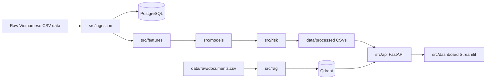

# MVP Architecture

The MVP is intentionally modular. Each package owns one part of the maintenance intelligence workflow and can be expanded independently.

## System Map

## Data Layer

- PostgreSQL stores structured assets, sensor readings, tickets, logs, risk scores, and documents.
- Qdrant stores embedded Vietnamese SOP/checklist chunks in the `maintenance_knowledge` collection.
- Processed CSV files provide a stable serving contract for the current FastAPI backend.

## Intelligence Layer

- `src/ingestion` validates and loads raw CSV data.
- `src/features` builds daily asset-level features from sensor readings and maintenance history.
- `src/models` combines rule-based anomaly detection with scikit-learn Isolation Forest scoring.
- `src/risk` turns anomaly scores and maintenance context into explainable asset risk.
- `src/rag` loads documents, chunks Vietnamese text, embeds chunks, searches Qdrant, and composes deterministic Vietnamese copilot answers.

## Serving Layer

- `src/api` exposes health, summary, risk, anomaly, asset context, and copilot endpoints.
- `src/dashboard` provides the Streamlit operator dashboard and Maintenance Copilot tab.

## Production Architecture Decisions

- Add Alembic migrations once schema evolution matters.
- Move scheduled ingestion and scoring into an orchestrator such as Airflow, Prefect, Dagster, or cron-managed jobs.
- Move API reads from processed CSVs to database-backed query services.
- Add retrieval/answer evaluation before replacing the deterministic composer with an LLM.
- Add authentication, authorization, observability, and deployment automation.
