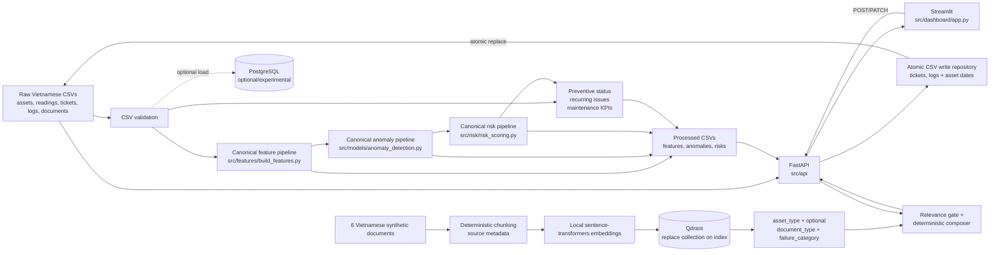

# Kiến Trúc Canonical Của MVP

## Architecture Decision

MVP sử dụng kiến trúc **CSV-first, batch-first**. Raw CSV là primary data source; processed CSV là analytics serving contract. FastAPI là boundary duy nhất cho Streamlit và các client ứng dụng.

PostgreSQL chỉ là optional/experimental adapter để minh họa structured storage. PostgreSQL không cần thiết để generate data, chạy analytics, khởi động FastAPI, mở dashboard hoặc sử dụng các trang không phụ thuộc RAG.

Đây là kiến trúc portfolio/development, không phải production architecture.

## System Map

## Primary Runtime Path

1. `src/data_generation/generate_data.py` tạo Vietnamese synthetic CSV data trong `data/raw`.
2. `src/ingestion/validation.py` kiểm tra schema, reference, enum, chronology và Vietnamese business values.
3. `src/features/build_features.py` tạo `data/processed/asset_daily_features.csv`.
4. `src/models/anomaly_detection.py` tạo `data/processed/anomaly_results.csv`.
5. `src/risk/risk_scoring.py` tạo `data/processed/risk_scores.csv`.
6. `src/features/build_features.py` tạo preventive status, recurring issue và KPI snapshots từ raw contract cùng latest canonical risk output.
7. `src/api/services.py` đọc raw/processed CSV và điều phối local ticket/log write rules.
8. `src/api/csv_repository.py` ghi từng ticket/log file bằng temporary file và atomic replacement; không có concurrent-user locking.
9. `src/dashboard/api_client.py` gọi FastAPI cho cả reads và writes; Streamlit không đọc hoặc ghi CSV trực tiếp.
10. Copilot kết hợp structured asset/ticket context từ API service với SOP/checklist chunks được retrieve từ Qdrant.

## Canonical Analytics Implementations

| Analytics stage | Canonical implementation | Canonical output |
|---|---|---|
| Daily feature engineering | `src/features/build_features.py` | `asset_daily_features.csv` |
| Batch anomaly detection | `src/models/anomaly_detection.py` | `anomaly_results.csv` |
| Explainable risk scoring | `src/risk/risk_scoring.py` | `risk_scores.csv` |
| Preventive/recurrence/KPI analytics | `src/features/build_features.py` | Ba focused maintenance CSV snapshots |

Chỉ các implementation trên được mở rộng trong future MVP work. Một thay đổi analytics phải đi vào canonical implementation, có test, và cập nhật data contract tương ứng.

Chi tiết formula và definitions: [Analytics pipeline](analytics.md).

## Serving Layer

- `src/api/main.py` tạo FastAPI application.
- `src/api/routes.py` giữ backward-compatible risk/anomaly/context/Copilot endpoints và bổ sung write endpoints `POST /tickets`, `PATCH /tickets/{ticket_id}`, `POST /maintenance/logs`.
- `src/api/services.py` đọc raw asset/ticket/log CSV cùng canonical processed outputs, kiểm tra availability/freshness, thực thi ticket transition/chronology rules và không trả internal file path trong lỗi.
- `src/api/csv_repository.py` kiểm tra minimum schema, duplicate ID và dùng `os.replace` để tránh partial file replacement.
- `src/dashboard/app.py` là Streamlit entrypoint canonical.
- `src/dashboard/api_client.py` là HTTP boundary giữa dashboard và API.

Streamlit chỉ gọi FastAPI. Năm views canonical là `Tổng quan`, `Thiết bị và rủi ro`, `Ticket workspace`, `Bất thường và lỗi lặp lại` và `Trợ lý bảo trì`. RAG availability không quyết định health của manager dashboard.

## Local Write Boundary

Write workflow chỉ đóng vòng demo: manager tạo inspection ticket từ risk context, technician nhận ticket, ghi maintenance result và resolve hoặc giữ follow-up. Ticket request thay một raw CSV; maintenance-log request stage log cùng asset maintenance dates và rollback các file đã thay nếu một bước replace thất bại. Processed risk/KPI files không thay đổi cho đến canonical batch tiếp theo.

Atomic replacement và handled-failure rollback ngăn file đích ở trạng thái ghi dở trong local workflow, nhưng không cung cấp crash-safe multi-file transaction, record locking hoặc conflict detection giữa nhiều process. Vì vậy write boundary này chỉ dành cho một local portfolio user, không phải production CMMS storage.

## RAG Layer

- `src/rag/document_loader.py` đọc legacy CSV fields và chuẩn hóa thành `document_id`, `document_type`, `content`, `failure_category`, `version` và `effective_date`.
- `src/rag/chunking.py` tạo deterministic chunks, bỏ empty chunk và giữ document identity cùng `chunk_index`.
- `src/rag/embeddings.py` tạo local embeddings.
- `src/rag/index_documents.py` embed toàn bộ document set rồi thay thế collection; re-index cùng input không tạo duplicate và document bị xóa không để stale chunk.
- `src/rag/vector_store.py` kiểm tra collection name, vector dimension, missing/empty collection và thực hiện metadata filtering trong Qdrant.
- `src/rag/retriever.py` thực hiện top-k retrieval với `asset_type`, `document_type` và `failure_category` filters.
- `src/rag/copilot.py` kiểm tra phạm vi câu hỏi, áp dụng relevance gate, kết hợp asset facts với retrieved guidance và tạo response deterministic có source/safety sections.

Khi chọn asset, `asset_type` của asset là filter mặc định. Failure category và ticket description gần đây chỉ bổ sung query context; chúng không thay đổi structured facts hoặc tự động chẩn đoán lỗi. Câu hỏi nêu rõ một focused asset type khác được xem là yêu cầu cross-asset tường minh và filter theo loại được nêu.

Relevance policy:

- `HashEmbeddingProvider` trong tests dùng cosine threshold `0.15`; đây chỉ là deterministic lexical test double, không phải semantic quality score.
- `SentenceTransformerEmbeddingProvider` dùng threshold `0.55`; đây là retrieval gate cấu hình cho MVP, không phải xác suất đúng và chưa được hiệu chuẩn bằng evaluation dataset thực tế.
- Empty result, điểm dưới threshold, câu hỏi ngoài phạm vi hoặc RAG unavailable đều trả safe fallback, không dùng unrelated chunk để tạo checklist.

Qdrant là dependency của RAG retrieval, không phải dependency của API health hoặc manager dashboard. Copilot hiện dùng deterministic composer; không được mô tả là LLM-generated answer hoặc automatic diagnostic system.

## PostgreSQL Optional/Experimental Path

Các module sau được giữ để tham khảo và thử nghiệm structured storage:

- `src/database/session.py`
- `src/database/models.py`
- `src/database/init_db.py`
- `src/ingestion/load_data.py`

Quy tắc:

- Không đưa PostgreSQL vào prerequisite của main portfolio demo.
- Không chuyển API sang database-backed serving trong revised MVP nếu chưa có quyết định scope mới.
- Không xem database `risk_scores` hiện tại là canonical analytics output.
- PostgreSQL experiments không được làm gián đoạn CSV-first pipeline.

## Cleanup Audit

Milestone 6 tìm kiếm toàn bộ imports, function references, tests, docs và CLI entrypoints trước khi xóa. Kết quả:

| Candidate | Phân loại cuối | Quyết định và canonical replacement |
|---|---|---|
| `src/models/anomaly.py` | Safe to remove | Không có import/test; dùng `src/models/anomaly_detection.py` |
| `src/risk/scoring.py` | Safe to remove | Formula 55/30/15 cũ không được import; dùng `src/risk/risk_scoring.py` |
| `src/ingestion/documents.py` | Safe to remove | Chunker duplicate không được dùng; dùng `src/rag/chunking.py` |
| `src/ingestion/tickets.py` | Safe to remove | Normalization helper không có caller; validation canonical ở `src/ingestion/validation.py` |
| `src/data_generation/sample_data.py` | Safe to remove | Wrapper demo không có caller; dùng `src/data_generation/generate_data.py` |
| Root `app.py` | Safe to remove | Duplicate Streamlit entrypoint; dùng `src/dashboard/app.py` |
| Root `proposal.md` | Safe to remove | File rỗng, không có reference |
| `build_asset_feature_frame` | Safe to remove | Helper cho schema `value` cũ, không có caller; daily pipeline giữ nguyên |
| `src/database/*`, `src/ingestion/load_data.py` | Compatibility-only | Retain với deprecation/status note vì optional PostgreSQL tests đang dùng |
| `src/rag/query.py` | Actively used | Retain làm CLI query được Make target sử dụng |

Generator vẫn chủ động xóa stale `data/raw/risk_scores.csv` nếu file cũ tồn tại. Đây là migration hygiene, không phải một analytics implementation khác.

## Human-in-the-Loop Boundary

- Anomaly và risk scores chỉ hỗ trợ prioritization.
- Recommended action là hướng dẫn tham khảo, không phải lệnh thực thi.
- Manager quyết định lịch và mức ưu tiên thực tế.
- Technician xác nhận hiện trường, an toàn và maintenance result.
- Hệ thống không tự động tạo production work order hoặc dự đoán exact failure time.

## Non-Goals Của Architecture

Architecture không được mở rộng trong MVP sang inventory, QR code, mobile apps, vendor management, real-time streaming, complex approvals, enterprise auth hoặc exact failure-time prediction. Các giới hạn lâu dài cho future agents được ghi trong `AGENTS.md`.
