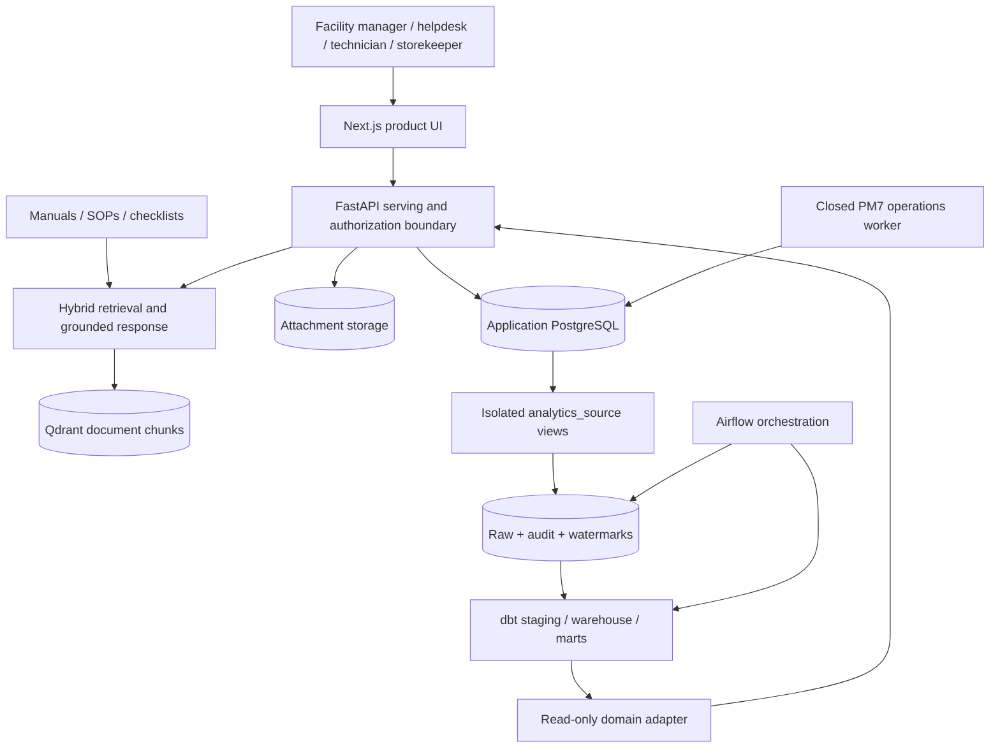
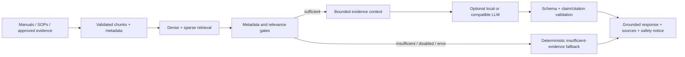
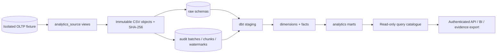
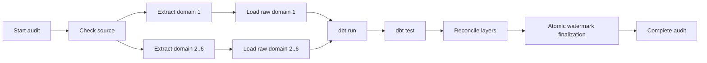
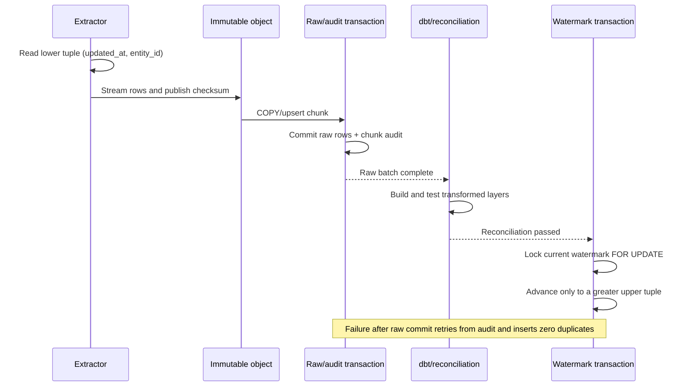

# Canonical Architecture

This document is the final architecture source for AI Maintenance Copilot and
its integrated Maintenance Data Platform. Focused business, transaction, RAG,
and benchmark documents remain authoritative for their detailed contracts and
are linked rather than copied here.

The system is a local, synthetic, batch-first engineering project. It is not a
production deployment or a complete CMMS.

## System context



There are two connected planes:

1. The operational and AI plane owns transactional maintenance workflows,
   identity, audit, files, UI, and document-grounded assistance.
2. The data and analytics plane owns isolated extraction, raw history,
   transformation, reconciliation, marts, and structured API projections.

They meet at explicit interfaces. Batch analytics reads isolated source views;
the product reads approved analytics projections. Neither plane reaches through
the other plane's transaction boundary.

## Component responsibilities

| Component | Responsibility | Explicit boundary |
|---|---|---|
| Next.js frontend | Authenticated product workflows and visualizations | Calls FastAPI; never accesses PostgreSQL or CSV directly |
| FastAPI | HTTP contracts, authentication, RBAC, request bounds, composition | Does not own repository transactions or arbitrary analytics SQL |
| Application services | Maintenance, ticket, asset, inventory, security, operations orchestration | Depend on repository contracts; humans retain decision authority |
| PostgreSQL repositories | Sessions, row locks, idempotency, audit/outbox coupling, commit/rollback | Sole owners of transactional mutation families |
| PM7 worker | Four allow-listed background capabilities, leases, retry/dead-letter, heartbeat | No arbitrary cron, shell, SQL, or callable execution |
| RAG pipeline | Document chunking, hybrid retrieval, relevance gates, grounded response validation | Unstructured evidence only; no relational fact replacement |
| Data Platform extractor/loaders | Tuple-watermark extraction, immutable artifacts, checksum/COPY, audit | Isolated scale database and independent migrations |
| Airflow | Ordered control flow, retry callbacks, bounded concurrency | Metadata only in XCom; no row payload transport |
| dbt | Staging, dimensions, facts, marts, and quality tests | Structured analytics remains in PostgreSQL |
| Analytics adapter | Six allow-listed parameterized read-only queries | Authentication/site scope stays in FastAPI and cache key |

## Local deployment topology

The repository has distinct local topologies:

- `docker-compose.yml`: application PostgreSQL, Qdrant, migration job, API,
  frontend, and optional worker;
- `docker-compose.test.yml`: isolated PostgreSQL test database fixed to a local
  `_test` database;
- `docker-compose.scale.yml`: PostgreSQL 17 scale database, Airflow metadata
  database/API/scheduler/DAG processor, and the stateless Analytics API;
- `docker-compose.pilot.yml`: historical pilot rehearsal contract, not proof of
  a real-company deployment.

The application and scale databases are intentionally isolated. Normal
verification does not require the scale topology or Docker daemon. Generated
scale data and dbt runtime artifacts are ignored.

## Operational and AI plane

### Transactional model

PostgreSQL is authoritative for assets, users, audit records, tickets, SLA
state, preventive plans, checklist versions, work orders, maintenance logs,
spare parts, stock positions, immutable movements, jobs, outbox events, and
notifications.

Named application services own validation and orchestration; repositories own
the full atomic transaction. A route may request an action but does not
manipulate ORM entities or commit. Selected audit/outbox records are written in
the same transaction as the business mutation.

Important invariants include:

- work-order transitions use the named state machine;
- preventive `(plan_id, due_date)` generation is unique and idempotent;
- work-order completion does not automatically resolve a ticket;
- checklist versions and work-order snapshots remain immutable;
- ticket comments, SLA events, escalation events, stock movements, reservation
  events, and delivery attempts are append-only;
- stock commands use row locks, stable idempotency keys, and server-derived
  balances;
- human actors make final safety and maintenance decisions.

Focused ownership maps are in [Application services](application-services.md)
and [Repository transaction map](repository-transaction-map.md).

### API and authentication boundary

FastAPI is the serving boundary. Local authentication uses short-lived access
tokens, revocable refresh sessions, CSRF protection, user version checks, RBAC,
and append-only audit. The frontend stores access state in memory and uses an
HttpOnly refresh cookie.

Authorization is enforced at routes and services. UI visibility is not a
security control. Audit payloads exclude passwords, tokens, cookies,
Authorization headers, connection strings, storage paths, and reporter contact
details.

### RAG flow



Qdrant stores approved document chunks. Structured work-order, ticket,
inventory, or cost rows stay in PostgreSQL/dbt. See
[Structured data versus RAG](structured-data-vs-rag.md) and
[LLM and citations](llm-and-citations.md).

## Data and analytics plane

### Layered data flow



Canonical schemas and responsibilities:

| Layer | Purpose |
|---|---|
| `analytics_source` | Compatibility views over the isolated OLTP fixture |
| local immutable objects | Restartable extraction payloads with checksums |
| `raw` | Append/version-preserving ingestion tables |
| `audit` | Batch state, chunk checksums, pipeline state, tuple watermarks |
| `analytics_staging` | Typed, deduplicated, latest-state transformations |
| `analytics_warehouse` | Dimensions and domain facts |
| `analytics_marts` | Site/date/domain aggregates for bounded consumption |

Stage 9 uses one work-order tuple watermark. Stage 10 uses six independent
domain watermarks for status history, tickets, ticket events, spare parts,
inventory movements, and work-order costs.

### Airflow dependency groups



The Stage 10 graph has 19 task instances. Extractors and raw loaders are
independent by domain, then converge before dbt and reconciliation. XCom carries
only bounded metadata. Airflow has `max_active_runs=1`; task concurrency is
bounded to avoid overwhelming the laptop database.

### Tuple watermark and retry lifecycle



Raw data is committed before watermark advancement. A retry validates the
published object's checksum and committed chunk audit, then resumes without
duplicating inserted rows. Finalization locks the watermark and updates all
non-empty domains atomically only after dbt and reconciliation pass. Empty runs
insert zero rows and preserve the tuple/version.

## dbt model and quality design

Stage 10 contains 26 models: 6 incremental models, 10 tables, and 10 views. The
433 data tests plus 26 models produced `459/459` successful build nodes.

Quality gates cover:

- source/raw/staging/fact or dimension count equality;
- unique grains and dimension relationships;
- work-order and status chronology;
- duplicate consecutive status transitions;
- final status agreement;
- ticket event ownership and resolution/SLA evidence;
- inventory operation/sign/balance semantics;
- cost arithmetic and reconciliation;
- mart completion rates and daily/monthly reconciliation.

The final eight Stage 10 integrity queries returned zero violations.

## Analytics API, pool, and cache

Stage 10 originally allowed a theoretical connection fan-out of:

```text
2 workers * (pool 8 + overflow 4) + 2 workers * 8 direct slots = 40
```

Direct SQL evidence showed representative p50 times below 50 ms for most
queries and buffer-cache hits, while concurrent `/health` and analytics calls
queued for seconds. Stage 11 therefore changed concurrency, not query semantics
or indexes.

The accepted configuration is:

```text
2 workers * (pool 6 + overflow 0) + 2 workers * 6 direct slots = 24
```

The process-local LRU cache has a 5-second TTL and 256-entry limit. Its key
contains authorization identity, site, exact query, start date, end date, and
limit. It is bypassed when authorization scope is absent. Cache metrics expose
aggregate hit/miss/eviction counts without user/site/query labels. TTL-only,
process-local invalidation is an explicit limitation, not a distributed-cache
claim.

See [Stage 11 API performance](stage11-api-performance.md).

## Observability and audit

The operational plane exposes public liveness and bounded health plus protected
readiness/metrics. Durable jobs, attempts, heartbeats, outbox records,
notifications, and business audit remain in PostgreSQL. Structured logs use
request IDs and redact secrets.

The Data Platform records pipeline runs, extraction batches, chunk checksums,
row counts, retries/failures, and watermarks. The Stage 11 runner adds endpoint
latencies, status/error classes, non-empty payload counts, PostgreSQL activity,
app pool snapshots, and label-free analytics runtime metrics.

Machine-readable historical evidence lives in:

- [Stage 9 results](benchmark-results-1m.json);
- [Stage 10 results](benchmark-results-domain-scale.json);
- [Stage 10 manifest summary](benchmark-manifest-domain-scale.json);
- [Stage 11 results](benchmark-results-api-stage11.json);
- [Stage 12 release manifest](release-manifest.json).

## Migration ownership

The histories are deliberately independent:

| Owner | Head | Version table | Scope |
|---|---|---|---|
| Application | `20260726_0008` | `alembic_version` | Operational schema, auth, assets, maintenance, tickets, inventory, jobs |
| Data Platform | `20260824_dp0003` | `data_platform_alembic_version` | Analytics contracts, measured watermark index, domain scale schemas |

Application autogenerate excludes the narrow Data Platform-owned metadata.
Data Platform migrations use explicit forward SQL and `target_metadata=None`,
so `current=head`, offline history rendering, expected SQL assertions, and real
isolated upgrades are the relevant validation gates rather than autogenerate
drift.

## Secrets, files, and generated-data boundaries

- `.env` and environment-specific secret files are ignored; only examples are
  tracked.
- No release document may contain credentials, tokens, public endpoints,
  account IDs, secret values, or personal email.
- Attachments and generated datasets stay outside Git.
- `data/scale/`, dbt `target/` and `logs/`, caches, dumps, backups, restore
  artifacts, and pilot evidence are ignored.
- Scale-stage structured rows were not sent to external LLM/embedding APIs or
  bulk-loaded to Qdrant.
- The historical AWS RDS learning lab was torn down; this repository makes no
  live RDS claim.

## Known production gaps

The architecture deliberately does not claim:

- real-company deployment, adoption, business impact, uptime, or SLA;
- SSO/MFA or enterprise identity federation;
- private-cloud networking and least-privilege workload identity;
- managed secrets or stable encryption-key management;
- multi-node HA, failover, automated PITR, or production restore objectives;
- centralized monitoring, paging, and staffed incident response;
- coherent distributed cache invalidation;
- production-scale concurrency or mixed read/write capacity;
- real maintenance-data governance, classification, retention, and consent;
- real-time streaming, autonomous control, exact failure prediction, or a full
  procurement/accounting suite.

Recommended evolution is documented in the
[project handover](project-handover.md). Safe commands and offline fallbacks are
in the [operations runbook](operations-runbook.md).
