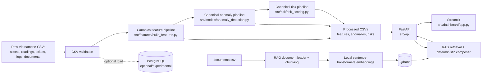

# Kiến Trúc Canonical Của MVP

## Architecture Decision

MVP sử dụng kiến trúc **CSV-first, batch-first**. Raw CSV là primary data source; processed CSV là analytics serving contract. FastAPI là boundary duy nhất cho Streamlit và các client ứng dụng.

PostgreSQL chỉ là optional/experimental adapter để minh họa structured storage. PostgreSQL không cần thiết để generate data, chạy analytics, khởi động FastAPI, mở dashboard hoặc sử dụng các trang không phụ thuộc RAG.

Đây là kiến trúc portfolio/development, không phải production architecture.

## System Map

## Primary Runtime Path

1. `src/data_generation/generate_data.py` tạo Vietnamese synthetic CSV data trong `data/raw`.
2. `src/ingestion/validation.py` kiểm tra schema, reference, enum, chronology và Vietnamese business values.
3. `src/features/build_features.py` tạo `data/processed/asset_daily_features.csv`.
4. `src/models/anomaly_detection.py` tạo `data/processed/anomaly_results.csv`.
5. `src/risk/risk_scoring.py` tạo `data/processed/risk_scores.csv`.
6. `src/api/services.py` đọc processed CSV và cung cấp data qua FastAPI routes.
7. `src/dashboard/api_client.py` gọi FastAPI; Streamlit không đọc CSV trực tiếp.
8. Copilot kết hợp structured asset context từ API service với SOP/checklist chunks được retrieve từ Qdrant.

## Canonical Analytics Implementations

| Analytics stage | Canonical implementation | Canonical output |
|---|---|---|
| Daily feature engineering | `src/features/build_features.py` | `asset_daily_features.csv` |
| Batch anomaly detection | `src/models/anomaly_detection.py` | `anomaly_results.csv` |
| Explainable risk scoring | `src/risk/risk_scoring.py` | `risk_scores.csv` |

Chỉ các implementation trên được mở rộng trong future MVP work. Một thay đổi analytics phải đi vào canonical implementation, có test, và cập nhật data contract tương ứng.

## Serving Layer

- `src/api/main.py` tạo FastAPI application.
- `src/api/routes.py` giữ API contract hiện tại cho health, summary, risk, anomaly, asset context và Copilot.
- `src/api/services.py` là CSV-backed query service hiện tại.
- `src/dashboard/app.py` là Streamlit entrypoint canonical.
- `src/dashboard/api_client.py` là HTTP boundary giữa dashboard và API.

Milestone 1 không thay đổi endpoint, request field hoặc response field hiện có.

## RAG Layer

- `src/rag/document_loader.py` đọc `documents.csv`.
- `src/rag/chunking.py` tạo chunks có source metadata.
- `src/rag/embeddings.py` tạo local embeddings.
- `src/rag/vector_store.py` lưu/search vectors trong Qdrant.
- `src/rag/retriever.py` thực hiện top-k retrieval và asset-type filter.
- `src/rag/copilot.py` kết hợp retrieved documents với structured asset context.

Qdrant là dependency của RAG retrieval, không phải dependency của risk/anomaly dashboard. Copilot hiện dùng deterministic composer; không được mô tả là LLM-generated answer.

## PostgreSQL Optional/Experimental Path

Các module sau được giữ để tham khảo và thử nghiệm structured storage:

- `src/database/session.py`
- `src/database/models.py`
- `src/database/init_db.py`
- `src/ingestion/load_data.py`

Quy tắc:

- Không đưa PostgreSQL vào prerequisite của main portfolio demo.
- Không chuyển API sang database-backed serving trong revised MVP nếu chưa có quyết định scope mới.
- Không xem database `risk_scores` hiện tại là canonical analytics output.
- PostgreSQL experiments không được làm gián đoạn CSV-first pipeline.

## Legacy Và Removal Candidates

Các file/implementation sau chưa bị xóa trong Milestone 1 nhưng không phải canonical extension points:

| Module hoặc implementation | Trạng thái |
|---|---|
| `src/models/anomaly.py` | Legacy anomaly wrapper; candidate for later removal |
| `src/risk/scoring.py` | Legacy risk formula; candidate for later removal |
| Legacy `data/raw/risk_scores.csv` | Không còn được generator tạo; stale file được xóa khi save dataset |
| `_risk_reasons_legacy` và `_recommended_action_legacy` | Legacy helpers |
| `src/ingestion/documents.py` | Legacy chunking helper; canonical chunker ở `src/rag/chunking.py` |
| `src/ingestion/tickets.py` | Unused normalization helper; candidate for later removal |
| `build_asset_feature_frame` trong `src/features/build_features.py` | Backward-compatible helper, không phải daily feature pipeline |
| `src/data_generation/sample_data.py` | Convenience helper chưa được active workflow sử dụng |
| Root `app.py` | Compatibility dashboard entrypoint; canonical entrypoint là `src/dashboard/app.py` |

Không mở rộng legacy modules. Việc xóa chỉ được thực hiện trong cleanup milestone sau khi kiểm tra import, test và migration impact.

## Human-in-the-Loop Boundary

- Anomaly và risk scores chỉ hỗ trợ prioritization.
- Recommended action là hướng dẫn tham khảo, không phải lệnh thực thi.
- Manager quyết định lịch và mức ưu tiên thực tế.
- Technician xác nhận hiện trường, an toàn và maintenance result.
- Hệ thống không tự động tạo production work order hoặc dự đoán exact failure time.

## Non-Goals Của Architecture

Architecture không được mở rộng trong MVP sang inventory, QR code, mobile apps, vendor management, real-time streaming, complex approvals, enterprise auth hoặc exact failure-time prediction. Các giới hạn lâu dài cho future agents được ghi trong `AGENTS.md`.
