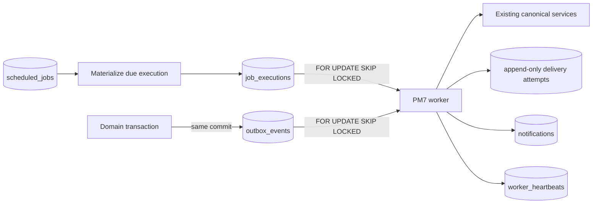

# Background Jobs Và Transactional Outbox

## Mục Đích

Product Milestone 7 thêm một worker PostgreSQL-backed để chạy bốn thao tác đã
có của PM1-PM6. Worker là nền tảng vận hành cho internal pilot, không phải
general-purpose scheduler và không chứng minh production readiness.

FastAPI và worker dùng cùng canonical domain services. API không chạy job trong
request thread; worker không sửa trực tiếp ticket, work order, inventory hoặc
analytics formula.

## Luồng Xử Lý



PostgreSQL là authority cho schedule, execution, lease, retry, dead-letter,
outbox, delivery attempt, notification và heartbeat. In-memory state chỉ dùng
để nhận signal dừng process.

## Closed Job Catalog

Migration `20260726_0007` seed bốn job ở trạng thái `disabled`:

| Job key | Interval mặc định | Lease | Attempts | Backoff | Tác vụ |
|---|---:|---:|---:|---:|---|
| `preventive_generation` | 3.600 giây | 300 giây | 3 | 30 giây | Gọi canonical preventive generation |
| `sla_escalation` | 300 giây | 180 giây | 3 | 30 giây | Đánh giá SLA/escalation hiện có |
| `analytics_refresh` | 86.400 giây | 3.600 giây | 2 | 120 giây | Snapshot và chạy canonical batch |
| `inventory_reorder_detection` | 900 giây | 180 giây | 3 | 30 giây | Đọc balance/reorder state hiện có |

Timezone duy nhất hiện hỗ trợ là `Asia/Ho_Chi_Minh`. Interval hợp lệ nằm trong
30-604.800 giây. Configuration payload phải rỗng; API/CLI không nhận cron,
module, function, Python, shell, SQL hoặc executable payload.

Khi Administrator enable job, hệ thống snapshot actor thành `run_as_user_id`.
Worker từ chối execution nếu actor không còn tồn tại hoặc không active. Job
disabled không tạo scheduled execution; pending scheduled execution bị
`cancelled` nếu job bị disable trước khi claim. Manual trigger là persisted
execution và có thể dùng để kiểm tra một job disabled mà không thay đổi schedule.

## Claim Và Concurrency

- Worker materialize due jobs và claim work bằng `FOR UPDATE SKIP LOCKED`.
- Mỗi scheduled occurrence có deterministic idempotency key từ `job_key` và
  `scheduled_for`.
- Mỗi job dùng `forbid_overlap`. Due occurrence trong lúc execution cùng job
  còn active được ghi `skipped`, không chạy song song.
- Worker chỉ xử lý tối đa một job execution mỗi iteration và một bounded batch
  outbox events.
- Execution đang chạy có lease. Long-running job renew lease theo heartbeat
  interval.
- Worker khác có thể recover lease hết hạn; expired work quay lại retry hoặc
  dead-letter theo cùng policy.
- SIGINT/SIGTERM đặt stop flag, chờ iteration hiện tại kết thúc rồi ghi heartbeat
  `stopping`.

## Retry Và Dead Letter

Job failure tăng `attempt_number` và đặt `available_after` theo exponential
backoff:

```text
retry_delay = retry_backoff_seconds * 2^(attempt_number - 1)
```

Delay được giới hạn bởi schema/configuration. Khi hết `max_attempts`, execution
chuyển `dead_lettered`. Safe error chỉ có bounded code/summary; stack trace,
path, credential và raw payload không được lưu hoặc trả qua operator API.

Outbox dùng policy riêng: tối đa 5 attempts, base backoff 30 giây. Mỗi attempt
thành công/thất bại tạo một append-only `outbox_delivery_attempts` row. Trigger
PostgreSQL chặn update/delete lịch sử. Operator không retry outbox bằng cách sửa
row. PM8 thêm explicit Administrator redrive với caller-stable idempotency key,
row lock, append-only request/audit và một bounded attempt cycle mới. Event hết
attempts vẫn giữ `dead_lettered`; không có automatic infinite replay.

Retry job qua API/CLI tạo execution mới liên kết bằng safe metadata; execution
dead-letter cũ không bị viết lại.

## Transactional Outbox

Selected business actions gọi `enqueue_outbox_event()` trong cùng SQLAlchemy
transaction với mutation:

- critical ticket creation và assignment;
- ticket hold/resume;
- SLA warning, breach và escalation;
- work-order assignment;
- work-order completion chờ verification;
- preventive work-order generation;
- inventory issue completion;
- inventory low-stock detection cycle;
- terminal analytics refresh failure.

Event catalog tại `src/operations/domain.py` định nghĩa aggregate, required và
allowed fields, recipient rules, severity, Vietnamese title/body và related
entity. Payload tối đa 16 KiB, có SHA-256 hash và caller-stable idempotency key.
Key nhạy cảm như password, token, cookie, reporter contact, storage key và file
bytes bị từ chối.

Business transaction rollback thì outbox event cũng rollback. Replaying cùng
key và cùng payload trả event đã có; cùng key nhưng payload khác là conflict.

## Từng Job Làm Gì

### Preventive Generation

Worker gọi `src/maintenance_management/service.py`. Unique
`(preventive_plan_id, due_date)` và plan row lock hiện có tiếp tục bảo đảm
idempotency. Execution summary ghi `generated_count`, `skipped_count` và số
plan; lifecycle work order không đổi.

### SLA Escalation

Worker gọi canonical ticket workflow service, giữ business calendar snapshot,
pause/resume và `(ticket_id, rule_code, occurrence_number)` uniqueness. Job chỉ
ghi SLA/escalation/outbox records; không tự resolve ticket hoặc complete work
order.

### Analytics Refresh

Job export repeatable PostgreSQL snapshot vào staging directory, chạy feature,
anomaly, risk, preventive, recurring issue và KPI pipelines, xác nhận đủ output,
sau đó publish cả directory bằng atomic rename. Failure xóa staging và giữ
output hợp lệ gần nhất. Tests luôn dùng temporary output ngoài canonical paths.

### Inventory Reorder Detection

Job đọc canonical balance với:

```text
available = on_hand - reserved
```

Job không thay đổi stock và không tạo purchase order. Một part/location chỉ phát
event ở đầu low-stock cycle. Sau khi balance recover rồi giảm lại, cycle mới mới
eligible.

## Chạy Worker

```powershell
python -m alembic upgrade head
python -m src.operations.worker
```

Một iteration có giới hạn:

```powershell
python -m src.operations.worker --once --worker-id local-check
```

Docker worker là profile explicit:

```powershell
docker compose --profile worker up -d --build worker
docker compose --profile worker logs -f worker
docker compose --profile worker stop worker
```

Operator commands và recovery procedure nằm tại
[Operations runbook](operations_runbook.md). API contracts nằm tại
[API contract](api_contract.md).

## Giới Hạn Internal Pilot

- Một PostgreSQL-backed polling worker, chưa có HA, autoscaling hoặc queue
  partitioning.
- Không có external email/SMS/push/webhook delivery.
- Không có generic workflow designer hoặc arbitrary schedule editor.
- Không có background job cho domain mới.
- Không có production backup automation, centralized alerting hoặc on-call
  integration.
- Worker không thay thế quyết định của manager, technician hoặc Storekeeper.

PM8 không thêm job thứ năm. Operational alert evaluation và outbox redrive là
protected action explicit; worker vẫn chỉ thực thi closed four-job catalog.
