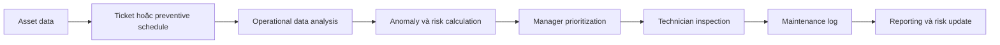

# Quy Trình Nghiệp Vụ MVP

## Mục Tiêu Quy Trình

Quy trình mô tả cách dữ liệu bảo trì theo batch được chuyển thành thông tin ưu tiên cho manager và ngữ cảnh kiểm tra cho technician. AI Maintenance Copilot hỗ trợ phân tích và truy xuất tài liệu; con người vẫn phê duyệt và thực hiện mọi hành động ngoài hiện trường.

## Các Bước

| Bước | Actor | Action | Input | System feature | Output/report | Business purpose |
|---|---|---|---|---|---|---|
| 1. Asset data | Facility Manager hoặc data owner | Duy trì danh mục thiết bị và thông tin bảo trì cơ bản | Asset ID, loại, vị trí, criticality, status, ngày bảo trì | CSV generation/validation; asset data contract | Danh mục asset hợp lệ | Tạo định danh và ngữ cảnh chung cho toàn bộ pipeline |
| 2. Ticket hoặc preventive schedule | Manager, supervisor | Ghi nhận sự cố hoặc xác định thiết bị sắp đến hạn/quá hạn | Ticket, ngày bảo trì gần nhất, chu kỳ và ngày kế tiếp | Ticket/log validation; feature `days_overdue` | Danh sách sự cố và nhu cầu bảo trì | Bảo đảm cả corrective và preventive maintenance đều tạo tín hiệu ưu tiên |
| 3. Operational data analysis | Batch pipeline | Tổng hợp reading theo asset và ngày | Energy, runtime, temperature, vibration | `src/features/build_features.py` | Daily asset feature records | Chuyển reading chi tiết thành tín hiệu có thể so sánh và giải thích |
| 4. Anomaly và risk calculation | Batch pipeline | Tính anomaly score, risk components và final risk | Daily features, ticket counts, overdue days, criticality | `src/models/anomaly_detection.py`; `src/risk/risk_scoring.py` | Anomaly results, risk results, reasons, recommended action | Xếp hạng asset theo mức cần chú ý, không dự đoán chính xác thời điểm hỏng |
| 5. Manager prioritization | Facility Manager | Xem summary, top risky assets và nguyên nhân | FastAPI risk/anomaly responses | FastAPI và Streamlit dashboard | Danh sách asset cần xem xét theo thứ tự ưu tiên | Giảm thời gian tổng hợp thủ công và hỗ trợ lập kế hoạch kiểm tra |
| 6. Technician inspection | Technician | Kiểm tra hiện trường và tham khảo hướng dẫn | Asset context, risk reasons, recent anomalies, SOP/checklist | Asset Context và RAG Copilot | Checklist tham khảo, nguồn tài liệu, kết quả kiểm tra thực tế | Giúp technician tiếp cận đúng tài liệu nhưng không thay thế đánh giá an toàn/chuyên môn |
| 7. Maintenance log | Technician, supervisor | Ghi lại hành động, kết quả và lịch kế tiếp | Kết quả inspection/maintenance | Maintenance log data contract | Maintenance history và next maintenance date | Tạo lịch sử có thể audit và làm input cho batch tiếp theo |
| 8. Reporting và risk update | Manager, batch pipeline | Tổng hợp KPI và chạy lại analytics | Asset, ticket, log và operational data mới | Batch pipeline, API, dashboard | Báo cáo bảo trì và risk ranking cập nhật | Đóng vòng phản hồi giữa hành động bảo trì và quyết định ưu tiên tiếp theo |

## Trách Nhiệm Quyết Định

- Hệ thống đề xuất thứ tự ưu tiên và tài liệu liên quan.
- Facility Manager quyết định kế hoạch và mức ưu tiên thực tế.
- Technician xác nhận điều kiện thiết bị, tuân thủ an toàn và ghi nhận kết quả.
- Không có bước nào tự động tạo work order production hoặc tự động phê duyệt hành động.

## Trạng Thái Triển Khai

Các bước asset data, operational analysis, anomaly/risk calculation, manager prioritization và SOP retrieval đã có implementation chính. Upcoming schedule, recurring issue reporting, maintenance KPI và maintenance-result contract vẫn là future milestones trong phạm vi MVP.

