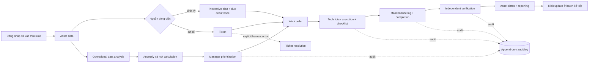

# Quy Trình Nghiệp Vụ MVP

## Mục Tiêu Quy Trình

Quy trình mô tả cách dữ liệu bảo trì theo batch được chuyển thành thông tin ưu tiên cho manager và ngữ cảnh kiểm tra cho technician. AI Maintenance Copilot hỗ trợ phân tích và truy xuất tài liệu; con người vẫn phê duyệt và thực hiện mọi hành động ngoài hiện trường.



Mọi bước tương tác qua product UI bắt đầu bằng authenticated user. FastAPI kiểm tra permission và resource ownership trước khi gọi business service; frontend visibility không thay thế backend authorization. Mỗi mutation thành công ghi actor, request ID và safe before/after state trong cùng transaction.

## Các Bước

| Bước | Actor | Action | Input | System feature | Output/report | Business purpose |
|---|---|---|---|---|---|---|
| 1. Asset lifecycle | Chief Engineer, Property Manager | Đăng ký hồ sơ kỹ thuật, gán location, warranty/attachment; thay đổi operational/lifecycle hoặc archive/restore có chủ đích | Identity, technical fields, location, criticality, maintenance dates, version | PostgreSQL asset/location repositories, attachment storage, QR lookup, RBAC và audit | Rich asset profile, breadcrumb, lifecycle state, attachments, QR, history | Tạo định danh và traceability chung mà không biến hệ thống thành full CMMS |
| 2. Ticket hoặc preventive plan | Helpdesk, Manager, Chief Engineer | Ghi nhận sự cố hoặc cấu hình recurring maintenance intent | Ticket facts hoặc interval/start/end/timezone/lead/grace/checklist | PostgreSQL ticket service hoặc preventive-plan service | Ticket `Mới tạo` hoặc plan active/paused/archived | Tách incident khỏi lịch định kỳ; plan không phải executable job |
| 3. Operational data analysis | Batch pipeline | Tổng hợp reading theo asset và ngày | Energy, runtime, temperature, vibration | `src/features/build_features.py` | Daily asset feature records | Chuyển reading chi tiết thành tín hiệu có thể so sánh và giải thích |
| 4. Anomaly và risk calculation | Batch pipeline | Tính anomaly score, risk components và final risk | Daily features, ticket counts, overdue days, criticality | `src/models/anomaly_detection.py`; `src/risk/risk_scoring.py` | Anomaly results, risk results, reasons, recommended action | Xếp hạng asset theo mức cần chú ý, không dự đoán chính xác thời điểm hỏng |
| 5. Occurrence và work-order generation | Chief Engineer | Preview kỳ đến hạn, dry-run rồi trigger generation có chủ đích | Active plan, business date, asset eligibility | Bounded recurrence service; unique `(plan_id, due_date)`; CLI/API cùng service | Preventive work order planned/assigned; report generated/skipped | Phát hành công việc deterministic, retry-safe mà không có scheduler ẩn |
| 6. Manager prioritization và phân công | Facility Manager, Chief Engineer | Xem risk/overdue/source, tạo inspection/corrective WO hoặc assign technician | Latest analytics, ticket, plan occurrence, technician roster | Work-order service, RBAC và optimistic version | Work order có asset, source, priority, due date và assignee | Chuyển tín hiệu hoặc nhu cầu định kỳ thành một executable job có owner |
| 7. Technician execution | Technician | Start, hold/resume, hoàn tất checklist, thêm evidence và ghi kết quả hiện trường | Assigned work order, immutable checklist snapshot, SOP/checklist | Resource ownership, state machine, safe attachment storage, RAG Copilot | Checklist responses, evidence, labor, completion summary | Hướng dẫn thao tác và giữ traceability nhưng không thay thế đánh giá an toàn |
| 8. Maintenance log và completion | Technician | Complete work order sau khi mandatory checklist đạt | Inspection result, actions, result, follow-up, notes | Một transaction cho WO completion + exactly-one MaintenanceLog + audit | Work order `completed`, linked maintenance log | Ghi durable outcome; repeated completion không tạo log trùng |
| 9. Technical verification | Chief Engineer, Property Manager | Review checklist/evidence và verify bằng actor khác người thực hiện | Completed WO, maintenance log, version | Self-verification denial; transaction cập nhật WO, asset dates và audit | Work order `verified`; asset last/next maintenance dates được đồng bộ | Phân tách execution khỏi technical acceptance |
| 10. Ticket decision | Authorized manager/technician | Resolve linked ticket hoặc giữ follow-up explicit | Ticket state, linked maintenance evidence | Existing ticket transition service | Ticket `Đã xử lý` hoặc tiếp tục `Đang xử lý` | Không đóng incident chỉ vì WO tồn tại/complete/verify |
| 11. Reporting và risk update | Manager, batch pipeline | Export snapshot và chạy analytics | PostgreSQL assets/tickets/logs + generated operational data | Snapshot bridge; canonical batch pipeline, API, dashboards | KPI/risk ranking của batch mới | Đóng feedback loop; không giả lập recalculation khi transaction vừa commit |

## Trách Nhiệm Quyết Định

- Hệ thống đề xuất thứ tự ưu tiên và tài liệu liên quan.
- Facility Manager quyết định kế hoạch và mức ưu tiên thực tế.
- Technician xác nhận điều kiện thiết bị, tuân thủ an toàn và ghi nhận kết quả.
- Preventive work order chỉ được generate khi actor được ủy quyền gọi API/CLI; không có startup generation, infinite loop hoặc distributed scheduler.
- Completion và verification không tự resolve ticket. Verification không được thực hiện bởi chính technician đã complete theo default rule.

## Phân Quyền Theo Actor

- **Property Manager:** xem plan/WO, tạo hoặc assign/cancel/reopen/verify work order, ưu tiên asset và quản lý lifecycle; không sửa preventive schedule hoặc nhập checklist kỹ thuật.
- **Chief Engineer:** tạo/update/pause/archive plan, version checklist, run generation, tạo/assign/execute/complete/verify work order và quản lý hồ sơ kỹ thuật.
- **Technician:** chỉ đọc và execute/complete assigned work order, ghi checklist/evidence; không đổi plan, assign người khác hoặc tự verify.
- **Helpdesk:** tiếp nhận ticket và xem limited WO status; không tạo plan, ghi checklist, complete hoặc verify.
- **Administrator:** quản lý account, role, active state và xem audit; business permissions vẫn đi qua cùng service rules.
- **Storekeeper:** đọc asset và identity/status tương lai của work order; không có stock operation hoặc inventory workflow.

Login/session/account, asset/location/lifecycle/attachment, ticket assignment/status/priority và maintenance log đều tạo audit event phù hợp. Audit chỉ hỗ trợ điều tra và traceability; nó không tạo approval workflow.

## Lifecycle Và QR Field Flow

```text
planned -> active <-> inactive -> retired
   \          \         \          \
    +---------- archive (có lý do) --+ -> explicit restore
```

- Lifecycle state mô tả asset còn thuộc vòng quản lý nào; operational status mô tả tình trạng tạm thời và không được dùng thay lifecycle.
- Retired/archived asset không nhận ticket mới. Archive giữ profile, attachment metadata, ticket, log, analytics reference và history.
- QR chỉ nhận diện asset qua opaque token. Người scan phải đăng nhập và vẫn chịu RBAC; QR không phải quyền truy cập.

## Trạng Thái Triển Khai

Các bước asset data, preventive plan, deterministic generation, standalone work order, checklist/evidence execution, MaintenanceLog, independent verification, operational analysis, anomaly/risk calculation, reporting, authenticated workflow, PostgreSQL audit và SOP retrieval đã có implementation. FastAPI phục vụ protected product workflow cho Next.js theo additive contracts. Streamlit chỉ còn public health/status client. Hệ thống vẫn chưa có production scheduler/worker, SSO/MFA, distributed rate limiting, centralized observability, backup automation hoặc deployment hardening.
