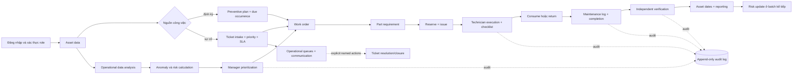

# Quy Trình Nghiệp Vụ MVP

## Mục Tiêu Quy Trình

Quy trình mô tả cách dữ liệu bảo trì theo batch được chuyển thành thông tin ưu tiên cho manager và ngữ cảnh kiểm tra cho technician. AI Maintenance Copilot hỗ trợ phân tích và truy xuất tài liệu; con người vẫn phê duyệt và thực hiện mọi hành động ngoài hiện trường.



Mọi bước tương tác qua product UI bắt đầu bằng authenticated user. FastAPI kiểm tra permission và resource ownership trước khi gọi business service; frontend visibility không thay thế backend authorization. Mỗi mutation thành công ghi actor, request ID và safe before/after state trong cùng transaction.

## Các Bước

| Bước | Actor | Action | Input | System feature | Output/report | Business purpose |
|---|---|---|---|---|---|---|
| 1. Asset lifecycle | Chief Engineer, Property Manager | Đăng ký hồ sơ kỹ thuật, gán location, warranty/attachment; thay đổi operational/lifecycle hoặc archive/restore có chủ đích | Identity, technical fields, location, criticality, maintenance dates, version | PostgreSQL asset/location repositories, attachment storage, QR lookup, RBAC và audit | Rich asset profile, breadcrumb, lifecycle state, attachments, QR, history | Tạo định danh và traceability chung mà không biến hệ thống thành full CMMS |
| 2. Ticket hoặc preventive plan | Helpdesk, Manager, Chief Engineer | Intake sự cố có category/source/impact/urgency hoặc cấu hình recurring maintenance intent | Reporter và ticket facts; hoặc interval/start/end/timezone/lead/grace/checklist | Ticket service tính priority + snapshot SLA; preventive-plan service giữ schedule intent | Ticket `open/assigned` cùng SLA hoặc plan active/paused/archived | Tách incident khỏi lịch định kỳ; plan không phải executable job |
| 3. Operational data analysis | Batch pipeline | Tổng hợp reading theo asset và ngày | Energy, runtime, temperature, vibration | `src/features/build_features.py` | Daily asset feature records | Chuyển reading chi tiết thành tín hiệu có thể so sánh và giải thích |
| 4. Anomaly và risk calculation | Batch pipeline | Tính anomaly score, risk components và final risk | Daily features, ticket counts, overdue days, criticality | `src/models/anomaly_detection.py`; `src/risk/risk_scoring.py` | Anomaly results, risk results, reasons, recommended action | Xếp hạng asset theo mức cần chú ý, không dự đoán chính xác thời điểm hỏng |
| 5. Occurrence và work-order generation | Chief Engineer | Preview kỳ đến hạn, dry-run rồi trigger generation có chủ đích | Active plan, business date, asset eligibility | Bounded recurrence service; unique `(plan_id, due_date)`; CLI/API cùng service | Preventive work order planned/assigned; report generated/skipped | Phát hành công việc deterministic, retry-safe mà không có scheduler ẩn |
| 6. Manager prioritization và phân công | Facility Manager, Chief Engineer, Helpdesk | Xem risk, operational ticket queues, priority/SLA; assign group/technician hoặc tạo corrective WO | Latest analytics, ticket timeline, SLA snapshot, technician roster | Server-side queues, named ticket actions, work-order service, RBAC và optimistic version | Ticket có owner/first response hoặc work order có source, priority, due date và assignee | Chuyển tín hiệu thành công việc có owner mà không nhập priority tùy ý |
| 7. Lập nhu cầu vật tư | Chief Engineer | Thêm planned part requirement cho preventive/corrective work order | Part, planned quantity, required-by date, source stock location, notes | Inventory service kiểm tra active part/location và WO state | Requirement `planned` cùng shortage derived | Làm rõ nhu cầu; chưa reserve và chưa đổi stock |
| 8. Reserve và issue | Storekeeper, Chief Engineer | Reserve/release/replace allocation; Storekeeper issue reserved hoặc unreserved stock | Requirement/version, available stock, idempotency key, actor/reason | Row locks, optimistic version, immutable event/movement, audit | Reserved/available update; issue giảm on-hand và liên kết WO | Chống oversubscription và phân biệt allocation với physical issue |
| 9. Technician execution và usage | Technician | Start, hold/resume, hoàn tất checklist, thêm evidence; ghi explicit consumption của issued stock | Assigned WO, checklist snapshot, issue outstanding, SOP/checklist | Resource ownership, state machine, RAG, append-only consumption | Checklist/evidence/usage records; không trừ stock lần hai | Giữ traceability hiện trường và quantity thực dùng |
| 10. Return hoặc follow-up stock | Storekeeper | Return phần issued chưa dùng; transfer/adjust damaged stock bằng action riêng | Outstanding issue, active destination, reason/evidence | Locked transaction, return/transfer/adjustment movement và audit | On-hand update; unresolved quantity/shortage còn lại | Không sửa trực tiếp balance/history |
| 11. Maintenance log và completion | Technician | Complete work order sau khi mandatory checklist đạt | Inspection result, actions, result, follow-up, notes | Một transaction cho WO completion + exactly-one MaintenanceLog + audit; inventory chỉ warning | Work order `completed`, linked maintenance log | Ghi durable outcome; không silent issue/consume/return/release |
| 12. Technical verification | Chief Engineer, Property Manager | Review checklist/evidence và verify bằng actor khác người thực hiện | Completed WO, maintenance log, version | Self-verification denial; transaction cập nhật WO, asset dates và audit | Work order `verified`; asset last/next maintenance dates được đồng bộ | Phân tách execution khỏi technical acceptance |
| 13. Ticket decision | Authorized manager/technician | Hold/resume, comment, resolve sau maintenance log, close hoặc reopen có lý do | Ticket state/version, SLA clocks, linked maintenance evidence | Named ticket actions, append-only timeline và transaction-coupled audit | Rich status `waiting/resolved/closed/reopened` và immutable events | Không đóng incident chỉ vì WO tồn tại/complete/verify; lịch sử SLA không bị viết lại |
| 14. Reporting và risk update | Manager, batch pipeline | Xem inventory operational metrics; export snapshot và chạy analytics | PostgreSQL transactions + generated operational data | Inventory API; snapshot bridge; canonical batch pipeline | Stock views tức thời; KPI/risk ranking của batch mới | Giữ inventory transaction tách khỏi unchanged risk/KPI formulas |

## Trách Nhiệm Quyết Định

- Hệ thống đề xuất thứ tự ưu tiên và tài liệu liên quan.
- Facility Manager quyết định kế hoạch và mức ưu tiên thực tế.
- Technician xác nhận điều kiện thiết bị, tuân thủ an toàn và ghi nhận kết quả.
- Preventive work order chỉ được generate khi actor được ủy quyền gọi API/CLI; không có startup generation, infinite loop hoặc distributed scheduler.
- Completion và verification không tự resolve ticket. Verification không được thực hiện bởi chính technician đã complete theo default rule.
- Priority ticket chỉ được derive từ impact và urgency ở backend.
- SLA breach/due-soon là trạng thái tính từ snapshot và timestamps, không phải checkbox có thể sửa.
- Escalation chỉ tạo operational event qua API/CLI explicit; chưa có email/SMS hoặc background worker.
- Storekeeper xác nhận physical receipt/issue/return/transfer/adjustment. Reorder suggestion không tự mua hàng.
- Work-order completion chỉ hiển thị warning khi còn shortage hoặc unresolved issued stock; không tạo stock action ẩn.

## Phân Quyền Theo Actor

- **Property Manager:** quản lý ticket lifecycle/SLA/escalation, xem inventory/report, tạo hoặc assign/cancel/reopen/verify work order, ưu tiên asset và quản lý lifecycle; không thực hiện stock movement.
- **Chief Engineer:** assign/execute/resolve/reopen ticket kỹ thuật; quản lý plan/checklist/generation/work order, thêm part requirement và reserve/release theo technical oversight.
- **Technician:** chỉ đọc và execute/resolve assigned ticket/work order, ghi checklist/evidence và permitted consumption cho issued stock của work order được gán; không issue/return/adjust hoặc tự verify.
- **Helpdesk:** intake/assign/acknowledge ticket, trao đổi requester, xem SLA và limited part availability; không thực hiện stock mutation.
- **Administrator:** quản lý account, role, active state và xem audit; business permissions vẫn đi qua cùng service rules.
- **Storekeeper:** quản lý part/location master, receipt, reservation/release, issue, return, transfer, adjustment và inventory evidence; không thay đổi ticket lifecycle hoặc maintenance verification.

Login/session/account, asset/location/lifecycle/attachment, ticket assignment/status/priority và maintenance log đều tạo audit event phù hợp. Audit chỉ hỗ trợ điều tra và traceability; nó không tạo approval workflow.

## Lifecycle Và QR Field Flow

```text
planned -> active <-> inactive -> retired
   \          \         \          \
    +---------- archive (có lý do) --+ -> explicit restore
```

- Lifecycle state mô tả asset còn thuộc vòng quản lý nào; operational status mô tả tình trạng tạm thời và không được dùng thay lifecycle.
- Retired/archived asset không nhận ticket mới. Archive giữ profile, attachment metadata, ticket, log, analytics reference và history.
- QR chỉ nhận diện asset qua opaque token. Người scan phải đăng nhập và vẫn chịu RBAC; QR không phải quyền truy cập.

## Trạng Thái Triển Khai

Các bước asset data, rich ticket intake/priority/SLA/queues/comments/escalation, preventive plan, deterministic generation, standalone work order, spare-part stock control, checklist/evidence execution, MaintenanceLog, independent verification, operational analysis, anomaly/risk calculation, reporting, authenticated workflow, PostgreSQL audit và SOP retrieval đã có implementation. FastAPI phục vụ protected product workflow cho Next.js theo additive contracts. Streamlit chỉ còn public health/status client. Hệ thống vẫn chưa có procurement/suppliers, notification delivery, production scheduler/worker, SSO/MFA, distributed rate limiting, centralized observability, backup automation hoặc deployment hardening.
