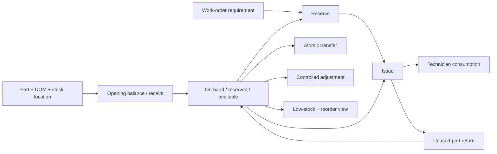

# Quy Trình Nghiệp Vụ Kho Vật Tư

## Mục Tiêu

Product Milestone 6 cung cấp stock control vừa đủ cho maintenance work order: biết vật tư nào đang có, đã được giữ cho công việc nào, đã xuất bao nhiêu, thực dùng bao nhiêu và phần nào được hoàn. Đây không phải purchasing, supplier, accounting hoặc warehouse-management suite.



## Các Bước

| Bước | Actor | Action | Input | System feature | Output/report | Business purpose |
|---|---|---|---|---|---|---|
| 1. Chuẩn bị master | Storekeeper, Administrator | Tạo category, UOM, spare part và stock location; quản lý lifecycle | Stable code, tên tiếng Việt, precision, thresholds, compatible asset types | Typed API, unique constraints, optimistic version, audit | Part/location active hoặc non-destructive inactive/archived | Dùng một định danh nhất quán cho stock history |
| 2. Khởi tạo/nhập kho | Storekeeper | Ghi opening balance hoặc receipt | Part, location, positive quantity, reference, reason, idempotency key, optional cost/evidence | Named service, row lock, immutable movement, audit | On-hand tăng; movement giữ resulting balance | Ghi nhận physical stock mà không PATCH balance |
| 3. Lập nhu cầu | Chief Engineer | Thêm planned requirement vào work order | Part, planned quantity, source location, required-by date, notes | WO state/part/location validation | Requirement + shortage derived | Planning chưa giữ hoặc xuất stock |
| 4. Reserve | Storekeeper, Chief Engineer | Reserve một phần/toàn phần, release/expire/replace khi cần | Requirement version, quantity, expiry, reason, idempotency key | Row lock, available check, occurrence uniqueness, append-only event | Reserved tăng, available giảm, on-hand giữ nguyên | Tránh hai work order dùng cùng available stock |
| 5. Issue | Storekeeper | Xuất reserved hoặc unreserved stock cho eligible work order | Part/location/quantity, optional requirement/reservation, recipient, reason, idempotency key | Locked transaction, availability/WO-state check | On-hand giảm, reserved được giải phóng tương ứng, issue + movement | Phân biệt physical issue với allocation |
| 6. Consume | Assigned Technician | Xác nhận quantity thực dùng | Issue, positive quantity, timestamp/note, idempotency key | Ownership + outstanding check, append-only consumption | Net consumed tăng; không tạo movement thứ hai | Không mặc định mọi issued quantity đã được lắp |
| 7. Return | Storekeeper | Hoàn phần chưa dùng về active location | Issue outstanding, destination, quantity, reason, idempotency key | Locked issue/position transaction | Return record + movement; on-hand tăng | Giữ stock và usage khớp thực tế |
| 8. Transfer | Storekeeper | Chuyển vật tư giữa hai active stock locations | Source, destination, quantity, reference/reason, idempotency key | Deterministic lock order, common transfer group | Transfer-out + transfer-in cùng commit hoặc rollback | Không tạo trạng thái “đã ra nhưng chưa vào” |
| 9. Adjustment/damage | Storekeeper, Administrator | Ghi tăng/giảm hoặc damaged/scrapped có kiểm soát | Quantity, reason, supporting note, optional evidence | Authorization, negative-stock guard, immutable movement/audit | Position mới và traceable adjustment | Sửa chênh lệch bằng compensating event, không sửa lịch sử |
| 10. Theo dõi | Manager, Chief Engineer, Storekeeper | Xem balance, low-stock, reservations, movement, WO shortage | Server filters/sort/pagination | Derived state/reorder suggestion/metrics | Operational queue và report | Hỗ trợ quyết định; không tự mua hàng |

## Quy Tắc Quantity

```text
available = on_hand - reserved
```

- `on_hand`: physical quantity theo transactional position.
- `reserved`: allocation active chưa issue/release.
- `available`: phần còn có thể reserve/issue.
- Requirement không đổi quantity.
- Reservation chỉ đổi reserved/available.
- Issue và return tạo physical movement.
- Consumption quyết toán usage nhưng không trừ tồn lần nữa.

Client không submit current balance, stock state hoặc reorder suggestion. Backend derive các field đó từ movement/position và effective threshold.

## Lifecycle Và Immutability

- Part/location inactive hoặc archived vẫn hiện trong history.
- Part archived không nhận requirement/reservation/issue mới.
- Location inactive/archived không nhận receipt/reserve/issue/transfer/return mới.
- Movement, reservation event, issue, consumption và return là append-only. Correction dùng movement mới.
- PostgreSQL trigger chặn update/delete lịch sử; database administrator vẫn là trust boundary.

## Completion Policy

Current policy là `warning_only`: work order có shortage hoặc issued quantity chưa consume/return vẫn có thể được authorized technician complete sau khi review warning. Completion/verification không tự tạo inventory action, không resolve ticket và không cập nhật Risk Score/KPI.

## Giới Hạn

- Không có supplier, request for quotation, purchase requisition/order, receiving against PO hoặc approval workflow.
- Không có lot/serial/expiry tracking, cycle count, barcode/QR stock scan, automatic replenishment hoặc demand forecast.
- Unit cost chỉ là optional metadata snapshot; không có stock valuation, accounting hoặc maintenance-cost report.
- Attachment bytes dùng local single-node storage; chưa có malware scan hoặc object storage.

