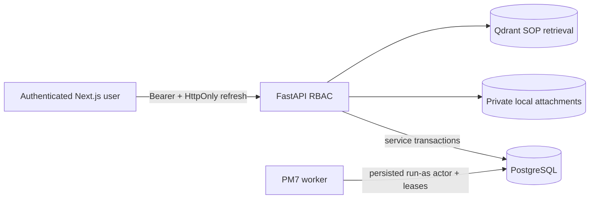

# Security Boundary

## Mục Tiêu

Security hiện phù hợp local/internal pilot với company users. Đây không phải
security certification hoặc production-readiness claim.

## Trust Boundaries



- FastAPI là authorization boundary; hidden UI controls không cấp hoặc thu hồi
  quyền.
- PostgreSQL administrator, host administrator và local attachment-storage
  operator vẫn là trusted infrastructure roles.
- Worker chỉ dùng persisted active user đã được snapshot khi job enable/manual
  trigger; nó không có superuser bypass trong service layer.

## Authentication Và Session

- Password hash dùng Argon2id theo existing security service.
- Access token ngắn hạn chỉ ở frontend memory.
- Refresh token ngẫu nhiên nằm trong revocable HttpOnly cookie; PostgreSQL chỉ
  lưu hash.
- Refresh rotation, logout, password change và account disable giữ existing
  revocation behavior.
- Không lưu token trong `localStorage`.
- Local in-process login throttling chưa phải distributed rate limiting.

## Authorization

Canonical permissions nằm tại `src/security/permissions.py`. PM7 thêm:

- `notifications:read` cho sáu internal roles;
- `job_operations:read` và `job_operations:manage` cho Administrator.

Notification repository luôn scope theo current `recipient_user_id`. Operator
API không nhận arbitrary actor, module, SQL hoặc executable payload. Existing
ticket, work-order, inventory và audit permissions không bị nới lỏng.

## Transactional Integrity

- Selected outbox event commit cùng business mutation.
- Audit event thành công commit cùng business mutation.
- Job/outbox claims dùng row lock, `SKIP LOCKED`, lease owner và persisted state.
- Unique idempotency constraints bảo vệ manual trigger, scheduled occurrence,
  outbox event và per-recipient notification.
- Delivery attempts, ticket communication/SLA/escalation, audit và inventory
  ledger tiếp tục append-only bằng service rules và PostgreSQL trigger.
- PM7 không thay đổi canonical inventory rule hoặc ticket/work-order lifecycle
  independence.

## Data Minimization

Outbox event phải khớp explicit catalog, giới hạn 16 KiB và từ chối:

```text
password, password_hash, token, access_token, refresh_token,
authorization, cookie, storage_key, file_body,
reporter_email, reporter_phone
```

Notification chỉ lưu business ID, minimum routing context và Vietnamese
operational text. Operator outbox API không trả payload. Structured logging dùng
allow-list fields và không log connection string, credential, raw payload, stack
trace hoặc attachment path.

## Attachments Và Qdrant

PM7 không thay đổi attachment hoặc RAG boundary:

- attachment bytes ở private local `AttachmentStorage`, download qua FastAPI,
  MIME/signature/extension/size/checksum controls;
- storage key/path không ra API/audit/notification;
- Qdrant chỉ chứa SOP/checklist chunks, không là transactional queue hoặc user
  identity store.

## Secrets

- `.env` bị gitignore; `.env.example` chỉ có non-secret local Docker defaults.
- `TOKEN_SIGNING_SECRET` để rỗng trong example và phải được inject cho pilot.
- Không commit database dump, runtime log, attachment byte hoặc generated token.
- Health/metrics không trả `DATABASE_URL`.

## Residual Risks

- Local authentication chưa có SSO, MFA, account recovery hoặc external IdP.
- Signing-key rotation và managed secret store chưa được triển khai.
- Attachment storage là single-node và chưa có malware scanner/object store.
- Worker chưa có HA/load test; stale heartbeat cần operator quan sát.
- Metrics/logs chưa có centralized collector hoặc alert routing.
- Không có field-level encryption/retention workflow cho reporter PII.
- Không có external notification delivery hoặc recipient acknowledgement.
- Database/host administrator vẫn có quyền cao và cần organizational controls,
  backup, access review và log retention bên ngoài repository.
