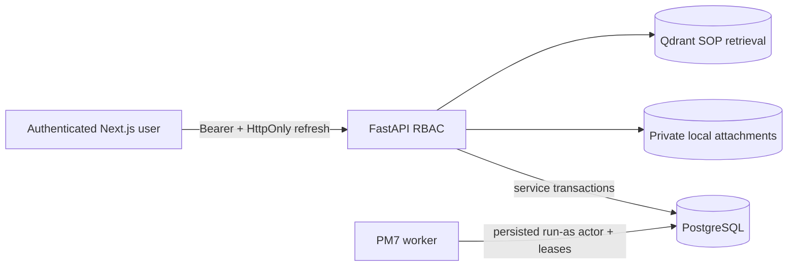

# Security Boundary

## Mục Tiêu

Security hiện phù hợp local/internal pilot với company users. Đây không phải
security certification hoặc production-readiness claim.

## Trust Boundaries



- FastAPI là authorization boundary; hidden UI controls không cấp hoặc thu hồi
  quyền.
- PostgreSQL administrator, host administrator và local attachment-storage
  operator vẫn là trusted infrastructure roles.
- Worker chỉ dùng persisted active user đã được snapshot khi job enable/manual
  trigger; nó không có superuser bypass trong service layer.

## Authentication Và Session

- Password hash dùng Argon2id theo existing security service.
- Access token ngắn hạn chỉ ở frontend memory.
- Refresh token ngẫu nhiên nằm trong revocable HttpOnly cookie; PostgreSQL chỉ
  lưu hash.
- Refresh rotation, logout, password change và account disable giữ existing
  revocation behavior.
- Không lưu token trong `localStorage`.
- Local in-process login throttling chưa phải distributed rate limiting.

## Authorization

Canonical permissions nằm tại `src/security/permissions.py`. PM7 thêm:

- `notifications:read` cho sáu internal roles;
- `job_operations:read` và `job_operations:manage` cho Administrator.

Notification repository luôn scope theo current `recipient_user_id`. Operator
API không nhận arbitrary actor, module, SQL hoặc executable payload. Existing
ticket, work-order, inventory và audit permissions không bị nới lỏng.

## Transactional Integrity

- Selected outbox event commit cùng business mutation.
- Audit event thành công commit cùng business mutation.
- Job/outbox claims dùng row lock, `SKIP LOCKED`, lease owner và persisted state.
- Unique idempotency constraints bảo vệ manual trigger, scheduled occurrence,
  outbox event và per-recipient notification.
- Delivery attempts, ticket communication/SLA/escalation, audit và inventory
  ledger tiếp tục append-only bằng service rules và PostgreSQL trigger.
- PM7 không thay đổi canonical inventory rule hoặc ticket/work-order lifecycle
  independence.

## Data Minimization

Outbox event phải khớp explicit catalog, giới hạn 16 KiB và từ chối:

```text
password, password_hash, token, access_token, refresh_token,
authorization, cookie, storage_key, file_body,
reporter_email, reporter_phone
```

Notification chỉ lưu business ID, minimum routing context và Vietnamese
operational text. Operator outbox API không trả payload. Structured logging dùng
allow-list fields và không log connection string, credential, raw payload, stack
trace hoặc attachment path.

## Attachments Và Qdrant

PM7 không thay đổi attachment hoặc RAG boundary:

- attachment bytes ở private local `AttachmentStorage`, download qua FastAPI,
  MIME/signature/extension/size/checksum controls;
- storage key/path không ra API/audit/notification;
- Qdrant chỉ chứa SOP/checklist chunks, không là transactional queue hoặc user
  identity store.

## Secrets

- `.env` bị gitignore; `.env.example` chỉ có non-secret replacement
  placeholders và bounded local defaults.
- `TOKEN_SIGNING_SECRET` để rỗng trong example và phải được inject cho pilot.
- Không commit database dump, runtime log, attachment byte hoặc generated token.
- Health/metrics không trả `DATABASE_URL`.

## Residual Risks

- Local authentication chưa có SSO, MFA, account recovery hoặc external IdP.
- Một-previous-key verification đã triển khai, nhưng real pilot rotation chưa
  chạy và chưa có managed secret store/JWKS.
- Attachment storage là single-node và chưa có malware scanner/object store.
- Worker chưa có HA; bounded local baseline/stress đã chạy nhưng soak,
  mutation-bearing load, capacity-to-failure và pilot-host validation chưa chạy.
- Metrics/logs chưa có centralized collector hoặc alert routing.
- Không có field-level encryption/retention workflow cho reporter PII.
- Không có external notification delivery hoặc recipient acknowledgement.
- Database/host administrator vẫn có quyền cao và cần organizational controls,
  backup, access review và log retention bên ngoài repository.

## PM8 Secret Và Reliability Hardening

- Pilot/production fail startup nếu database URL thiếu host/database/user/password,
  còn dùng `maintenance:maintenance` hoặc giữ literal `replace_with_*`
  placeholders.
- Token mới luôn ký bằng current key. Một `TOKEN_SIGNING_PREVIOUS_SECRET` khác
  current chỉ verify trong bounded rotation grace period.
- Refresh/CSRF vẫn random per session và chỉ lưu hash; không thêm shared secret.
- Backup tool nhận password qua environment, không đặt trong generated
  command/manifest.
- Metrics/alerts chỉ có aggregate count, age, threshold và closed code; không có
  credential, payload, stack trace hoặc attachment path.
- Structured JSON log dùng ASCII-safe Unicode escapes để redirected Windows
  output không rơi vào logging traceback có local path.
- Outbox redrive cần Administrator, stable key, row lock, append-only intent và
  same-transaction audit; API không deliver inline.
- Attachment integrity report chỉ có counts; PM8 không expose path hoặc thêm
  malware scanner.

Xem [secret rotation](secret_rotation.md). Đây vẫn là environment-provided secret
model, không phải managed secrets platform.

## PM9 Deployment Security

PM9 thêm versioned, secret-free deployment/release contract; nó không thay
authentication/RBAC model.

- Pilot mode bắt buộc PostgreSQL storage và verified release
  identifier/commit/tag/revision.
- Development database credential/default placeholder, weak/missing signing
  secret và CSV mode bị từ chối.
- Protected dotenv được parse không expand command; duplicate/invalid names bị
  từ chối.
- Rehearsal subprocess nhận secret qua environment; redacted evidence không chứa
  value.
- Deployment command surface chỉ có fixed Compose operations, không nhận shell,
  SQL, Python, module hoặc workflow payload.
- Execute từ chối dirty Git worktree và Compose project name đã có container,
  nên release identity không thể che một build context chưa checkpoint và
  failure không được cleanup project do invocation khác sở hữu.
- Raw evidence/load reports/backups/restores phải nằm ngoài repository.
- Health/OpenAPI chỉ thêm application version và release identity không bí mật;
  không trả database URL, token hoặc storage path.
- Frontend `NEXT_PUBLIC_*` vẫn là public build configuration.

Pilot host phải dùng HTTPS, `AUTH_COOKIE_SECURE=true`, explicit CORS/trusted
hosts và approved network/TLS boundary. Current workstation chưa phải
intended-host evidence.

Authenticated post-start không chỉ nhận `200` từ refresh/logout. Nó yêu cầu access
token, refresh cookie và CSRF cookie đều rotate; old access/refresh session phải
trả `401`; sau logout cả current access và refresh replay cũng phải trả `401`.
Evidence chỉ ghi aggregate boolean/count, không ghi token, cookie, username hoặc
credential.

## PM9 Rotation Evidence

PM8 synthetic tests xác nhận current key ký token mới và đúng một previous key
verify trong grace period. PM9 focused tests xác nhận missing/placeholder pilot
secret và report redaction. Không có approved pilot key/database credential,
real rotation, active-session measurement hoặc rollback-window rehearsal.

Vì vậy engineering implementation cho secret controls là complete, nhưng local
rehearsal chỉ `PARTIAL` và real-company secret gate vẫn bị chặn bởi external
dependency:

```text
Engineering readiness: PASS
Local rehearsal: PARTIAL
Real-company pilot: BLOCKED — EXTERNAL DEPENDENCY
Overall: NO-GO / WAITING FOR PILOT SPONSOR
```

Procedure đầy đủ tại [PM9 secret rotation](pilot_secret_rotation.md). Không mark
`passed` từ synthetic keys.

## PM9 Attachment And Evidence Risks

Attachment archive/restore helpers giữ containment/checksum và không expose
path. Chúng không thêm malware scanner, object storage hoặc distributed
transaction. Generated non-empty PDF upload, byte archive/restore, Administrator
download `200` và Helpdesk `403` đã pass trên disposable PostgreSQL 16 `_test`.
Test dùng original database metadata; paired PostgreSQL dump +
database/filesystem restore chưa chạy.

Solo project developer được ghi nhận là security implementation contact cho
technical controls. Company-approved security owner, incident coordinator,
production support coverage và approved incident channel vẫn là
`BLOCKED_EXTERNAL_DEPENDENCY`; technical stewardship không thay thế
organizational authority. Xem
[operational ownership](operational_ownership.md) và
[known limitations](known_limitations_acceptance.md).
