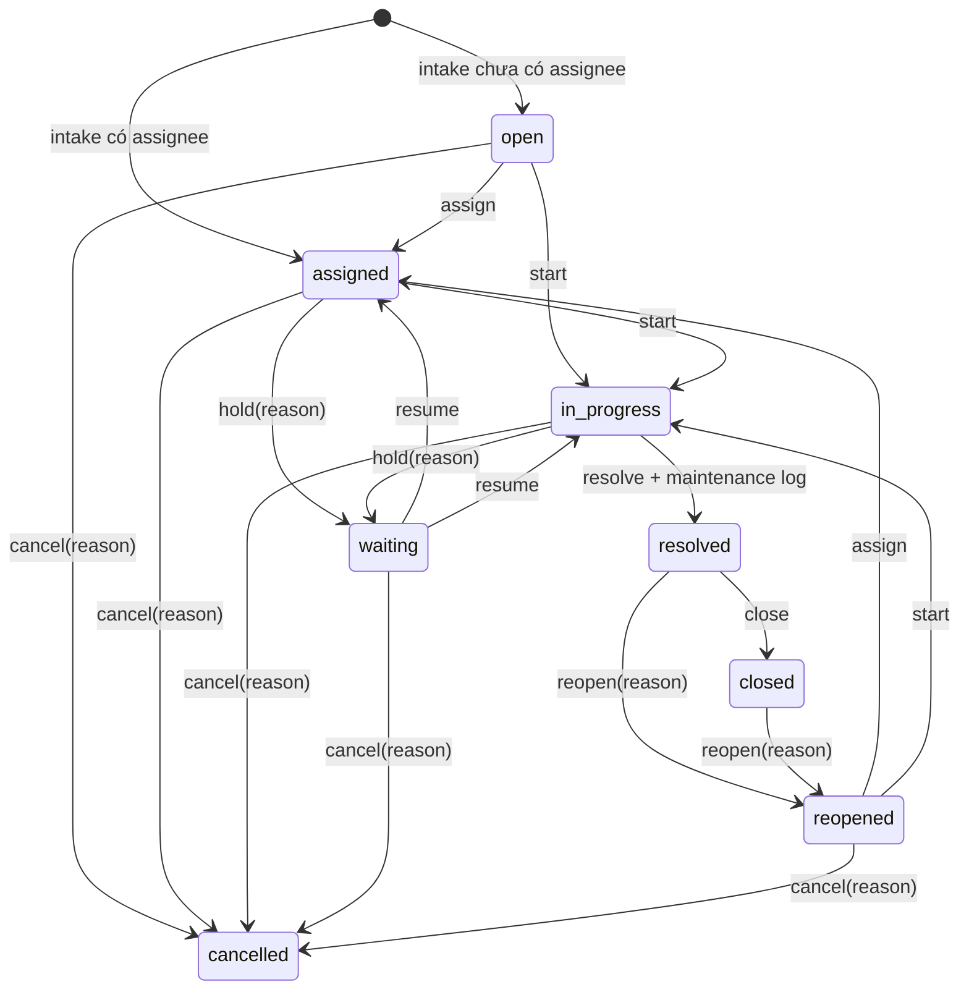

# Ticket Operations Và SLA

## Phạm Vi

Product Milestone 5 bổ sung một bounded context cho ticket intake, priority, SLA, communication và operational queues. Đây là workflow điều phối bảo trì cho local/internal pilot, không phải ITSM suite hoàn chỉnh, notification platform hoặc full CMMS.

Canonical implementation:

- domain codes và priority matrix: `src/ticket_management/domain.py`;
- business-calendar math: `src/ticket_management/sla.py`;
- business rules và named actions: `src/ticket_management/service.py`;
- PostgreSQL transactions: `src/repositories/postgres_tickets.py`;
- typed FastAPI schemas/routes: `src/ticket_management/schemas.py` và `routes.py`.

Legacy `GET|POST|PATCH /tickets` vẫn là compatibility adapter với Vietnamese display values và lifecycle ba mức cũ. Rich PM5 endpoints dùng stable English codes, đồng thời trả field `*_display` bằng tiếng Việt.

## Ticket Lifecycle



`acknowledge` ghi first response nhưng không đổi lifecycle. `assign`, `acknowledge`, `start`, `hold`, `resume`, `resolve`, `close`, `reopen` và `cancel` là action riêng, đều nhận `expected_version`. Rich API không có generic status patch.

Các invariant:

- ticket chỉ resolve từ `in_progress` và phải có linked `MaintenanceLog`;
- `hold`, `cancel` và `reopen` bắt buộc có reason;
- `resolve` không đồng nghĩa `close`;
- reopen xóa terminal timestamps phù hợp, tăng `reopen_count` và mở SLA occurrence mới;
- corrective work order có thể liên kết ticket, nhưng create/complete/verify work order không tự đổi ticket status;
- technician chỉ thao tác ticket được gán cho chính mình.

## Priority Matrix

Backend tính priority từ `impact x urgency`; client không gửi một priority tùy ý.

| Impact \ Urgency | `low` | `medium` | `high` | `immediate` |
|---|---|---|---|---|
| `low` | `low` | `low` | `medium` | `high` |
| `medium` | `low` | `medium` | `high` | `high` |
| `high` | `medium` | `high` | `high` | `critical` |
| `critical` | `high` | `high` | `critical` | `critical` |

`GET /ticketing/priority-preview` và `GET /ticketing/options` expose kết quả/ma trận canonical cùng Vietnamese labels. Khi thay đổi impact hoặc urgency, API tính lại priority và ghi audit reason.

## SLA Policy Snapshot

Mỗi active policy gồm:

- effective date range và optional category;
- IANA timezone;
- versioned business calendar;
- một target cho từng priority;
- first-response minutes, resolution minutes;
- `pause_on_waiting`;
- `due_soon_percent`;
- active/inactive lifecycle.

Khi intake, service chọn policy đang hiệu lực rồi snapshot policy name/code, target minutes, timezone và toàn bộ calendar definition vào `ticket_sla_states`. Vì vậy:

- sửa policy hoặc calendar chỉ ảnh hưởng ticket tạo sau đó;
- ticket lịch sử không bị đổi deadline;
- manual policy override cần permission, reason và optimistic version;
- override tạo audit/SLA event, không sửa nguồn policy cũ.

Default local seed dùng `VN_BUSINESS`, `Asia/Ho_Chi_Minh`, thứ Hai đến thứ Sáu, 08:00 đến 17:00. Calendar hỗ trợ nhiều same-day working periods, weekend, holidays và timezone transitions; cross-midnight hoặc overlapping periods bị từ chối.

## SLA Clock Semantics

Hai clock độc lập:

| Clock | Start | Stop | Pause |
|---|---|---|---|
| First response | ticket intake | `acknowledge` hoặc implicit khi `start` | Có thể pause khi ticket chờ trước first response |
| Resolution | ticket intake hoặc reopen occurrence | `resolve` hoặc `cancel` | Pause/resume khi policy bật `pause_on_waiting` |

Derived states là `not_started`, `active`, `paused`, `met`, `due_soon`, `breached`, `stopped`. Client không được submit các state này. API derive state và remaining business minutes từ source timestamps, snapshot và `as_of`.

Mỗi pause lưu số business minutes còn lại. Resume tạo deadline mới từ thời điểm resume; nhiều pause interval được cộng dồn. Reopen giữ event lịch sử, tăng `occurrence_number`, rồi khởi động lại resolution clock bằng target đã snapshot.

`ticket_sla_events` ghi append-only các sự kiện policy applied, clock started, pause, resume, first response, target met, breach detection, resolution, reopen và stop. PostgreSQL trigger chặn `UPDATE`/`DELETE` lịch sử.

## Communication Và PII

Comment có hai visibility:

- `internal`: dành cho actor có `ticket_comments:internal`;
- `requester`: dành cho actor có `ticket_comments:requester`.

Comment giữ author, UTC timestamp và optional links đến secure asset/work-order attachments. Comment không có edit/delete API; database trigger bảo vệ append-only history. Storekeeper chỉ thấy requester-visible updates. Reporter name/email/phone chỉ trả cho role có `ticket_pii:read`; các role còn lại nhận `reporter_redacted=true` và contact fields là `null`.

Audit payload dùng allow-list và không ghi reporter contact, token, cookie hoặc attachment body/path.

## Operational Queues

`GET /ticket-queues/{queue_name}` hỗ trợ:

- `all`;
- `unassigned`;
- `assigned_to_me`;
- `assigned_to_queue`;
- `critical`;
- `due_soon`;
- `breached`;
- `waiting`;
- `recently_resolved` trong 7 ngày;
- `reopened`.

Filters gồm `asset_id`, `status`, `priority`, `category_id`, `support_group_id`, `assigned_user_id`, `search`, `page` và `page_size`. Sorting, resource scoping và pagination do server quyết định. Technician queue chỉ chứa ticket thuộc ownership của technician đang đăng nhập.

## Escalation

Một service duy nhất đánh giá:

- first-response due soon;
- first-response breached;
- resolution due soon;
- resolution breached;
- critical priority;
- repeated reopen từ lần thứ hai.

`dry_run` chỉ trả candidates. Execute insert append-only escalation events và audit trong transaction. Unique boundary `(ticket_id, rule_code, occurrence_number)` làm retry và concurrent evaluation idempotent; response/resolution đã được phân biệt bằng `rule_code`.

Escalation hiện là operational record. Không có background worker, email/SMS delivery, notification scheduler hoặc automatic transition.

```powershell
python -m src.ticket_management.cli seed-defaults
python -m src.ticket_management.cli evaluate-escalations --dry-run
python -m src.ticket_management.cli evaluate-escalations
```

Tương đương Make targets: `make seed-ticketing`, `make escalation-dry-run`, `make evaluate-escalations`.

## Current Limitations

- SLA evaluation chạy khi API/CLI được gọi; không có distributed scheduler.
- Calendar/policy administration phù hợp local pilot, chưa có approval/version publication workflow.
- Queue filtering là server-owned nhưng chưa được benchmark với production volume.
- Escalation không gửi notification.
- Reporter PII chưa có field-level encryption, retention policy hoặc data-subject workflow.
- Internal auth chưa có SSO/MFA và hệ thống chưa production-ready.
