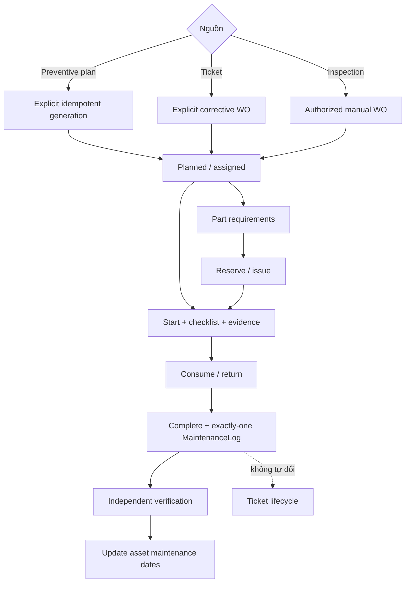
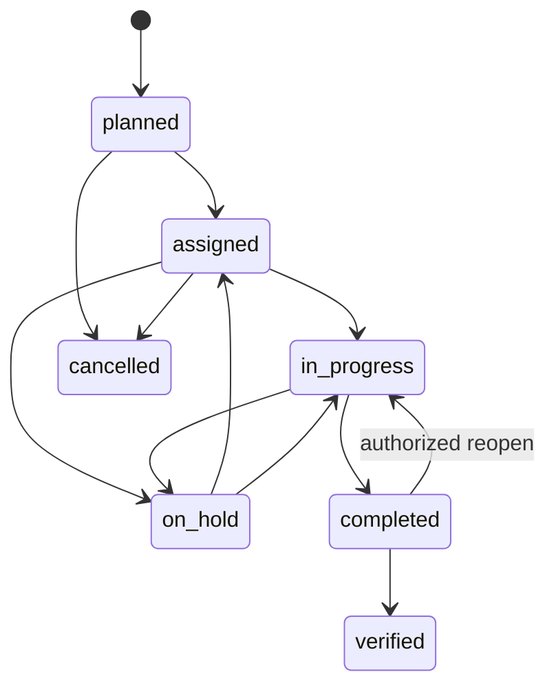

# Quy Trình Work Order Và Vật Tư

## Mục Tiêu

Work order là executable maintenance job. Ticket mô tả incident; preventive plan mô tả recurring intent; MaintenanceLog ghi outcome; inventory movement ghi physical stock. Các entity này liên kết nhưng không thay thế hoặc tự chuyển trạng thái cho nhau.

## Trách Nhiệm

| Actor | Trách nhiệm |
|---|---|
| Facility Manager | Prioritize, assign/cancel/reopen theo permission, review operational outcome và verify độc lập |
| Chief Engineer | Tạo plan/checklist/WO, lập part requirement, reserve/release, technical oversight và verify |
| Storekeeper | Receipt/reserve/issue/return/transfer/adjust inventory; không complete/verify maintenance |
| Technician | Execute assigned WO, checklist/evidence, explicit consumption, completion outcome |
| Helpdesk | Intake/route ticket và xem linked work order; không execute maintenance hoặc stock action |

## State Machine

Checklist mandatory/safety rules và optimistic `version` được kiểm tra ở service. Completion tạo/link đúng một MaintenanceLog. Verification phải do actor khác người complete và mới đồng bộ asset dates.

## Part Workflow Trong Work Order

1. Requirement chỉ ghi planned quantity và source location.
2. Reserve là allocation; on-hand chưa đổi.
3. Issue mới làm giảm on-hand và liên kết physical movement với work order.
4. Assigned technician ghi consumption cho quantity thực dùng.
5. Storekeeper return outstanding unused quantity.
6. Work-order detail hiển thị planned, reserved, issued, returned, net consumed, shortage, location và movement timeline.
7. Nếu còn shortage hoặc unresolved issue, completion hiển thị warning. Backend không tự issue/consume/return/release.

`MaintenanceLog.parts_replaced` vẫn giữ narrative để tương thích, nhưng authoritative inventory quantity nằm ở linked issue/consumption/return/movement.

## Independence Rules

- Generate/create/complete/verify work order không tự resolve/close ticket.
- Issue/consume/return stock không đổi work-order hoặc ticket status.
- Complete/verify work order không tự refresh risk, anomaly, preventive KPI hoặc SLA.
- Qdrant/Copilot không ghi work order hoặc inventory.
- Mọi quyết định safety, physical usage, verification và incident closure vẫn thuộc người được ủy quyền.

## Failure Và Retry

- Stale work-order/requirement/reservation version trả `409`; user reload trước khi thử lại.
- Stock-changing command dùng caller-stable `Idempotency-Key`; replay đúng payload trả kết quả cũ, payload khác bị conflict.
- Insufficient available/outstanding quantity bị từ chối và toàn transaction rollback.
- Transfer-out/in là atomic.
- API không fallback sang mutable CSV nếu PostgreSQL unavailable.

